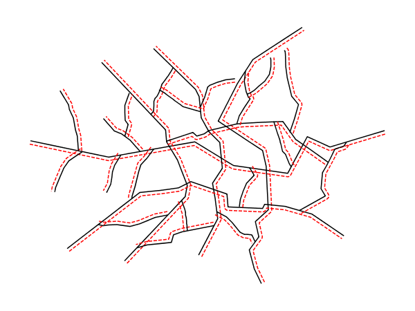
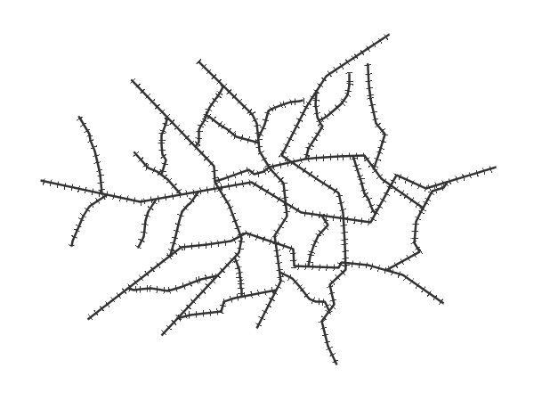
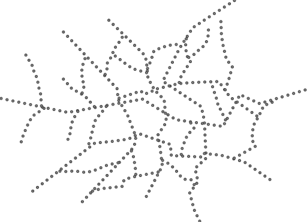
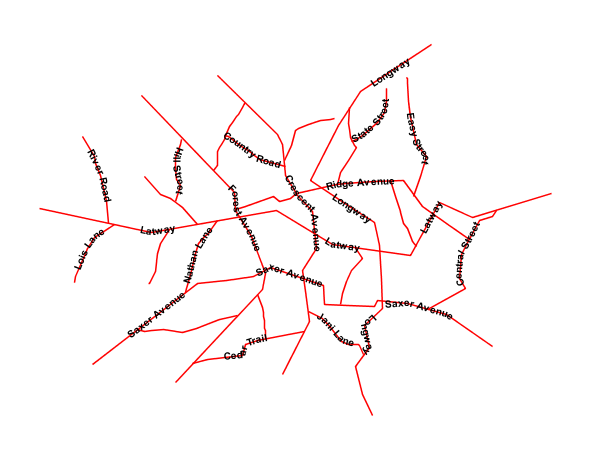
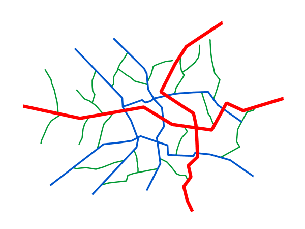
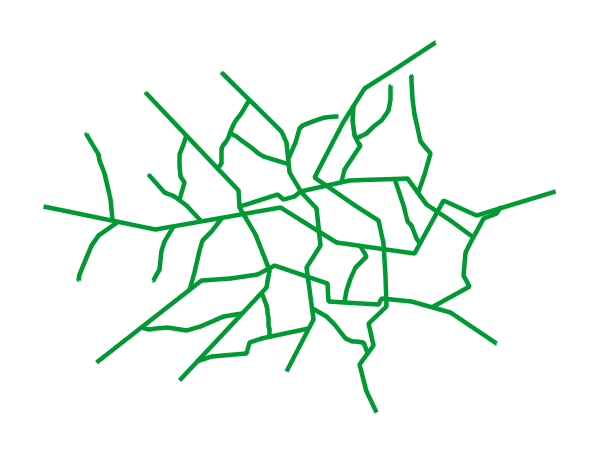
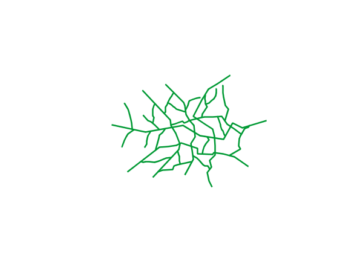

# Lines

While lines can also seem to be simple shapes, having length but no width, there are many options and tricks for making lines display nicely.

!!! warning

    The code examples shown on this page are **not the full SLD code**, as they omit the SLD header and footer information for the sake of brevity. Please use the links to download the full SLD for each example.

## Example lines layer {: #sld_cookbook_lines_attributes }

The [lines layer](artifacts/sld_cookbook_line.zip) used in the examples below contains road information for a fictional country. For reference, the attribute table for the points in this layer is included below.

  ---------------------- ---------------------------- -----------------------
  **fid** (Feature ID)   **name** (Road name)         **type** (Road class)

  line.1                 Latway                       highway

  line.2                 Crescent Avenue              secondary

  line.3                 Forest Avenue                secondary

  line.4                 Longway                      highway

  line.5                 Saxer Avenue                 secondary

  line.6                 Ridge Avenue                 secondary

  line.7                 Holly Lane                   local-road

  line.8                 Mulberry Street              local-road

  line.9                 Nathan Lane                  local-road

  line.10                Central Street               local-road

  line.11                Lois Lane                    local-road

  line.12                Rocky Road                   local-road

  line.13                Fleet Street                 local-road

  line.14                Diane Court                  local-road

  line.15                Cedar Trail                  local-road

  line.16                Victory Road                 local-road

  line.17                Highland Road                local-road

  line.18                Easy Street                  local-road

  line.19                Hill Street                  local-road

  line.20                Country Road                 local-road

  line.21                Main Street                  local-road

  line.22                Jani Lane                    local-road

  line.23                Shinbone Alley               local-road

  line.24                State Street                 local-road

  line.25                River Road                   local-road
  ---------------------- ---------------------------- -----------------------

[Download the lines shapefile](artifacts/sld_cookbook_line.zip)

## Simple line {: #sld_cookbook_lines_simpleline }

This example specifies lines be colored black with a thickness of 3 pixels.


*Simple line*

### Code

[View and download the full "Simple line" SLD](artifacts/line_simpleline.sld)

``` {.xml linenos=""}
<FeatureTypeStyle>
  <Rule>
    <LineSymbolizer>
      <Stroke>
        <CssParameter name="stroke">#000000</CssParameter>
        <CssParameter name="stroke-width">3</CssParameter>    
      </Stroke>
    </LineSymbolizer>
  </Rule>
</FeatureTypeStyle>
```

### Details

There is one `<Rule>` in one `<FeatureTypeStyle>` for this SLD, which is the simplest possible situation. (All subsequent examples will contain one `<Rule>` and one `<FeatureTypeStyle>` unless otherwise specified.) Styling lines is accomplished via the `<LineSymbolizer>` (**lines 3-8**). **Line 5** specifies the color of the line to be black (`#000000`), while **line 6** specifies the width of the lines to be 3 pixels.

## Line with border

This example shows how to draw lines with borders (sometimes called "cased lines"). In this case the lines are drawn with a 3 pixel blue center and a 1 pixel wide gray border.


*Line with border*

### Code

[View and download the full "Line with border" SLD](artifacts/line_linewithborder.sld)

``` {.xml linenos=""}
<FeatureTypeStyle>
   <Rule>
    <LineSymbolizer>
      <Stroke>
        <CssParameter name="stroke">#333333</CssParameter>                           
        <CssParameter name="stroke-width">5</CssParameter>    
        <CssParameter name="stroke-linecap">round</CssParameter>    
      </Stroke> 
    </LineSymbolizer>
  </Rule>
</FeatureTypeStyle>
<FeatureTypeStyle>
   <Rule>
    <LineSymbolizer>
    <Stroke>
        <CssParameter name="stroke">#6699FF</CssParameter>                           
        <CssParameter name="stroke-width">3</CssParameter> 
        <CssParameter name="stroke-linecap">round</CssParameter>  
      </Stroke>
    </LineSymbolizer>                                          
   </Rule>
</FeatureTypeStyle>
```

### Details

Lines in SLD have no notion of a "fill", only "stroke". Thus, unlike points or polygons, it is not possible to style the "edge" of the line geometry. It is, however, possible to achieve this effect by drawing each line twice: once with a certain width and again with a slightly smaller width. This gives the illusion of fill and stroke by obscuring the larger lines everywhere except along the edges of the smaller lines.

Since every line is drawn twice, the order of the rendering is *very* important. GeoServer renders `<FeatureTypeStyle>`s in the order that they are presented in the SLD. In this style, the gray border lines are drawn first via the first `<FeatureTypeStyle>`, followed by the blue center lines in a second `<FeatureTypeStyle>`. This ensures that the blue lines are not obscured by the gray lines, and also ensures proper rendering at intersections, so that the blue lines "connect".

In this example, **lines 1-11** comprise the first `<FeatureTypeStyle>`, which is the outer line (or "stroke"). **Line 5** specifies the color of the line to be dark gray (`#333333`), **line 6** specifies the width of this line to be 5 pixels, and in **line 7** a `stroke-linecap` parameter of `round` renders the ends of the line as rounded instead of flat. (When working with bordered lines using a round line cap ensures that the border connects properly at the ends of the lines.)

**Lines 12-22** comprise the second `<FeatureTypeStyle>`, which is the inner line (or "fill"). **Line 16** specifies the color of the line to be a medium blue (`#6699FF`), **line 17** specifies the width of this line to be 3 pixels, and **line 18** again renders the edges of the line to be rounded instead of flat.

The result is a 3 pixel blue line with a 1 pixel gray border, since the 5 pixel gray line will display 1 pixel on each side of the 3 pixel blue line.

## Dashed line

This example alters the [Simple line](lines.md#sld_cookbook_lines_simpleline) to create a dashed line consisting of 5 pixels of drawn line alternating with 2 pixels of blank space.


*Dashed line*

### Code

[View and download the full "Dashed line" SLD](artifacts/line_dashedline.sld)

``` {.xml linenos=""}
<FeatureTypeStyle>
  <Rule>
    <LineSymbolizer>
      <Stroke>
        <CssParameter name="stroke">#0000FF</CssParameter>
        <CssParameter name="stroke-width">3</CssParameter>
        <CssParameter name="stroke-dasharray">5 2</CssParameter>
      </Stroke>
    </LineSymbolizer>
  </Rule>
</FeatureTypeStyle>
```

### Details

In this example, **line 5** sets the color of the lines to be blue (`#0000FF`) and **line 6** sets the width of the lines to be 3 pixels. **Line 7** determines the composition of the line dashes. The value of `5 2` creates a repeating pattern of 5 pixels of drawn line, followed by 2 pixels of omitted line.

## Offset line

This example alters the [Simple line](lines.md#sld_cookbook_lines_simpleline) to add a perpendicular offset line on the left side of the line, at five pixels distance.


*Offset line*

### Code

[View and download the full "Dashed line" SLD](artifacts/line_offset.sld)

``` {.xml linenos=""}
<FeatureTypeStyle>
  <Rule>
    <LineSymbolizer>
      <Stroke>
        <CssParameter name="stroke">#000000</CssParameter>
      </Stroke>
    </LineSymbolizer>
    <LineSymbolizer>
      <Stroke>
        <CssParameter name="stroke">#FF0000</CssParameter>
        <CssParameter name="stroke-dasharray">5 2</CssParameter>
      </Stroke>
      <PerpendicularOffset>5</PerpendicularOffset>
    </LineSymbolizer>
  </Rule>
</FeatureTypeStyle>
```

### Details

In this example, the first line symbolizer just paints the lines black. **line 8** begins a second lines symbolizer, sets the color of the lines to be red (`#FF0000`) at line 10 and determines the composition of the line dashes at **Line 11**. **Line 13** finally specifies a perpendicular offset of 5 pixels (positive, thus on the left side).

## Railroad (hatching)

This example uses hatching to create a railroad style. Both the line and the hatches are black, with a 2 pixel thickness for the main line and a 1 pixel width for the perpendicular hatches.

!!! note

    This example leverages an SLD extension in GeoServer. Hatching is not part of the standard SLD 1.0 specification.


*Railroad (hatching)*

### Code

[View and download the full "Railroad (hatching)" SLD](artifacts/line_railroad.sld)

``` {.xml linenos=""}
<FeatureTypeStyle>
  <Rule>
    <LineSymbolizer>
      <Stroke>
        <CssParameter name="stroke">#333333</CssParameter>
        <CssParameter name="stroke-width">3</CssParameter>
      </Stroke>
    </LineSymbolizer> 
    <LineSymbolizer>
      <Stroke>
        <GraphicStroke>
          <Graphic>
            <Mark>
              <WellKnownName>shape://vertline</WellKnownName>
              <Stroke>
                <CssParameter name="stroke">#333333</CssParameter>
                <CssParameter name="stroke-width">1</CssParameter>
              </Stroke>
            </Mark>
            <Size>12</Size>
          </Graphic>
        </GraphicStroke>
      </Stroke>
    </LineSymbolizer>
  </Rule>
</FeatureTypeStyle>
```

### Details

In this example there are two `<LineSymbolizer>`s. The first symbolizer, on **lines 3-8**, draws a standard line, with **line 5** drawing the lines as dark gray (`#333333`) and **line 6** setting the width of the lines to be 2 pixels.

The hatching is invoked in the second symbolizer, on **lines 9-24**. **Line 14** specifies that the symbolizer draw a vertical line hatch (`shape://vertline`) perpendicular to the line geometry. **Lines 16-17** set the hatch color to dark gray (`#333333`) and width to 1 pixel. Finally, **line 20** specifies both the length of the hatch and the distance between each hatch to both be 12 pixels.

## Spaced graphic symbols

This example uses a graphic stroke along with dash arrays to create a "dot and space" line type. Adding the dash array specification allows to control the amount of space between one symbol and the next one. Without using the dash array the lines would be densely populated with dots, each one touching the previous one.

!!! note

    This example may not work in other systems using SLD, since they may not support combining the use of `stroke-dasharray` and `GraphicStroke`. While the SLD is spec-compliant, the SLD specification does not state what this combination is supposed to produce.


*Spaced symbols along a line*

### Code

[View and download the full "Spaced symbols" SLD](artifacts/line_dashspace.sld)

``` {.xml linenos=""}
<FeatureTypeStyle>
  <Rule>
    <LineSymbolizer>
      <Stroke>
        <GraphicStroke>
          <Graphic>
            <Mark>
              <WellKnownName>circle</WellKnownName>
              <Fill>
                <CssParameter name="fill">#666666</CssParameter>  
              </Fill>
              <Stroke>
                <CssParameter name="stroke">#333333</CssParameter>
                <CssParameter name="stroke-width">1</CssParameter>
              </Stroke>
            </Mark>
            <Size>4</Size>
          </Graphic>
        </GraphicStroke>
        <CssParameter name="stroke-dasharray">4 6</CssParameter>
      </Stroke>
    </LineSymbolizer>
  </Rule>
</FeatureTypeStyle>
```

### Details

This example, like others before, uses a `GraphicStroke` to place a graphic symbol along a line. The symbol, defined at **lines 7-16** is a 4 pixel gray circle with a dark gray outline. The spacing between symbols is controlled with the `stroke-dasharray` at **line 20**, which specifies 4 pixels of pen-down (just enough to draw the circle) and 6 pixels of pen-up, to provide the spacing.

## Alternating symbols with dash offsets {: #sld_cookbook_lines_defaultlabel }

This example shows how to create a complex line style which alternates a dashed line and a graphic symbol. The code builds on features shown in the previous examples:

> -   `stroke-dasharray` controls pen-down/pen-up behavior to generate dashed lines
> -   `GraphicStroke` places symbols along a line
> -   combining the two allows control of symbol spacing

This also shows the usage of a `et`, which controls where rendering starts in the dash array. For example, with a dash array of `5 10` and a dash offset of `7` the renderer starts drawing the pattern 7 pixels from the beginning. It skips the 5 pixels pen-down section and 2 pixels of the pen-up section, then draws the remaining 8 pixels of pen-up, then 5 down, 10 up, and so on.

The example shows how to use these features to create two synchronized sequences of dash arrays, one drawing line segments and the other symbols.

!!! note

    This example may not work in other systems using SLD, since they may not support combining the use of `stroke-dasharray` and `GraphicStroke`. While the SLD is spec-compliant, the SLD specification does not state what this combination is supposed to produce.


*Alternating dash and symbol*

### Code

[View and download the full "Spaced symbols" SLD](artifacts/line_dashdot.sld)

``` {.xml linenos=""}
<FeatureTypeStyle>
  <Rule>
    <LineSymbolizer>
      <Stroke>
        <CssParameter name="stroke">#0000FF</CssParameter>
        <CssParameter name="stroke-width">1</CssParameter>
        <CssParameter name="stroke-dasharray">10 10</CssParameter>
      </Stroke>
    </LineSymbolizer>
    <LineSymbolizer>
      <Stroke>
        <GraphicStroke>
          <Graphic>
            <Mark>
              <WellKnownName>circle</WellKnownName>
              <Stroke>
                <CssParameter name="stroke">#000033</CssParameter>
                <CssParameter name="stroke-width">1</CssParameter>
              </Stroke>
            </Mark>
            <Size>5</Size>
          </Graphic>
        </GraphicStroke>
        <CssParameter name="stroke-dasharray">5 15</CssParameter>
        <CssParameter name="stroke-dashoffset">7.5</CssParameter>
      </Stroke>
    </LineSymbolizer>
  </Rule>
</FeatureTypeStyle>
```

### Details

In this example two `LineSymbolizer`s use `stroke-dasharray` and different symbology to produce a sequence of alternating dashes and symbols. The first symbolizer (**lines 3-9**) is a simple dashed line alternating 10 pixels of pen-down with 10 pixels of pen-up. The second symbolizer (**lines 10-27**) alternates a 5 pixel empty circle with 15 pixels of white space. The circle symbol is produced by a `Mark` element, with its symbology specified by `stroke` parameters (**lines 17-18**). The spacing between symbols is controlled with the `stroke-dasharray` (**line 24**), which specifies 5 pixels of pen-down (just enough to draw the circle) and 15 pixels of pen-up. In order to have the two sequences positioned correctly the second one uses a `stroke-dashoffset` of 7.5 (**line 25**). This makes the sequence start with 12.5 pixels of white space, then a circle (which is then centered between the two line segments of the other pattern), then 15 pixels of white space, and so on.

## Line with default label

This example shows a text label on the simple line. This is how a label will be displayed in the absence of any other customization.


*Line with default label*

### Code

[View and download the full "Line with default label" SLD](artifacts/line_linewithdefaultlabel.sld)

``` {.xml linenos=""}
<FeatureTypeStyle>
  <Rule>
    <LineSymbolizer>
      <Stroke>
        <CssParameter name="stroke">#FF0000</CssParameter>
      </Stroke>
    </LineSymbolizer>
    <TextSymbolizer>
      <Label>
        <ogc:PropertyName>name</ogc:PropertyName>
      </Label>
      <LabelPlacement>
        <LinePlacement />
      </LabelPlacement>
      <Fill>
        <CssParameter name="fill">#000000</CssParameter>
      </Fill>
    </TextSymbolizer>
  </Rule>
</FeatureTypeStyle>
```

### Details

In this example, there is one rule with a `<LineSymbolizer>` and a `<TextSymbolizer>`. The `<LineSymbolizer>` (**lines 3-7**) draws red lines (`#FF0000`). Since no width is specified, the default is set to 1 pixel. The `<TextSymbolizer>` (**lines 8-15**) determines the labeling of the lines. **Lines 9-11** specify that the text of the label will be determined by the value of the "name" attribute for each line. (Refer to the attribute table in the [Example lines layer](lines.md#sld_cookbook_lines_attributes) section if necessary.) **Line 13** sets the text color to black. All other details about the label are set to the renderer default, which here is Times New Roman font, font color black, and font size of 10 pixels.

## Label following line {: #sld_cookbook_lines_labelfollowingline }

This example renders the text label to follow the contour of the lines.

!!! note

    Labels following lines is an SLD extension specific to GeoServer. It is not part of the SLD 1.0 specification.


*Label following line*

### Code

[View and download the full "Label following line" SLD](artifacts/line_labelfollowingline.sld)

``` {.xml linenos=""}
<FeatureTypeStyle>
  <Rule>
    <LineSymbolizer>
      <Stroke>
        <CssParameter name="stroke">#FF0000</CssParameter>
      </Stroke>
    </LineSymbolizer>
    <TextSymbolizer>
      <Label>
        <ogc:PropertyName>name</ogc:PropertyName>
      </Label>
      <LabelPlacement>
        <LinePlacement />
      </LabelPlacement>
      <Fill>
        <CssParameter name="fill">#000000</CssParameter>
      </Fill>
      <VendorOption name="followLine">true</VendorOption>
    </TextSymbolizer>
  </Rule>
</FeatureTypeStyle>
```

### Details

As the [Alternating symbols with dash offsets](lines.md#sld_cookbook_lines_defaultlabel) example showed, the default label behavior isn't optimal. The label is displayed at a tangent to the line itself, leading to uncertainty as to which label corresponds to which line.

This example is similar to the [Alternating symbols with dash offsets](lines.md#sld_cookbook_lines_defaultlabel) example with the exception of **lines 12-18**. **Line 18** sets the option to have the label follow the line, while **lines 12-14** specify that the label is placed along a line. If `<LinePlacement />` is not specified in an SLD, then `<PointPlacement />` is assumed, which isn't compatible with line-specific rendering options.

!!! note

    Not all labels are shown due to label conflict resolution. See the next section on [Optimized label placement](lines.md#sld_cookbook_lines_optimizedlabel) for an example of how to maximize label display.

## Optimized label placement {: #sld_cookbook_lines_optimizedlabel }

This example optimizes label placement for lines such that the maximum number of labels are displayed.

!!! note

    This example uses options that are specific to GeoServer and are not part of the SLD 1.0 specification.


*Optimized label*

### Code

[View and download the full "Optimized label" SLD](artifacts/line_optimizedlabel.sld)

``` {.xml linenos=""}
<FeatureTypeStyle>
  <Rule>
    <LineSymbolizer>
      <Stroke>
        <CssParameter name="stroke">#FF0000</CssParameter>
      </Stroke>
    </LineSymbolizer>
    <TextSymbolizer>
      <Label>
        <ogc:PropertyName>name</ogc:PropertyName>
      </Label>
      <LabelPlacement>
         <LinePlacement />
      </LabelPlacement>
      <Fill>
        <CssParameter name="fill">#000000</CssParameter>
      </Fill>
      <VendorOption name="followLine">true</VendorOption>
      <VendorOption name="maxAngleDelta">90</VendorOption>
      <VendorOption name="maxDisplacement">400</VendorOption>
      <VendorOption name="repeat">150</VendorOption>
    </TextSymbolizer>
  </Rule>
</FeatureTypeStyle>
```

### Details

GeoServer uses "conflict resolution" to ensure that labels aren't drawn on top of other labels, obscuring them both. This accounts for the reason why many lines don't have labels in the previous example, [Label following line](lines.md#sld_cookbook_lines_labelfollowingline). While this setting can be toggled, it is usually a good idea to leave it on and use other label placement options to ensure that labels are drawn as often as desired and in the correct places. This example does just that.

This example is similar to the previous example, [Label following line](lines.md#sld_cookbook_lines_labelfollowingline). The only differences are contained in **lines 18-21**. **Line 19** sets the maximum angle that the label will follow. This sets the label to never bend more than 90 degrees to prevent the label from becoming illegible due to a pronounced curve or angle. **Line 20** sets the maximum displacement of the label to be 400 pixels. In order to resolve conflicts with overlapping labels, GeoServer will attempt to move the labels such that they are no longer overlapping. This value sets how far the label can be moved relative to its original placement. Finally, **line 21** sets the labels to be repeated every 150 pixels. A feature will typically receive only one label, but this can cause confusion for long lines. Setting the label to repeat ensures that the line is always labeled locally.

## Optimized and styled label {: #sld_cookbook_lines_optimizedstyledlabel }

This example improves the style of the labels from the [Optimized label placement](lines.md#sld_cookbook_lines_optimizedlabel) example.


*Optimized and styled label*

### Code

[View and download the full "Optimized and styled label" SLD](artifacts/line_optimizedstyledlabel.sld)

``` {.xml linenos=""}
<FeatureTypeStyle>
  <Rule>
    <LineSymbolizer>
      <Stroke>
        <CssParameter name="stroke">#FF0000</CssParameter>
      </Stroke>
    </LineSymbolizer>
    <TextSymbolizer>
      <Label>
        <ogc:PropertyName>name</ogc:PropertyName>
      </Label>
      <LabelPlacement>
        <LinePlacement />
      </LabelPlacement>
      <Fill>
        <CssParameter name="fill">#000000</CssParameter>
      </Fill>
      <Font>
        <CssParameter name="font-family">Arial</CssParameter>
        <CssParameter name="font-size">10</CssParameter>
        <CssParameter name="font-style">normal</CssParameter>
        <CssParameter name="font-weight">bold</CssParameter>
      </Font>
      <VendorOption name="followLine">true</VendorOption>
      <VendorOption name="maxAngleDelta">90</VendorOption>
      <VendorOption name="maxDisplacement">400</VendorOption>
      <VendorOption name="repeat">150</VendorOption>
    </TextSymbolizer>
  </Rule>
</FeatureTypeStyle>
```

### Details

This example is similar to the [Optimized label placement](lines.md#sld_cookbook_lines_optimizedlabel). The only difference is in the font information, which is contained in **lines 18-23**. **Line 19** sets the font family to be "Arial", **line 20** sets the font size to 10, **line 21** sets the font style to "normal" (as opposed to "italic" or "oblique"), and **line 22** sets the font weight to "bold" (as opposed to "normal").

## Attribute-based line

This example styles the lines differently based on the "type" (Road class) attribute.


*Attribute-based line*

### Code

[View and download the full "Attribute-based line" SLD](artifacts/line_attributebasedline.sld)

``` {.xml linenos=""}
<FeatureTypeStyle>
  <Rule>
    <Name>local-road</Name>
    <ogc:Filter>
      <ogc:PropertyIsEqualTo>
        <ogc:PropertyName>type</ogc:PropertyName>
        <ogc:Literal>local-road</ogc:Literal>
      </ogc:PropertyIsEqualTo>
    </ogc:Filter>
    <LineSymbolizer>
      <Stroke>
        <CssParameter name="stroke">#009933</CssParameter>
        <CssParameter name="stroke-width">2</CssParameter>
      </Stroke>
    </LineSymbolizer>
  </Rule>
</FeatureTypeStyle>
<FeatureTypeStyle>
  <Rule>
    <Name>secondary</Name>
    <ogc:Filter>
      <ogc:PropertyIsEqualTo>
        <ogc:PropertyName>type</ogc:PropertyName>
        <ogc:Literal>secondary</ogc:Literal>
      </ogc:PropertyIsEqualTo>
    </ogc:Filter>
    <LineSymbolizer>
      <Stroke>
        <CssParameter name="stroke">#0055CC</CssParameter>
        <CssParameter name="stroke-width">3</CssParameter>
      </Stroke>
    </LineSymbolizer>
  </Rule>
</FeatureTypeStyle>
<FeatureTypeStyle>
  <Rule>
  <Name>highway</Name>
    <ogc:Filter>
      <ogc:PropertyIsEqualTo>
        <ogc:PropertyName>type</ogc:PropertyName>
        <ogc:Literal>highway</ogc:Literal>
      </ogc:PropertyIsEqualTo>
    </ogc:Filter>
    <LineSymbolizer>
      <Stroke>
        <CssParameter name="stroke">#FF0000</CssParameter>
        <CssParameter name="stroke-width">6</CssParameter>
      </Stroke>
    </LineSymbolizer>
  </Rule>
</FeatureTypeStyle>
```

### Details

!!! note

    Refer to the [Example lines layer](lines.md#sld_cookbook_lines_attributes) to see the attributes for the layer. This example has eschewed labels in order to simplify the style, but you can refer to the example [Optimized and styled label](lines.md#sld_cookbook_lines_optimizedstyledlabel) to see which attributes correspond to which points.

There are three types of road classes in our fictional country, ranging from back roads to high-speed freeways: "highway", "secondary", and "local-road". In order to handle each case separately, there is more than one `<FeatureTypeStyle>`, each containing a single rule. This ensures that each road type is rendered in order, as each `<FeatureTypeStyle>` is drawn based on the order in which it appears in the SLD.

The three rules are designed as follows:

  ---------------- ---------------------- --------------------- --------------
  **Rule order**   **Rule name / type**   **Color**             **Size**

  1                local-road             `#009933` (green)     2

  2                secondary              `#0055CC` (blue)      3

  3                highway                `#FF0000` (red)       6
  ---------------- ---------------------- --------------------- --------------

**Lines 2-16** comprise the first `<Rule>`. **Lines 4-9** set the filter for this rule, such that the "type" attribute has a value of "local-road". If this condition is true for a particular line, the rule is rendered according to the `<LineSymbolizer>` which is on **lines 10-15**. **Lines 12-13** set the color of the line to be a dark green (`#009933`) and the width to be 2 pixels.

**Lines 19-33** comprise the second `<Rule>`. **Lines 21-26** set the filter for this rule, such that the "type" attribute has a value of "secondary". If this condition is true for a particular line, the rule is rendered according to the `<LineSymbolizer>` which is on **lines 27-32**. **Lines 29-30** set the color of the line to be a dark blue (`#0055CC`) and the width to be 3 pixels, making the lines slightly thicker than the "local-road" lines and also a different color.

**Lines 36-50** comprise the third and final `<Rule>`. **Lines 38-43** set the filter for this rule, such that the "type" attribute has a value of "primary". If this condition is true for a particular line, the rule is rendered according to the `<LineSymbolizer>` which is on **lines 44-49**. **Lines 46-47** set the color of the line to be a bright red (`#FF0000`) and the width to be 6 pixels, so that these lines are rendered on top of and thicker than the other two road classes. In this way, the "primary" roads are given priority in the map rendering.

## Zoom-based line

This example alters the [Simple line](lines.md#sld_cookbook_lines_simpleline) style at different zoom levels.


*Zoom-based line: Zoomed in*


*Zoom-based line: Partially zoomed*


*Zoom-based line: Zoomed out*

### Code

[View and download the full "Zoom-based line" SLD](artifacts/line_zoombasedline.sld)

``` {.xml linenos=""}
<FeatureTypeStyle>
  <Rule>
    <Name>Large</Name>
    <MaxScaleDenominator>180000000</MaxScaleDenominator>
    <LineSymbolizer>
      <Stroke>
        <CssParameter name="stroke">#009933</CssParameter>
        <CssParameter name="stroke-width">6</CssParameter>
      </Stroke>
    </LineSymbolizer>
  </Rule>
  <Rule>
    <Name>Medium</Name>
    <MinScaleDenominator>180000000</MinScaleDenominator>
    <MaxScaleDenominator>360000000</MaxScaleDenominator>
    <LineSymbolizer>
      <Stroke>
        <CssParameter name="stroke">#009933</CssParameter>
        <CssParameter name="stroke-width">4</CssParameter>
      </Stroke>
    </LineSymbolizer>
  </Rule>
  <Rule>
    <Name>Small</Name>
    <MinScaleDenominator>360000000</MinScaleDenominator>
    <LineSymbolizer>
      <Stroke>
        <CssParameter name="stroke">#009933</CssParameter>
        <CssParameter name="stroke-width">2</CssParameter>
      </Stroke>
    </LineSymbolizer>
  </Rule>
</FeatureTypeStyle>
```

### Details

It is often desirable to make shapes larger at higher zoom levels when creating a natural-looking map. This example varies the thickness of the lines according to the zoom level (or more accurately, scale denominator). Scale denominators refer to the scale of the map. A scale denominator of 10,000 means the map has a scale of 1:10,000 in the units of the map projection.

!!! note

    Determining the appropriate scale denominators (zoom levels) to use is beyond the scope of this example.

This style contains three rules. The three rules are designed as follows:

  ---------------- ----------------- -------------------------------- ----------------
  **Rule order**   **Rule name**     **Scale denominator**            **Line width**

  1                Large             1:180,000,000 or less            6

  2                Medium            1:180,000,000 to 1:360,000,000   4

  3                Small             Greater than 1:360,000,000       2
  ---------------- ----------------- -------------------------------- ----------------

The order of these rules does not matter since the scales denominated in each rule do not overlap.

The first rule (**lines 2-11**) is the smallest scale denominator, corresponding to when the view is "zoomed in". The scale rule is set on **line 4**, so that the rule will apply to any map with a scale denominator of 180,000,000 or less. **Line 7-8** draws the line to be dark green (`#009933`) with a width of 6 pixels.

The second rule (**lines 12-22**) is the intermediate scale denominator, corresponding to when the view is "partially zoomed". **Lines 14-15** set the scale such that the rule will apply to any map with scale denominators between 180,000,000 and 360,000,000. (The `<MinScaleDenominator>` is inclusive and the `<MaxScaleDenominator>` is exclusive, so a zoom level of exactly 360,000,000 would *not* apply here.) Aside from the scale, the only difference between this rule and the previous is the width of the lines, which is set to 4 pixels on **line 19**.

The third rule (**lines 23-32**) is the largest scale denominator, corresponding to when the map is "zoomed out". The scale rule is set on **line 25**, so that the rule will apply to any map with a scale denominator of 360,000,000 or greater. Again, the only other difference between this rule and the others is the width of the lines, which is set to 2 pixels on **line 29**.

The result of this style is that lines are drawn with larger widths as one zooms in and smaller widths as one zooms out.
