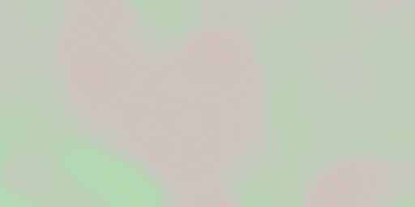
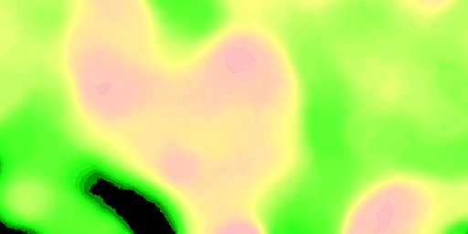
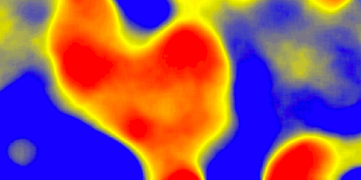
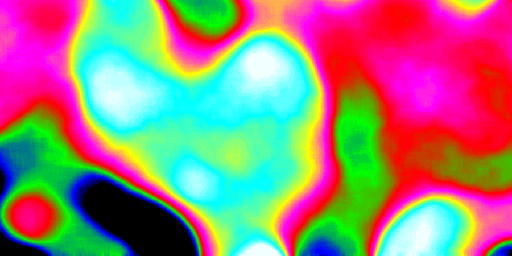

# Rasters {: #sld_cookbook_rasters }

Rasters are geographic data displayed in a grid. They are similar to image files such as PNG files, except that instead of each point containing visual information, each point contains geographic information in numerical form. Rasters can be thought of as a georeferenced table of numerical values.

One example of a raster is a Digital Elevation Model (DEM) layer, which has elevation data encoded numerically at each georeferenced data point.

!!! warning

    The code examples shown on this page are **not the full SLD code**, as they omit the SLD header and footer information for the sake of brevity. Please use the links to download the full SLD for each example.

## Example raster

The [raster layer](artifacts/sld_cookbook_raster.zip) that is used in the examples below contains elevation data for a fictional world. The data is stored in EPSG:4326 (longitude/latitude) and has a data range from 70 to 256. If rendered in grayscale, where minimum values are colored black and maximum values are colored white, the raster would look like this:


*Raster file as rendered in grayscale*

[Download the raster shapefile](artifacts/sld_cookbook_raster.zip)

## Two-color gradient {: #sld_cookbook_raster_twocolorgradient }

This example shows a two-color style with green at lower elevations and brown at higher elevations.


*Two-color gradient*

### Code

[View and download the full "Two-color gradient" SLD](artifacts/raster_twocolorgradient.sld)

``` {.xml linenos=""}
<FeatureTypeStyle>
  <Rule>
    <RasterSymbolizer>
      <ColorMap>
        <ColorMapEntry color="#008000" quantity="70" />
        <ColorMapEntry color="#663333" quantity="256" />
      </ColorMap>
    </RasterSymbolizer>
  </Rule>
</FeatureTypeStyle>
```

### Details

There is one `<Rule>` in one `<FeatureTypeStyle>` for this example, which is the simplest possible situation. All subsequent examples will share this characteristic. Styling of rasters is done via the `<RasterSymbolizer>` tag (**lines 3-8**).

This example creates a smooth gradient between two colors corresponding to two elevation values. The gradient is created via the `<ColorMap>` on **lines 4-7**. Each entry in the `<ColorMap>` represents one entry or anchor in the gradient. **Line 5** sets the lower value of 70 via the `quantity` parameter, which is styled a dark green (`#008000`). **Line 6** sets the upper value of 256 via the `quantity` parameter again, which is styled a dark brown (`#663333`). All data values in between these two quantities will be linearly interpolated: a value of 163 (the midpoint between 70 and 256) will be colored as the midpoint between the two colors (in this case approximately `#335717`, a muddy green).

## Transparent gradient

This example creates the same two-color gradient as in the [Two-color gradient](rasters.md#sld_cookbook_raster_twocolorgradient) as in the example above but makes the entire layer mostly transparent by setting a 30% opacity.


*Transparent gradient*

### Code

[View and download the full "Transparent gradient" SLD](artifacts/raster_transparentgradient.sld)

``` {.xml linenos=""}
<FeatureTypeStyle>
  <Rule>
    <RasterSymbolizer>
      <Opacity>0.3</Opacity>
      <ColorMap>
        <ColorMapEntry color="#008000" quantity="70" />
        <ColorMapEntry color="#663333" quantity="256" />
      </ColorMap>
    </RasterSymbolizer>
  </Rule>
</FeatureTypeStyle>
```

### Details

This example is similar to the [Two-color gradient](rasters.md#sld_cookbook_raster_twocolorgradient) example save for the addition of **line 4**, which sets the opacity of the layer to 0.3 (or 30% opaque). An opacity value of 1 means that the shape is drawn 100% opaque, while an opacity value of 0 means that the shape is rendered as completely transparent. The value of 0.3 means that the raster partially takes on the color and style of whatever is drawn beneath it. Since the background is white in this example, the colors generated from the `<ColorMap>` look lighter, but were the raster imposed on a dark background the resulting colors would be darker.

## Brightness and contrast

This example normalizes the color output and then increases the brightness by a factor of 2.


*Brightness and contrast*

### Code

[View and download the full "Brightness and contrast" SLD](artifacts/raster_brightnessandcontrast.sld)

``` {.xml linenos=""}
<FeatureTypeStyle>
  <Rule>
    <RasterSymbolizer>
      <ContrastEnhancement>
        <Normalize />
        <GammaValue>0.5</GammaValue>
      </ContrastEnhancement>
      <ColorMap>
        <ColorMapEntry color="#008000" quantity="70" />
        <ColorMapEntry color="#663333" quantity="256" />
      </ColorMap>
    </RasterSymbolizer>
  </Rule>
</FeatureTypeStyle>
```

### Details

This example is similar to the [Two-color gradient](rasters.md#sld_cookbook_raster_twocolorgradient), save for the addition of the `<ContrastEnhancement>` tag on **lines 4-7**. **Line 5** normalizes the output by increasing the contrast to its maximum extent. **Line 6** then adjusts the brightness by a factor of 0.5. Since values less than 1 make the output brighter, a value of 0.5 makes the output twice as bright.

As with previous examples, **lines 8-11** determine the `<ColorMap>`, with **line 9** setting the lower bound (70) to be colored dark green (`#008000`) and **line 10** setting the upper bound (256) to be colored dark brown (`#663333`).

## Three-color gradient

This example creates a three-color gradient in primary colors.


*Three-color gradient*

### Code

[View and download the full "Three-color gradient" SLD](artifacts/raster_threecolorgradient.sld)

``` {.xml linenos=""}
<FeatureTypeStyle>
  <Rule>
    <RasterSymbolizer>
      <ColorMap>
        <ColorMapEntry color="#0000FF" quantity="150" />
        <ColorMapEntry color="#FFFF00" quantity="200" />
        <ColorMapEntry color="#FF0000" quantity="250" />
      </ColorMap>
    </RasterSymbolizer>
  </Rule>
</FeatureTypeStyle>
```

### Details

This example creates a three-color gradient based on a `<ColorMap>` with three entries on **lines 4-8**: **line 5** specifies the lower bound (150) be styled in blue (`#0000FF`), **line 6** specifies an intermediate point (200) be styled in yellow (`#FFFF00`), and **line 7** specifies the upper bound (250) be styled in red (`#FF0000`).

Since our data values run between 70 and 256, some data points are not accounted for in this style. Those values below the lowest entry in the color map (the range from 70 to 149) are styled the same color as the lower bound, in this case blue. Values above the upper bound in the color map (the range from 251 to 256) are styled the same color as the upper bound, in this case red.

## Alpha channel

This example creates an "alpha channel" effect such that higher values are increasingly transparent.


*Alpha channel*

### Code

[View and download the full "Alpha channel" SLD](artifacts/raster_alphachannel.sld)

``` {.xml linenos=""}
<FeatureTypeStyle>
  <Rule>
    <RasterSymbolizer>
      <ColorMap>
        <ColorMapEntry color="#008000" quantity="70" />
        <ColorMapEntry color="#008000" quantity="256" opacity="0"/>
      </ColorMap>
    </RasterSymbolizer>
  </Rule>
</FeatureTypeStyle>
```

### Details

An alpha channel is another way of referring to variable transparency. Much like how a gradient maps values to colors, each entry in a `<ColorMap>` can have a value for opacity (with the default being 1.0 or completely opaque).

In this example, there is a `<ColorMap>` with two entries: **line 5** specifies the lower bound of 70 be colored dark green (`#008000`), while **line 6** specifies the upper bound of 256 also be colored dark green but with an opacity value of 0. This means that values of 256 will be rendered at 0% opacity (entirely transparent). Just like the gradient color, the opacity is also linearly interpolated such that a value of 163 (the midpoint between 70 and 256) is rendered at 50% opacity.

## Discrete colors

This example shows a gradient that is not linearly interpolated but instead has values mapped precisely to one of three specific colors.

!!! note

    This example leverages an SLD extension in GeoServer. Discrete colors are not part of the standard SLD 1.0 specification.


*Discrete colors*

### Code

[View and download the full "Discrete colors" SLD](artifacts/raster_discretecolors.sld)

``` {.xml linenos=""}
<FeatureTypeStyle>
  <Rule>
    <RasterSymbolizer>
      <ColorMap type="intervals">
        <ColorMapEntry color="#008000" quantity="150" />
        <ColorMapEntry color="#663333" quantity="256" />
      </ColorMap>
    </RasterSymbolizer>
  </Rule>
</FeatureTypeStyle>
```

### Details

Sometimes color bands in discrete steps are more appropriate than a color gradient. The `type="intervals"` parameter added to the `<ColorMap>` on **line 4** sets the display to output discrete colors instead of a gradient. The values in each entry correspond to the upper bound for the color band such that colors are mapped to values less than the value of one entry but greater than or equal to the next lower entry. For example, **line 5** colors all values less than 150 to dark green (`#008000`) and line 6 colors all values less than 256 but greater than or equal to 150 to dark brown (`#663333`).

## Many color gradient

This example shows a gradient interpolated across eight different colors.


*Many color gradient*

### Code

[View and download the full "Many color gradient" SLD](artifacts/raster_manycolorgradient.sld)

``` {.xml linenos=""}
<FeatureTypeStyle>
  <Rule>
    <RasterSymbolizer>
      <ColorMap>
        <ColorMapEntry color="#000000" quantity="95" />
        <ColorMapEntry color="#0000FF" quantity="110" />
        <ColorMapEntry color="#00FF00" quantity="135" />
        <ColorMapEntry color="#FF0000" quantity="160" />
        <ColorMapEntry color="#FF00FF" quantity="185" />
        <ColorMapEntry color="#FFFF00" quantity="210" />
        <ColorMapEntry color="#00FFFF" quantity="235" />
        <ColorMapEntry color="#FFFFFF" quantity="256" />
      </ColorMap>
    </RasterSymbolizer>
  </Rule>
</FeatureTypeStyle>
```

### Details

A `<ColorMap>` can include up to 255 `<ColorMapEntry>` elements. This example has eight entries (**lines 4-13**):

  ------------------ ----------------- --------------------- ---------------------
  **Entry number**   **Value**         **Color**             **RGB code**

  1                  95                Black                 `#000000`

  2                  110               Blue                  `#0000FF`

  3                  135               Green                 `#00FF00`

  4                  160               Red                   `#FF0000`

  5                  185               Purple                `#FF00FF`

  6                  210               Yellow                `#FFFF00`

  7                  235               Cyan                  `#00FFFF`

  8                  256               White                 `#FFFFFF`
  ------------------ ----------------- --------------------- ---------------------
