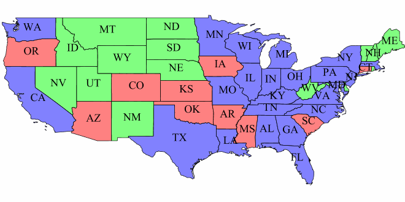
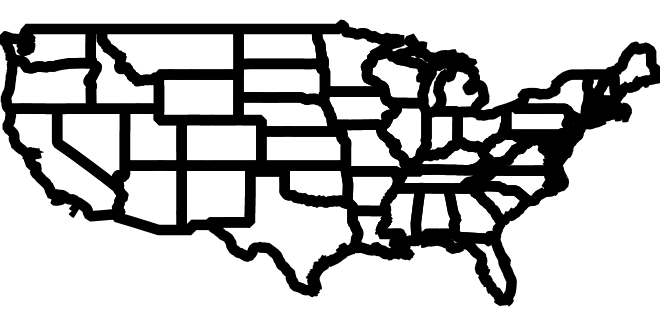
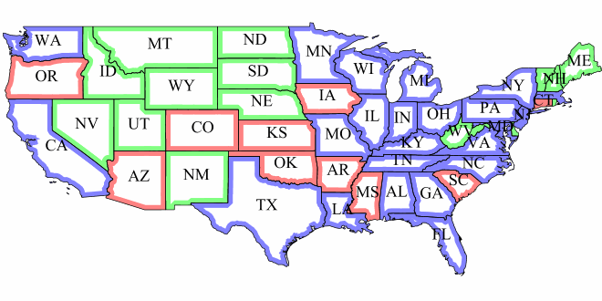
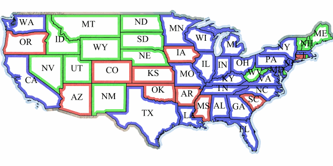
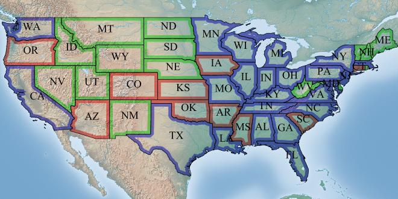
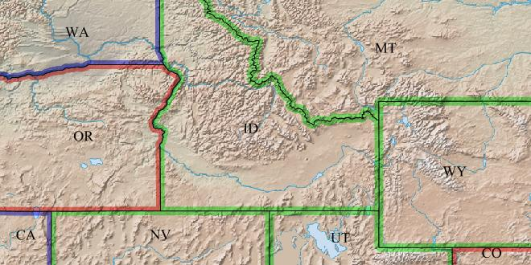

# Compositing and blending example

Let's say we want to draw the `topp:states` layer so that the polygons are not filled with the population keyed colors, but only an inner border inside the polygon should appear, leaving the internal fully transparent.

This is the destination:


*topp:states layer*

Using alpha blending, this can be achieved by creating a mask around the state borders with a thick stroke, and then using a "destination-in" alpha compositing.

This is the source (mask):


*Layer mask*

The SLD will contain three FeatureTypeStyles. The first one would be the standard rules (states colored by population) and the last one will contain the label rules. The second (middle) one is where the blending will occur:

``` xml
...
<FeatureTypeStyle>
  <!-- Usual states rules, skipped for brevity -->
</FeatureTypeStyle>
<FeatureTypeStyle>
  <Rule>
    <LineSymbolizer>
      <Stroke>
        <CssParameter name="stroke-width">10</CssParameter>
        <CssParameter name="stroke">#000000</CssParameter>
      </Stroke>
    </LineSymbolizer>
  </Rule>
  <VendorOption name="composite">destination-in</VendorOption>
</FeatureTypeStyle>
<FeatureTypeStyle>
  <!-- The label rules, skipped for brevity -->
</FeatureTypeStyle>
...
```

This is the result of the composition:



Now, if for example someone makes a WMS call in which the another layer is drawn below this one, the result will look like this:



This other background layer is hardly visible, because it has been cut by the mask. This shows the risks of using alpha compositing without care in a WMS setting.

In order to achieve the desired result no matter how the client composes the request, the first FeatureTypeStyle that draws the polygons (the states themselves) needs to be set as a *compositing base*, ensuring the mask will only be applied to it.

``` xml
<VendorOption name="composite-base">true</VendorOption>
```

The result will look like the following (though a multiply blend was added to the base to ensure a nice visual transparency effect on the border lines):





[Download the final style](files/statesblend.sld)

!!! note

    See the [full list of available modes](modes.md).
