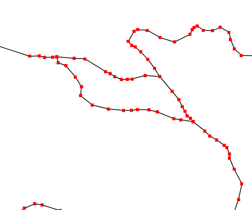
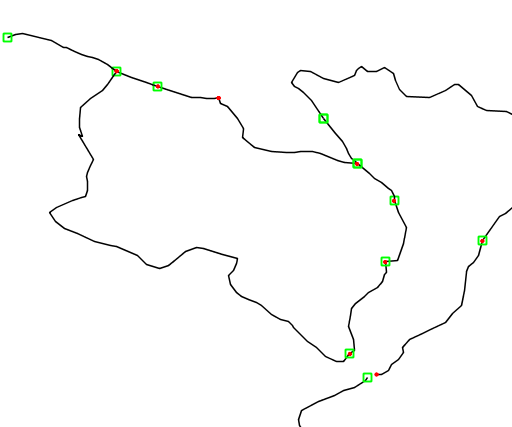
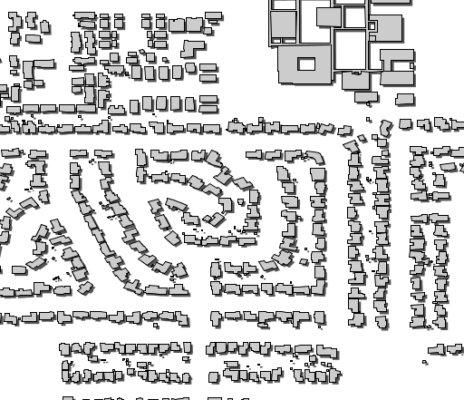

# Geometry transformations in SLD

SLD symbolizers may contain an optional `<Geometry>` element, which allows specifying which geometry attribute is to be rendered. In the common case of a featuretype with a single geometry attribute this element is usually omitted, but it is useful when a featuretype has multiple geometry-valued attributes.

SLD 1.0 requires the `<Geometry>` content to be a `<ogc:PropertyName>`. GeoServer extends this to allow a general SLD expression to be used. The expression can contain filter functions that manipulate geometries by transforming them into something different. This facility is called SLD *geometry transformations*.

GeoServer provides a number of filter functions that can transform geometry. A full list is available in the [Filter Function Reference](../../../filter/function_reference.md). They can be used to do things such as extracting line vertices or endpoints, offsetting polygons, or buffering geometries.

Geometry transformations are computed in the geometry's original coordinate reference system, before any reprojection and rescaling to the output map is performed. For this reason, transformation parameters must be expressed in the units of the geometry CRS. This must be taken into account when using geometry transformations at different screen scales, since the parameters will not change with scale.

## Examples

Let's look at some examples.

### Extracting vertices

Here is an example that allows one to extract all the vertices of a geometry, and make them visible in a map, using the `vertices` function:

``` {.xml linenos=""}
<PointSymbolizer>
  <Geometry>
    <ogc:Function name="vertices">
       <ogc:PropertyName>the_geom</ogc:PropertyName>
    </ogc:Function>
  </Geometry>
  <Graphic>
    <Mark>
      <WellKnownName>square</WellKnownName>
      <Fill>
        <CssParameter name="fill">#FF0000</CssParameter>
      </Fill>
    </Mark>
    <Size>6</Size>
  </Graphic>
</PointSymbolizer>
```

[View the full "Vertices" SLD](artifacts/vertices.sld)

Applied to the sample ``tasmania_roads`` layer this will result in:


*Extracting and showing the vertices out of a geometry*

### Start and end point

The ``startPoint`` and ``endPoint`` functions can be used to extract the start and end point of a line.

``` {.xml linenos="
<PointSymbolizer>
<Geometry>
  <ogc:Function name=\"startPoint\">
    <ogc:PropertyName>the_geom</ogc:PropertyName>
  </ogc:Function>
</Geometry>
<Graphic>
  <Mark>
    <WellKnownName>square</WellKnownName>
    <Stroke>
      <CssParameter name=\"stroke\">0x00FF00</CssParameter>
      <CssParameter name=\"stroke-width\">1.5</CssParameter>
    </Stroke>
  </Mark>
  <Size>8</Size>
</Graphic>
</PointSymbolizer>
<PointSymbolizer>
 <Geometry>
   <ogc:Function name=\"endPoint\">
     <ogc:PropertyName>the_geom</ogc:PropertyName>
   </ogc:Function>
 </Geometry>
 <Graphic>
   <Mark>
     <WellKnownName>circle</WellKnownName>
     <Fill>
        <CssParameter name=\"fill\">0xFF0000</CssParameter>
     </Fill>
   </Mark>
   <Size>4</Size>
 </Graphic>
</PointSymbolizer>"}
```

[View the full "StartEnd" SLD](artifacts/startend.sld)

Applied to the sample ``tasmania_roads`` layer this will result in:


*Extracting start and end point of a line*

### Drop shadow

The ``offset`` function can be used to create drop shadow effects below polygons. Notice that the offset values reflect the fact that the data used in the example is in a geographic coordinate system.

``` {.xml linenos=""}
<PolygonSymbolizer>
  <Geometry>
     <ogc:Function name="offset">
        <ogc:PropertyName>the_geom</ogc:PropertyName>
        <ogc:Literal>0.00004</ogc:Literal>
        <ogc:Literal>-0.00004</ogc:Literal>
     </ogc:Function>
  </Geometry>
  <Fill>
    <CssParameter name="fill">#555555</CssParameter>
  </Fill>
</PolygonSymbolizer>
```

[View the full "Shadow" SLD](artifacts/shadow.sld)

Applied to the sample ``tasmania_roads`` layer this will result in:


*Dropping building shadows*

## Performance tips

GeoServer's filter functions contain a number of set-related or constructive geometric functions, such as `buffer`, `intersection`, `difference` and others. These can be used as geometry transformations, but they be can quite heavy in terms of CPU consumption so it is advisable to use them with care. One strategy is to activate them only at higher zoom levels, so that fewer features are processed.

Buffering can often be visually approximated by using very large strokes together with round line joins and line caps. This avoids incurring the performance cost of a true geometric buffer transformation.

## Adding new transformations

Additional filter functions can be developed in Java and then deployed in a JAR file as a GeoServer plugin. A guide is not available at this time, but see the GeoTools `main` module for examples.
