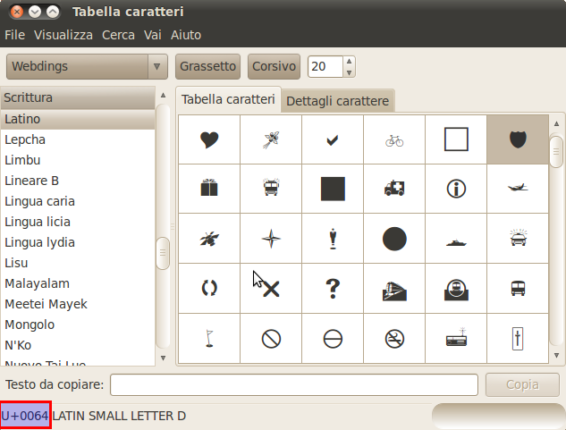
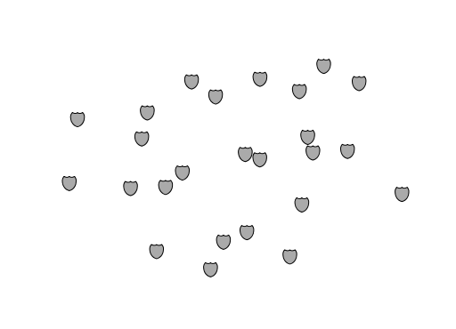

# Graphic symbology in GeoServer

Graphic symbology is supported via the SLD `<Graphic>` element. This element can appear in several contexts in SLD:

-   in a [PointSymbolizer](../reference/pointsymbolizer.md), to display symbols at points
-   in the `<Stroke>/<GraphicStroke>` element of a [LineSymbolizer](../reference/linesymbolizer.md) and [PolygonSymbolizer](../reference/polygonsymbolizer.md), to display repeated symbols along lines and polygon boundaries.
-   in the `<Stroke>/<GraphicFill>` element of a [LineSymbolizer](../reference/linesymbolizer.md) and [PolygonSymbolizer](../reference/polygonsymbolizer.md), to fill lines and polygon boundaries with tiled symbols.
-   in the `<Fill>/<GraphicFill>` element of a [PolygonSymbolizer](../reference/polygonsymbolizer.md), to fill polygons with tiled symbols (stippling).
-   in a [TextSymbolizer](../reference/textsymbolizer.md) to display a graphic behind or instead of text labels (this is a GeoServer extension).

`<Graphic>` contains either a `<Mark>` or an `<ExternalGraphic>` element. **Marks** are pure vector symbols whose geometry is predefined but with stroke and fill defined in the SLD itself. **External Graphics** are external files (such as PNG images or SVG graphics) that contain the shape and color information defining how to render a symbol.

In standard SLD the `<Mark>` and `<ExternalGraphic>` names are fixed strings. GeoServer extends this by providing `rs`, which allow computing symbol names on a per-feature basis by embedding CQL expressions in them.

## Marks

GeoServer supports the standard SLD `<Mark>` symbols, a user-expandable set of extended symbols, and also TrueType Font glyphs. The symbol names are specified in the `<WellKnownName>` element.

See also the [PointSymbolizer](../reference/pointsymbolizer.md) reference for further details, as well as the examples in the [Points](../cookbook/points.md) Cookbook section.

### Standard symbols

The SLD specification mandates the support of the following symbols:

  -------------- -----------------------------------------------------------------
  **Name**       **Description**

  `square`       A square

  `circle`       A circle

  `triangle`     A triangle pointing up

  `star`         five-pointed star

  `cross`        A square cross with space around (not suitable for hatch fills)

  `x`            A square X with space around (not suitable for hatch fills)
  -------------- -----------------------------------------------------------------

### Shape symbols

The shape symbols set adds extra symbols that are not part of the basic set.

1.  To enable ensure that the WMS Settings ****Mark Factory Precedence`has`ShapeMarkFactory`` selected.

2.  The shape symbols are prefixed by `shape://`

      --------------------- -----------------------------------------------------------------------------------------------------
      **Name**              **Description**

      `shape://vertline`    A vertical line (suitable for hatch fills or to make railroad symbols)

      `shape://horline`     A horizontal line (suitable for hatch fills)

      `shape://slash`       A diagonal line leaning forwards like the "slash" keyboard symbol (suitable for diagonal hatches)

      `shape://backslash`   Same as `shape://slash`, but oriented in the opposite direction

      `shape://dot`         A very small circle with space around

      `shape://plus`        A + symbol, without space around (suitable for cross-hatch fills)

      `shape://times`       A "X" symbol, without space around (suitable for cross-hatch fills)

      `shape://oarrow`      An open arrow symbol (triangle without one side, suitable for placing arrows at the end of lines)

      `shape://carrow`      A closed arrow symbol (closed triangle, suitable for placing arrows at the end of lines)
      --------------------- -----------------------------------------------------------------------------------------------------

### Weather Symbols

The weather symbols are prefixed by the `extshape://` protocol in the SLD:

1.  To enable ensure that the WMS Settings ****Mark Factory Precedence`has`MeteoMarkFactory`` selected.

2.  These symbols are:

      -------------------------------- ------------------ ----------------------------------------------------
      **Name**                         **Description**    **Produces**

      `extshape://triangle`            cold front         

      `extshape://emicircle`           warm front         

      `extshape://triangleemicircle`   stationary front   
      -------------------------------- ------------------ ----------------------------------------------------

3.  You can use `extshape://` for a few additional built-in shapes:

      --------------------- --------------------------------------------------------
      `extshape://narrow`   North Arrow

      `extshape://sarrow`   South Arrow
      --------------------- --------------------------------------------------------

More complex symbols like Wind Barbs can be created with the `windbarbs://` prefix.

1.  To enable ensure that the WMS Settings ****Mark Factory Precedence`has`WindBarbsmFactory`` selected.

2.  There are some examples:

      -------------------------------------------- ----------------------------------------------------------------------------
      **Name**                                     **Description**

      `windbarbs://default(15)[kts]`               *15* wind intensity with *[kts]* unit of measure

      `windbarbs://default(9)[m/s]?hemisphere=s`   *9* wind intensity with *[m/s]* unit of measure, in the south hemisphere
      -------------------------------------------- ----------------------------------------------------------------------------

### Custom WKT Shapes

Custom shapes can be defined using your own Geometry, to enable use WMS Settings ****Mark Factory Precedence`to select`WKTMarkFactory`.  Geometry is defined using the same well-known-text format used for CQL_FILTER.  .. code-block:: xml     <LineSymbolizer>      <Stroke>        <GraphicStroke>          <Graphic>            <Mark>              <WellKnownName>wkt://MULTILINESTRING((-0.25 -0.25, -0.125 -0.25), (0.125 -0.25, 0.25 -0.25), (-0.25 0.25, -0.125 0.25), (0.125 0.25, 0.25 0.25))</WellKnownName>              <Fill>                <CssParameter name="fill">#0000ff</CssParameter>              </Fill>              <Stroke>                <CssParameter name="stroke">#0000ff</CssParameter>                <CssParameter name="stroke-width">1</CssParameter>              </Stroke>            </Mark>            <Size>6</Size>          </Graphic>        </GraphicStroke>      </Stroke>    </LineSymbolizer>  Which produces double dashed line:  .. image:: images/double-dashed-line.png  You can also make use of curves when defining WKT:  .. code-block:: xml      <LineSymbolizer>       <Stroke>         <GraphicStroke>           <Graphic>             <Mark>               <WellKnownName>wkt://COMPOUNDCURVE((0 0, 0.25 0), CIRCULARSTRING(0.25 0, 0.5 0.5, 0.75 0), (0.75 0, 1 0))</WellKnownName>               <Fill>                 <CssParameter name="fill">#0000ff</CssParameter>               </Fill>               <Stroke>                 <CssParameter name="stroke">#0000ff</CssParameter>                 <CssParameter name="stroke-width">1</CssParameter>               </Stroke>             </Mark>             <Size>10</Size>           </Graphic>         </GraphicStroke>       </Stroke>     </LineSymbolizer>  Producing an "emi circle" line:  .. image:: images/emicircle-line.png  Bulk TTF marks ~~~~~~~~~~~~~~  It is possible to create a mark using glyphs from any decorative or symbolic True Type Font, such as Wingdings, WebDings, or the many symbol fonts available on the internet. To enable use WMS Settings ****Mark Factory Precedence` to select `TTFMarkFactory`.

The syntax for specifying this is:

    ttf://<fontname>#<hexcode>

where `fontname` is the full name of a TTF font available to GeoServer, and `hexcode` is the hexadecimal code of the symbol. To get the hex code of a symbol, use the "Char Map" utility available in most operating systems (Windows and Linux Gnome both have one).

For example, to use the "shield" symbol contained in the WebDings font, the Gnome `charmap` reports the symbol hex code as shown:


*Selecting a symbol hex code in the Gnome char map*

The SLD to use the shield glyph as a symbol is:

``` {.xml linenos=""}
<PointSymbolizer>
    <Graphic>
      <Mark>
        <WellKnownName>ttf://Webdings#0x0064</WellKnownName>
        <Fill>
          <CssParameter name="fill">#AAAAAA</CssParameter>
        </Fill>
        <Stroke/>
      </Mark>
    <Size>16</Size>
  </Graphic>
</PointSymbolizer>
```

This results in the following map display:


*Shield symbols rendered on the map*

### Extending the Mark subsystem using Java

The Mark subsystem is user-extensible. To do this using Java code, implement the `MarkFactory` interface and declare the implementation in the `META-INF/services/org.geotools.renderer.style.MarkFactory` file.

For further information see the Javadoc of the GeoTools [MarkFactory](https://github.com/geotools/geotools/blob/main/modules/library/render/src/main/java/org/geotools/renderer/style/MarkFactory.java), along with the following example code:

> -   The [factory SPI registration file](https://github.com/geotools/geotools/blob/main/modules/library/render/src/main/resources/META-INF/services/org.geotools.renderer.style.MarkFactory)
> -   The [TTFMarkFactory](https://github.com/geotools/geotools/blob/main/modules/library/render/src/main/java/org/geotools/renderer/style/TTFMarkFactory.java) implementation
> -   The [ShapeMarkFactory](https://github.com/geotools/geotools/blob/main/modules/library/render/src/main/java/org/geotools/renderer/style/ShapeMarkFactory.java) implementation

## External Graphics

`<ExternalGraphic>` is the other way to define point symbology. Unlike marks, external graphics are used as-is, so the specification is somewhat simpler. The element content specifies a graphic `<OnlineResource>` using a URL or file path, and the graphic `<Format>` using a MIME type:

``` {.xml linenos=""}
<PointSymbolizer>
    <Graphic>
       <ExternalGraphic>
          <OnlineResource xlink:type="simple" xlink:href="http://mywebsite.com/pointsymbol.png" />
          <Format>image/png</Format>
       </ExternalGraphic>
    </Graphic>
</PointSymbolizer>
```

As with `<Mark>`, a `<Size>` element can be optionally specified. When using images as graphic symbols it is better to avoid resizing, as that may blur their appearance. Use images at their native resolution by omitting the `<Size>` element. In contrast, for SVG graphics specifying a `<Size>` is recommended. SVG files are a vector-based format describing both shape and color, so they scale cleanly to any size.

If the path of the symbol file is relative, the file is looked for under `$GEOSERVER_DATA_DIR/styles`. For example:

``` {.xml linenos=""}
<PointSymbolizer>
  <Graphic>
    <ExternalGraphic>
      <OnlineResource xlink:type="simple" xlink:href="burg02.svg" />
      <Format>image/svg+xml</Format>
    </ExternalGraphic>
    <Size>20</Size>
  </Graphic>
</PointSymbolizer>
```

In this example an SVG graphic is being used, so the size is specified explicitly.

### SVG Parameters

GeoServer can handle SVG images in which parts of the SVG-attributes are named parameters, as outlined the [SVG Parameters 1.0 specification](https://www.w3.org/TR/SVGParamPrimer/). This capability is also supported by [QGIS](http://qgis.org).

SVG Parameters are represented in a file like: [poi_peak.svg](https://github.com/qgis/QGIS/blob/master/images/svg/symbol/poi_peak.svg) as:

``` xml
<svg enable-background="new 0 0 580 580" height="580" viewBox="0 0 580 580" width="580" xmlns="http://www.w3.org/2000/svg">
<path d="m290.565 67.281l-255.498 442.534-1.087 1.885 511.229.393 2.18.002z" fill="param(fill)" 
 fill-opacity="param(fill-opacity)" stroke="param(outline)" stroke-opacity="param(outline-opacity)" stroke-width="param(outline-width)"/>
</svg>
```

The 'param'-constructs mean that you can define the parameters: `ll`, ``fill-opacity``, `ne`, ``outline-opacity`` and ``outline-width`` as part of an SVG URL reference, where a reference to this image with red fill would be: `poi_peak.svg?fill=#FF0000`.

Note: When editng **`SVG`** files (e.g. in Inkscape) save using 'simple svg' format.

Default behaviour:

-   OnlineResource `ef` URI without any parameters.

    ``` xml
    <se:OnlineResource xlink:href="poi_peak.svg" xlink:type="simple"/>
    ```

-   Displays **`poi_peak.svg`** with the default black `ll`.

    
    *SVG image with default black fill*

Using ``#ff000`` red parameter:

-   OnlineResource `ef` URI with parameter:

    ``` xml
    <se:OnlineResource xlink:href="poi_peak.svg?fill=#ff0000" xlink:type="simple"/>
    ```

-   Displays **`poi_peak.svg`** with supplied red `ll`.

    
    *SVG image with fill provided by parameter*

To define several parameters, the query-parameters should be url-encoded.

-   A green peak with 25% opacity: ``?fill=#00ff00&opacity=0.25``, requires encoding both the '#' ( `%23` ) and the '&' ( `&amp;` ) signs:

    ``` xml
    <se:OnlineResource xlink:href="poi_peak.svg?fill=%2300ff00&amp;opacity=0.25" xlink:type="simple"/>
    ```

-   Displayed with white fill, red outlined peaks:

    
    *SVG image with fill and outline provided by parameters*

Parameters names are defined by the SVG file:

-   The parameter 'stroke' above is called 'outline' in the original **`svg`** file:

    ``` xml
    stroke="param(outline)"
    ```

-   OnlineResource `ef` URI referencing parameters `ll`, `ne` and `outline-width`:

    ``` xml
    <se:OnlineResource xlink:href="poi_peak.svg?fill=%23ffffff&amp;outline=%23ff0000&amp;outline-width=5" xlink:type="simple"/>
    ```

-   Displayed as:

    
    *SVG image with fill*

The use of SVG parameters can be combinded with dynamic symbolizers (covered below) to supply SVG parameter values based on feature attribute data and expressions.

-   OnlineResource `ef` URI referencing SVG Parameter with dynamic CQL expression:

    ``` xml
    <se:OnlineResource xlink:href="poi_peak.svg?fill=${COLOR}" xlink:type="simple"/>
    ```

-   Display depends on the feature attribute `OR`.

### Bulk WKT Shapes

It is possible to create a symbol set of your own custom marks using a property file.

Here is an **`example.properties`**:

``` text
zig=LINESTRING(0.0 0.25, 0.25 0.25, 0.5 0.75, 0.75 0.25, 1.00 0.25)
block=POLYGON((0 0, 1 0, 1 1, 0 1, 0 0))
```

The SLD to use the symbols defined in **`example.properties`** is:

``` {.xml linenos=""}
<PointSymbolizer>
  <Graphic>
    <ExternalGraphic>
      <OnlineResource 
        xlink:type="simple"
        xlink:href="example.properties#zig" />
      <Format>wkt</Format>
    </ExternalGraphic>
    <Size>20</Size>
  </Graphic>
</PointSymbolizer>
```

### Symbol Positioning

Graphic symbols are rendered so that the center of the graphic extent lies on the placement point (or points, in the case of repeated or tiled graphics). If it is desired to have a graphic offset from a point (such as a symbol which acts as a pointer) it is necessary to offset the visible portion of the graphic within the overall extent. For images this can be accomplished by extending the image with transparent pixels. For SVG graphics this can be done by surrounding the shape with an invisible rectangle with the desired relative position.

## Dynamic symbolizers

In standard SLD, the `Mark/WellKnowName` element and the `ExternalGraphic/OnlineResource/@xlink:href` attribute are fixed strings. This means they have the same value for all rendered features. When the symbols to be displayed vary depending on feature attributes this restriction leads to very verbose styling, as a separate `Rule` and `Symbolizer` must be used for each different symbol.

GeoServer improves this by allowing `CQL expressions<filter_ecql_reference>`{.interpreted-text role="ref"} to be embedded inside the content of both `WellKnownName` and `OnlineResource/@xlink:href`. When the names of the symbols can be derived from the feature attribute values, this provides much more compact styling. CQL expressions can be embedded in a `<WellKnownName>` content string or an `<OnlineResource>` `xlink:href` attribute by using the syntax:

    ${<cql expression>}

!!! note

    Currently `xlink:href` strings must be valid URLs *before* expression expansion is performed. This means that the URL cannot be completely provided by an expression. The `xlink:href` string must explicitly include at least the prefix `http://`

The simplest form of expression is a single attribute name, such as `${STATE_ABBR}`. For example, suppose we want to display the flags of the US states using symbols whose file names match the state name. The following style specifies the flag symbols using a single rule:

``` {.xml linenos=""}
<ExternalGraphic>
   <OnlineResource xlink:type="simple" 
                   xlink:href="http://mysite.com/tn_${STATE_ABBR}.jpg"/>
   <Format>image/jpeg</Format>
</ExternalGraphic>
```

If manipulation of the attribute values is required a full CQL expression can be specified. For example, if the values in the `STATE_ABBR` attribute are uppercase but the URL requires a lowercase name, the CQL `strToLowerCase` function can be used:

``` {.xml linenos=""}
<ExternalGraphic>
   <OnlineResource xlink:type="simple"
            xlink:href="http://mysite.com/tn_${strToLowerCase(STATE_ABBR)}.jpg" />
   <Format>image/jpeg</Format>
</ExternalGraphic>
```
