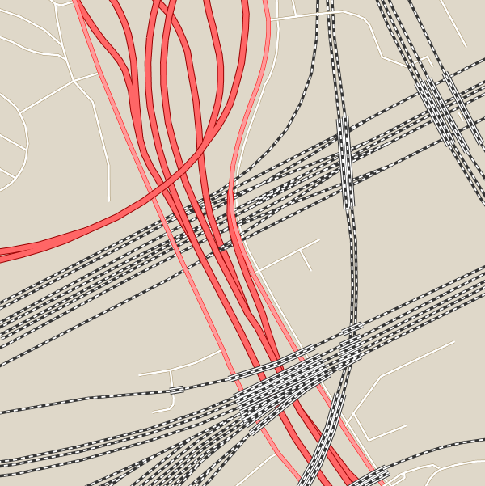

# Z ordering single layer example {: #sld-extensions_z_ordering_example }

The OpenStreetMap dataset uses extensively a `z_order` attribute to model the above/below relationships between elements in the real world.

A [small downloadable shapefile](files/z_order_roads.zip) is provided that shows a small area with a rich set of different z-orders, where roads and rails go above and below each other. For reference, this is the dataset schema:

  -----------------------------------------------------------------------------------------------------------------
  Name           Type           Notes
  -------------- -------------- -----------------------------------------------------------------------------------
  osm_id         numeric        

  type           string         The type of the segment, can be "mainroads", "minorroads", "railways", \...

  bridge         numeric        0 or 1

  ref            numeric        0 or 1

  tunnel         numeric        

  oneway         numeric        0 or 1

  z_order        numeric        

  class          string         
  -----------------------------------------------------------------------------------------------------------------

The dataset contains several different values for z_order, in particular: -10, -7, -5, -3, -1, 0, 3, 4, 5, 7, 9, 10, 13, 14, 15, 17, 19.

Here is a sample CSS style using z-ordering, but not groups, to perform the display. Road casing is achieved by multiple FeatureTypeStyle, or `z-index` values in CSS:

``` css
[class = 'railways' and bridge = 1] {
  stroke: #333333;
  stroke-width: 8;
  z-index: 0;
}

[class = 'minorroads'] {
  stroke: #a69269;
  stroke-width: 3;
  z-index: 0;
}

[class = 'mainroads'] {
  stroke: #ff0000;
  stroke-width: 5;
  z-index: 0;
}

[class = 'motorways'] {
  stroke: #990000;
  stroke-width: 8;
  z-index: 0;
}

[class = 'railways' and bridge = 1] {
  stroke: #ffffff;
  stroke-width: 6;
  z-index: 1;
}

[class = 'railways'] {
  stroke: #333333;
  stroke-width: 3;
  z-index: 2;
}

[class = 'railways'] {
  stroke: #ffffff;
  stroke-width: 1.5;
  stroke-dasharray: 5, 5;
  z-index: 3;
}

[class = 'motorways'] {
  stroke: #ff6666;
  stroke-width: 6;
  stroke-linecap: round;
  z-index: 3;
}

[class = 'minorroads'] {
  stroke: #ffffff;
  stroke-width: 2,5;
  stroke-linecap: round;
  z-index: 3;
}

[class = 'mainroads'] {
  stroke: #ff9999;
  stroke-width: 4;
  stroke-linecap: round;
  z-index: 3;
}

* {
 sort-by: "z_order";
}
```

The sorting is achieved by using the `sort-by` property, which translates into a `sortBy` VendorOption in SLD. A full equivalent SLD is [available for download](files/roads_no_groups.sld).

This is the resulting map:


As one can see, there are evident issues:

> -   Roads and rails are not showing any evident z-ordering, in fact, all rails are below roads, but their dashed white center shows a mix of below and above roads
> -   The rails bridges (depicted with a third thicker line around the rail symbol) are consistently below some other road or rail, while they should be above.

This is mostly happening because the various FeatureTypeStyle elements are not put doctor in a single group.

A slight change in the CSS, grouping all levels in the same sortByGroup, solves the issues above:

``` css
[class = 'railways' and bridge = 1] {
  stroke: #333333;
  stroke-width: 8;
  z-index: 0;
}

[class = 'minorroads'] {
  stroke: #a69269;
  stroke-width: 3;
  z-index: 0;
}

[class = 'mainroads'] {
  stroke: #ff0000;
  stroke-width: 5;
  z-index: 0;
}

[class = 'motorways'] {
  stroke: #990000;
  stroke-width: 8;
  z-index: 0;
}

[class = 'railways' and bridge = 1] {
  stroke: #ffffff;
  stroke-width: 6;
  z-index: 1;
}

[class = 'railways'] {
  stroke: #333333;
  stroke-width: 3;
  z-index: 2;
}

[class = 'railways'] {
  stroke: #ffffff;
  stroke-width: 1.5;
  stroke-dasharray: 5, 5;
  z-index: 3;
}

[class = 'motorways'] {
  stroke: #ff6666;
  stroke-width: 6;
  stroke-linecap: round;
  z-index: 3;
}

[class = 'minorroads'] {
  stroke: #ffffff;
  stroke-width: 2,5;
  stroke-linecap: round;
  z-index: 3;
}

[class = 'mainroads'] {
  stroke: #ff9999;
  stroke-width: 4;
  stroke-linecap: round;
  z-index: 3;
}

* {
 sort-by: "z_order";
 sort-by-group: "roadsGroup";
}
```

A full equivalent SLD is also [available for download](files/roads_groups.sld).

The result now shows proper z-ordering:


