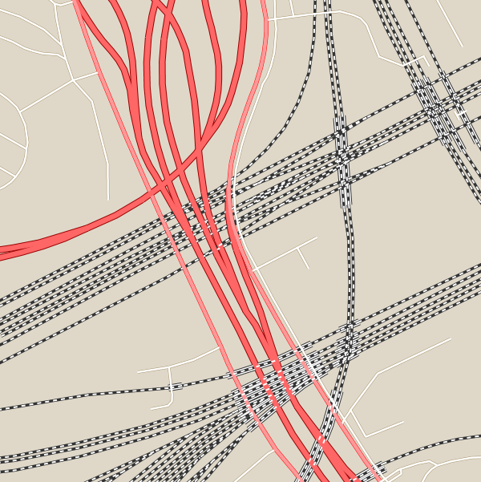

# Enabling z-ordering in a single FeatureTypeStyle

The z-ordering is implemented as a new FeatureTypeStyle vendor option, `sortBy`, which controls in which order the features are extracted from the data source, and thus painted. The `sortBy` syntax is the same as the WFS one, that is, a list of comma separated field names, with an optional direction modifier (ascending being the default):

    field1 [A|D], field2 [A|D], ... , fieldN [A|D]

Some examples:

> -   "z": sorts the features based on the `z` field, ascending (lower z values are painted first, higher later)
> -   "cat,z D": sorts the features on the `cat` attribute, with ascending order, and for those that have the same `cat` value, the sorting is on descending `z`
> -   "cat D,z D": sorts the features on the `cat` attribute, with descending order, and for those that have the same `cat` value, the sorting is on descending `z`

So, if we wanted to order features based on a single "elevation" attribute we'd be using the following SLD snippet:

``` xml
...
<sld:FeatureTypeStyle>
  <sld:Rule>
    ...
    <!-- filters and symbolizers here -->
    ...
  </sld:Rule>
  <sld:VendorOption name="sortBy">elevation</sld:VendorOption>
</sld:FeatureTypeStyle>
...
```

## z-ordering across FeatureTypeStyle

It is a common need to perform road casing against a complex road network, which can have its own z-ordering needs (e.g., over and under passes). Casing is normally achieved by using two separate two `FeatureTypeStyle`, one drawing a thick line, one drawing a thin one.

Let's consider a simple data set, made of just three roads:

    _=geom:LineString:404000,z:int
    Line.1=LINESTRING(0 4, 10 4)|1
    Line.2=LINESTRING(0 6, 10 6)|3
    Line.3=LINESTRING(7 0, 7 10)|1

Adding a "sortBy" rule to both `FeatureTypeStyle` objects will achieve no visible result:

``` xml
<?xml version="1.0" encoding="ISO-8859-1"?>
<StyledLayerDescriptor version="1.0.0"
  xsi:schemaLocation="http://www.opengis.net/sld StyledLayerDescriptor.xsd"
  xmlns="http://www.opengis.net/sld" xmlns:ogc="http://www.opengis.net/ogc"
  xmlns:xlink="http://www.w3.org/1999/xlink" xmlns:xsi="http://www.w3.org/2001/XMLSchema-instance">
  <!-- a named layer is the basic building block of an sld document -->

  <NamedLayer>
    <UserStyle>
      <FeatureTypeStyle>
        <Rule>
          <LineSymbolizer>
            <Stroke>
              <CssParameter name="stroke">#FF0000</CssParameter>
              <CssParameter name="stroke-width">8</CssParameter>
            </Stroke>
          </LineSymbolizer>
        </Rule>
        <sld:VendorOption name="sortBy">z</sld:VendorOption>
      </FeatureTypeStyle>
      <FeatureTypeStyle>
        <Rule>
          <LineSymbolizer>
            <Stroke>
              <CssParameter name="stroke">#FFFFFF</CssParameter>
              <CssParameter name="stroke-width">6</CssParameter>
            </Stroke>
          </LineSymbolizer>
        </Rule>
        <sld:VendorOption name="sortBy">z</sld:VendorOption>
      </FeatureTypeStyle>
    </UserStyle>
  </NamedLayer>
</StyledLayerDescriptor>
```

The result will be the following:



This is happening because while the roads are loaded in the right order, `Line.1,Line.3,Line.2`, they are all painted with the tick link first, and then the code will start over, and paint them all with the thin line.

In order to get both casing and z-ordering to work a new vendor option, `sortByGroup`, needs to be added to both `FeatureTypeStyle`, grouping them in a single z-ordering paint.

``` xml
<?xml version="1.0" encoding="ISO-8859-1"?>
<StyledLayerDescriptor version="1.0.0"
  xsi:schemaLocation="http://www.opengis.net/sld StyledLayerDescriptor.xsd"
  xmlns="http://www.opengis.net/sld" xmlns:ogc="http://www.opengis.net/ogc"
  xmlns:xlink="http://www.w3.org/1999/xlink" xmlns:xsi="http://www.w3.org/2001/XMLSchema-instance">
  <!-- a named layer is the basic building block of an sld document -->

  <NamedLayer>
    <UserStyle>
      <FeatureTypeStyle>
        <Rule>
          <LineSymbolizer>
            <Stroke>
              <CssParameter name="stroke">#FF0000</CssParameter>
              <CssParameter name="stroke-width">8</CssParameter>
            </Stroke>
          </LineSymbolizer>
        </Rule>
        <sld:VendorOption name="sortBy">z</sld:VendorOption>
        <sld:VendorOption name="sortByGroup">roads</sld:VendorOption>
      </FeatureTypeStyle>
      <FeatureTypeStyle>
        <Rule>
          <LineSymbolizer>
            <Stroke>
              <CssParameter name="stroke">#FFFFFF</CssParameter>
              <CssParameter name="stroke-width">6</CssParameter>
            </Stroke>
          </LineSymbolizer>
        </Rule>
        <sld:VendorOption name="sortBy">z</sld:VendorOption>
        <sld:VendorOption name="sortByGroup">roads</sld:VendorOption>
      </FeatureTypeStyle>
    </UserStyle>
  </NamedLayer>
</StyledLayerDescriptor>
```

The result will be the following:


When grouping is used, the code will first paint `Line.1,Line3` with the thick line, then track back and paint them with the thin line, then move to paint `Line.2` with the thick line, and finally `Line.2` with the thin line, achieving the desired result.

## z-ordering across layers

Different layers, such for example roads and rails, can have their features z-ordered together by putting all the `FeatureTypeStyle` in their styles in the same `sortByGroup`, provided the following conditions are met:

> -   The layers are side by side in the WMS request/layer group. In other words, the z-ordering allows to break the WMS specified order only if the layers are directly subsequent in the request. This can be extended to any number of layers, provided the progression of `FeatureTypeStyle` in the same group is not broken
> -   There is no FeatureTypeStyle in the layer style that's breaking the sequence

Let's consider an example, with a rails layer having two `FeatureTypeStyle`, one with a group, the other not:

| FeatureTypeStyle id | SortByGroup id |
|---------------------|----------------|
| rails1              | linework       |
| rails2              | `none`         |

We then have a roads layer with two `FeatureTypeStyle`, both in the same group:

| FeatureTypeStyle id | SortByGroup id |
|---------------------|----------------|
| road1               | linework       |
| road2               | linework       |

If the WMS request asks for `&layers=roads,rails`, then the expanded `FeatureTypeStyle` list will be:

| FeatureTypeStyle id | SortByGroup id |
|---------------------|----------------|
| road1               | linework       |
| road2               | linework       |
| rails1              | linework       |
| rails2              | `none`         |

As a result, the `road1,road2,rails1` will form a single group, and this will result in the rails be merged with the roads when z-ordering.

If instead the WMS request asks for ``&layers=rails,roads````, then the expanded ````FeatureTypeStyle``\` list will be:

| FeatureTypeStyle id | SortByGroup id |
|---------------------|----------------|
| rails1              | linework       |
| rails2              | `none`         |
| road1               | linework       |
| road2               | linework       |

The `rails2` feature type style breaks the sequence, as a result, the rails will not be z-ordered in the same group as the roads.
