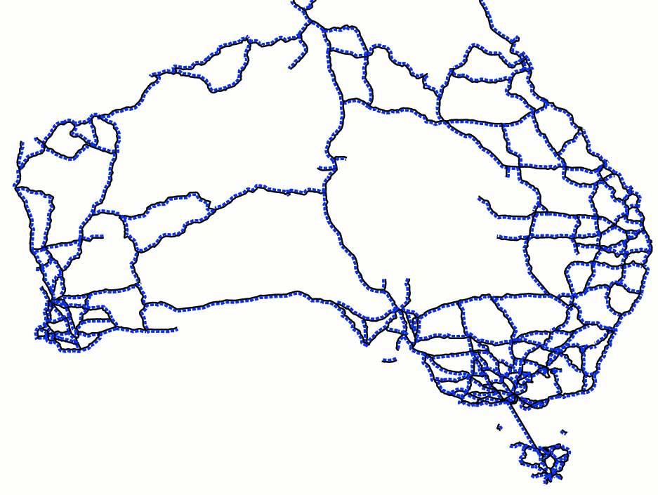
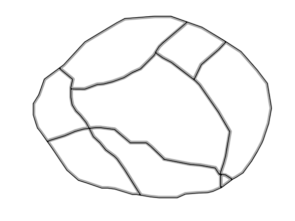

# LineSymbolizer

A **LineSymbolizer** styles features as **lines**. Lines are one-dimensional geometries that have both position and length. Each line is comprised of one or more **line segments**, and has either two **ends** or none (if it is closed).

## Syntax

A `<LineSymbolizer>` contains an optional `<Geometry>` element, and a required `<Stroke>` element specifying the line symbology.

**Tag**

:   **Required?**

    **Description**

`<Geometry>`

:   No

    Specifies the geometry to be rendered.

`<Stroke>`

:   Yes

    Specifies the styling for the line.

`<PerpendicularOffset>`

:   No

    Specifies the perpendicular offset for the current line

### Geometry

The `<Geometry>` element is optional. If present, it specifies the featuretype property from which to obtain the geometry to style using the `PropertyName` element. See also [Geometry transformations in SLD](../extensions/geometry-transformations.md) for GeoServer extensions for specifying geometry.

Any kind of geometry may be styled with a `<LineSymbolizer>`. Point geometries are treated as lines of zero length, with a horizontal orientation. For polygonal geometries the boundary (or boundaries) are used as the lines, each line being a closed ring with no ends.

### Stroke {: #sld_reference_stroke }

The `<Stroke>` element specifies the styling of a line. There are three elements that can be included inside the `<Stroke>` element.

**Tag**

:   **Required?**

    **Description**

`<GraphicFill>`

:   No

    Renders the pixels of the line with a repeated pattern.

`<GraphicStroke>`

:   No

    Renders the line with a repeated linear graphic.

`<CssParameter>`

:   0..N

    Determines the stroke styling parameters.

### GraphicFill

The `<GraphicFill>` element specifies that the pixels of the line are to be filled with a repeating graphic image or symbol. The graphic is specified by a `<Graphic>` sub-element, which is described in the `PointSymbolizer` [Graphic](pointsymbolizer.md#sld_reference_graphic) section.

### GraphicStroke {: #sld_reference_linesymbolizer_graphicstroke }

The `<GraphicStroke>` element specifies the line is to be drawn using a repeated graphic image or symbol following the line. The graphic is specified by a `<Graphic>` sub-element, which is described in the `PointSymbolizer` [Graphic](pointsymbolizer.md#sld_reference_graphic) section.

The spacing of the graphic symbol can be specified using the `<Size>` element in the `<Graphic>` element, or the `<CSSParameter name="stroke-dasharray">` in the `Stroke` element.

### CssParameter {: #sld_reference_linesymbolizer_css }

The `<CssParameter>` elements describe the basic styling of the line. Any number of `<CssParameter>` elements can be specified.

The `name` **attribute** indicates what aspect of styling an element specifies, using the standard CSS/SVG styling model. The **content** of the element supplies the value of the styling parameter. The value may contain [expressions](pointsymbolizer.md#sld_reference_parameter_expressions).

The following parameters are supported:

|                            |               |                                                                                                                                                                                                                                                                                                                                                                                                                                                                                |
|----------------------------|---------------|--------------------------------------------------------------------------------------------------------------------------------------------------------------------------------------------------------------------------------------------------------------------------------------------------------------------------------------------------------------------------------------------------------------------------------------------------------------------------------|
| **Parameter**              | **Required?** | **Description**                                                                                                                                                                                                                                                                                                                                                                                                                                                                |
| `name="stroke"`            | No            | Specifies the solid color given to the line, in the form `#RRGGBB`. Default is black (`#000000`).                                                                                                                                                                                                                                                                                                                                                                              |
| `name="stroke-width"`      | No            | Specifies the width of the line in pixels. Default is `1`.                                                                                                                                                                                                                                                                                                                                                                                                                     |
| `name="stroke-opacity"`    | No            | Specifies the opacity (transparency) of the line. The value is a number are between `0` (completely transparent) and `1` (completely opaque). Default is `1`.                                                                                                                                                                                                                                                                                                                  |
| `name="stroke-linejoin"`   | No            | Determines how lines are rendered at intersections of line segments. Possible values are `mitre` (sharp corner), `round` (rounded corner), and `bevel` (diagonal corner). Default is `mitre`.                                                                                                                                                                                                                                                                                  |
| `name="stroke-linecap"`    | No            | Determines how lines are rendered at their ends. Possible values are `butt` (sharp square edge), `round` (rounded edge), and `square` (slightly elongated square edge). Default is `butt`.                                                                                                                                                                                                                                                                                     |
| `name="stroke-dasharray"`  | No            | Encodes a dash pattern as a series of numbers separated by spaces. Odd-indexed numbers (first, third, etc) determine the length in pxiels to draw the line, and even-indexed numbers (second, fourth, etc) determine the length in pixels to blank out the line. Default is an unbroken line. ``Starting from version 2.1`` dash arrays can be combined with graphic strokes to generate complex line styles with alternating symbols or a mix of lines and symbols. |
| `name="stroke-dashoffset"` | No            | Specifies the distance in pixels into the `dasharray` pattern at which to start drawing. Default is `0`.                                                                                                                                                                                                                                                                                                                                                                       |

### PerpendicularOffset

The `<PerpendicularOffset>` element is optional. It is native to the SE 1.1 specification, but supported also in SLD 1.0 as a vendor extension.

If present, it makes the renderer draw a line parallel to the original one, at the given distance. When applied on lines, positive values generate a parallel line on the left hand side, negative values on the right hand side. When applied on polygons instead, positive is interpreted as outwards, negative as inwards.

As most properties, `<PerpendicularOffset>` accepts expressions.

Care should be taken when using it, as it might become a performance bottleneck. When offsetting lines a fast offset algorithm is used, which works well at small distances, but can generate visible artifacts at higher values. When working against polygons the fast offset line algorithm is used up to 3 pixels away from the original geometry, after that a full buffer algorithm is used instead, which always provides correct results, but is significantly more expensive.

## Basic Example

The following symbolizer is taken from the [Lines](../cookbook/lines.md) section in the [SLD Cookbook](../cookbook/index.md).

``` {.xml linenos=""}
<LineSymbolizer>
  <Stroke>
    <CssParameter name="stroke">#0000FF</CssParameter>
    <CssParameter name="stroke-width">3</CssParameter>
    <CssParameter name="stroke-dasharray">5 2</CssParameter>
  </Stroke>
</LineSymbolizer>
```

The symbolizer styles a feature as a dashed blue line of width 3 pixels.


*Dashed blue line*

## Offsetting lines

The following style excerpt generates a solid line, and then a dashed blue line 3 pixels on the left of it.

``` {.xml linenos=""}
<LineSymbolizer>
  <Stroke>
    <CssParameter name="stroke">#000000</CssParameter>
    <CssParameter name="stroke-width">2</CssParameter>
  </Stroke>
</LineSymbolizer>
<LineSymbolizer>
  <Stroke>
    <CssParameter name="stroke">#0000FF</CssParameter>
    <CssParameter name="stroke-width">3</CssParameter>
    <CssParameter name="stroke-dasharray">5 2</CssParameter>
  </Stroke>
  <PerpendicularOffset>3</PerpendicularOffset>
</LineSymbolizer>
```


*Left offset dashed line*

## Offsetting polygons

The following style excerpt builds a inward offset line for polygons.

``` {.xml linenos=""}
<PolygonSymbolizer>
  <Stroke>
    <CssParameter name="stroke">#000000</CssParameter>
    <CssParameter name="stroke-width">2</CssParameter> 
  </Stroke>
</PolygonSymbolizer>
<LineSymbolizer>
  <Stroke>
    <CssParameter name="stroke">#AAAAAA</CssParameter>
    <CssParameter name="stroke-width">3</CssParameter>
  </Stroke>
  <PerpendicularOffset>-2</PerpendicularOffset>
</LineSymbolizer>
```


*Inwards offset line*
