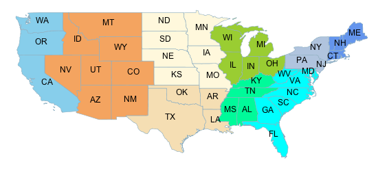
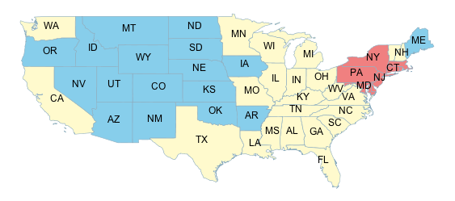
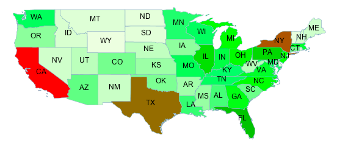

# Styling using Transformation Functions {: #transformation_func }

The Symbology Encoding 1.1 specification defines the following **transformation functions**:

-   `Recode` transforms a set of discrete attribute values into another set of values
-   `Categorize` transforms a continuous-valued attribute into a set of discrete values
-   `Interpolate` transforms a continuous-valued attribute into another continuous range of values

These functions provide a concise way to compute styling parameters from feature attribute values. GeoServer implements them as [Filter functions](../../../filter/function.md) with the same names.

!!! note

    The GeoServer function syntax is slightly different to the SE 1.1 definition, since the specification defines extra syntax elements which are not available in GeoServer functions.

These functions can make style documents more concise, since they express logic which would otherwise require many separate rules or complex Filter expressions, They even allow logic which is impossible to express any other way. A further advantage is that they often provide superior performance to explicit rules.

One disadvantage of using these functions for styling is that they are not displayed in WMS legend graphics.

## Recode

The `Recode` filter function transforms a set of discrete values for an attribute into another set of values. The function can be used within SLD styling parameters to convert the value of a feature attribute into specific values for a parameter such as color, size, width, opacity, etc.

The recoding is defined by a set of *(input, output)* value pairs.

### Example

Consider a chloropleth map of the US states dataset using the fill color to indicate the topographic regions for the states. The dataset has an attribute `SUB_REGION` containing the region code for each state. The `Recode` function is used to map each region code into a different color.

The symbolizer for this style is:

``` xml
<PolygonSymbolizer>
   <Fill>
     <CssParameter name="fill">
       <ogc:Function name="Recode">
         <!-- Value to transform -->
         <ogc:Function name="strTrim">
           <ogc:PropertyName>SUB_REGION</ogc:PropertyName>
         </ogc:Function>

         <!-- Map of input to output values -->
         <ogc:Literal>N Eng</ogc:Literal>
         <ogc:Literal>#6495ED</ogc:Literal>

         <ogc:Literal>Mid Atl</ogc:Literal>
         <ogc:Literal>#B0C4DE</ogc:Literal>

         <ogc:Literal>S Atl</ogc:Literal>
         <ogc:Literal>#00FFFF</ogc:Literal>  

         <ogc:Literal>E N Cen</ogc:Literal>
         <ogc:Literal>#9ACD32</ogc:Literal>

         <ogc:Literal>E S Cen</ogc:Literal>
         <ogc:Literal>#00FA9A</ogc:Literal>

         <ogc:Literal>W N Cen</ogc:Literal>
         <ogc:Literal>#FFF8DC</ogc:Literal>

         <ogc:Literal>W S Cen</ogc:Literal>
         <ogc:Literal>#F5DEB3</ogc:Literal>

         <ogc:Literal>Mtn</ogc:Literal>
         <ogc:Literal>#F4A460</ogc:Literal>

         <ogc:Literal>Pacific</ogc:Literal>
         <ogc:Literal>#87CEEB</ogc:Literal>
       </ogc:Function>  
     </CssParameter>
   </Fill>
</PolygonSymbolizer>
```

This style produces the following output:



## Categorize

The `Categorize` filter function transforms a continuous-valued attribute into a set of discrete values. The function can be used within SLD styling parameters to convert the value of a feature attribute into specific values for a parameter such as color, size, width, opacity, etc.

The categorization is defined by a list of alternating output values and data thresholds. The threshold values define the breaks between the input ranges. Inputs are converted into output values depending on which range they fall in.

### Example

Consider a chloropleth map of the US states dataset using the fill color to indicate a categorization of the states by population. The dataset has attributes `PERSONS` and `LAND_KM` from which the population density is computed using the `Div` operator. This value is input to the `Categorize` function, which is used to assign different colors to the density ranges [ <= 20], [20 - 100], and [ > 100].

The symbolizer for this style is:

``` xml
<PolygonSymbolizer>
   <Fill>
     <CssParameter name="fill">
       <ogc:Function name="Categorize">
         <!-- Value to transform -->
         <ogc:Div>
           <ogc:PropertyName>PERSONS</ogc:PropertyName>
           <ogc:PropertyName>LAND_KM</ogc:PropertyName>
         </ogc:Div>

         <!-- Output values and thresholds -->
         <ogc:Literal>#87CEEB</ogc:Literal>
         <ogc:Literal>20</ogc:Literal>
         <ogc:Literal>#FFFACD</ogc:Literal>
         <ogc:Literal>100</ogc:Literal>
         <ogc:Literal>#F08080</ogc:Literal>

       </ogc:Function>  
     </CssParameter>
   </Fill>
</PolygonSymbolizer>
```

This style produces the following output:



## Interpolate

The `Interpolate` filter function transforms a continuous-valued attribute into another continuous range of values. The function can be used within SLD styling parameters to convert the value of a feature attribute into a continuous-valued parameter such as color, size, width, opacity, etc.

The transformation is defined by a set of *(input, output)* control points chosen along a desired mapping curve. Piecewise interpolation along the curve is used to compute an output value for any input value.

The function is able to compute either numeric or color values as output. This is known as the **interpolation method**, and is specified by an optional parameter with a value of `numeric` (the default) or `color`.

The *shape* of the mapping curve between control points is specified by the **interpolation mode**, which is an optional parameter with values of `linear` (the default), `cubic`, or `cosine`.

### Example

Interpolating over color ranges allows concise definition of continuously-varying colors for chloropleth (thematic) maps. As an example, consider a map of the US states dataset using the fill color to indicate the population of the states. The dataset has an attribute `PERSONS` containing the population of each state. The population values lie in the range 0 to around 30,000,000. The interpolation curve is defined by three control points which assign colors to the population levels 0, 9,000,000 and 23,000,000. The colors for population values are computed by piecewise linear interpolation along this curve. For example, a state with a population of 16,000,000 is displayed with a color midway between the ones for the middle and upper control points. States with populations greater than 23,000,000 are displayed with the last color.

Because the interpolation is being performed over color values, the method parameter is supplied, with a value of `color`. Since the default linear interpolation is used, no interpolation mode is supplied,

The symbolizer for this style is:

``` xml
<PolygonSymbolizer>
   <Fill>
     <CssParameter name="fill">
       <ogc:Function name="Interpolate">
         <!-- Property to transform -->
         <ogc:PropertyName>PERSONS</ogc:PropertyName>

         <!-- Mapping curve definition pairs (input, output) -->
         <ogc:Literal>0</ogc:Literal>
         <ogc:Literal>#fefeee</ogc:Literal>

         <ogc:Literal>9000000</ogc:Literal>
         <ogc:Literal>#00ff00</ogc:Literal>

         <ogc:Literal>23000000</ogc:Literal>
         <ogc:Literal>#ff0000</ogc:Literal>

         <!-- Interpolation method -->
         <ogc:Literal>color</ogc:Literal>

         <!-- Interpolation mode - defaults to linear -->
       </ogc:Function>  
     </CssParameter>
   </Fill>
</PolygonSymbolizer>
```

This symbolizer produces the following output:


