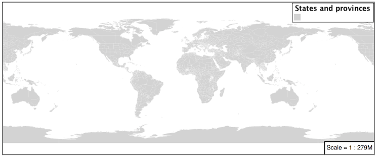
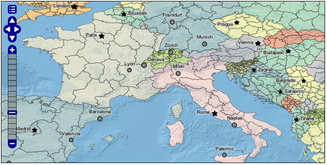
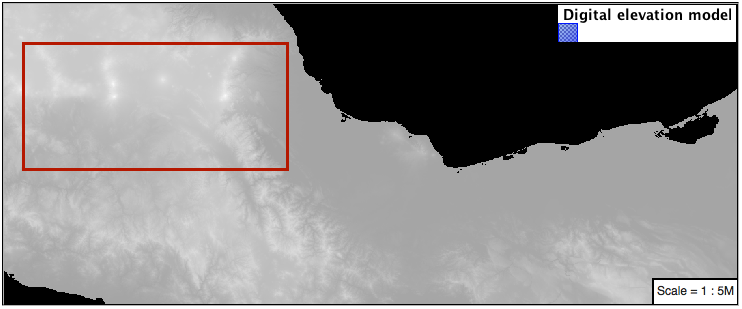
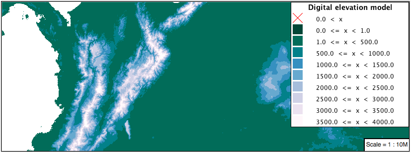

# CSS Workbook Conclusion

We hope you have enjoyed this styling workshop.

Additional resources:

-   [CSS Extension](../../css/index.md)
-   [CSS Cookbook](../../css/cookbook/index.md)

## CSS Workbook Answer Key

The following questions were listed throughout the workshop as an opportunity to explore the material in greater depth. Please do your best to consider the questions in detail prior to checking here for the answer. Questions are provided to teach valuable skills, such as a chance to understand how feature type styles are used to control z-order, or where to locate information in the user manual.

### SLD Generation {: #css.line.a0 }

Answer for `Challenge SLD Generation <css.line.q0>`{.interpreted-text role="ref"}:

1.  Generate the SLD for the following CSS.

    ``` css
    * {
      stroke: black;
    }
    ```

2.  **Challenge:** What is unusual about the generated SLD? Can you explain why it still works as expected?

    The generated SLD does not contain any stroke properties, even though black was specified:

        <sld:LineSymbolizer>
          <sld:Stroke/>
        </sld:LineSymbolizer>

    SLD considers black the default stroke color for a LineSymbolizer, so no further detail was required.

### Classification {: #css.line.a1 }

Answer for `Challenge Classification <css.line.q1>`{.interpreted-text role="ref"}:

1.  **Challenge:** Create a new style adjust road appearance based on **type**.

    

    Hint: The available values are 'Major Highway','Secondary Highway','Road' and 'Unknown'.

2.  Here is an example:

    ``` css
    [type = 'Major Highway' ] {
        stroke: #000088;
        stroke-width: 1.25;
    }
    [type = 'Secondary Highway' ]{
        stroke: #8888AA;
        stroke-width: 0.75;
    }
    [type = 'Road']{
        stroke: #888888;
        stroke-width: .75;
    }
    [type = 'Unknown' ]{
        stroke: #888888;
        stroke-width: 0.5;
    }
    * {
       stroke: #AAAAAA;
       stroke-opacity: 0.25;
       stroke-width: 0.5;
    }
    ```

### SLD Z-Index Generation {: #css.line.a2 }

Answer for `Challenge SLD Z-Index Generation <css.line.q2>`{.interpreted-text role="ref"}:

1.  Review the SLD generated by the **z-index** example.

    ``` css
    * {
      stroke: black, #8080E6;
      stroke-width: 5px, 3px;
      z-index: 0, 1;
    }
    ```

2.  *Challenge:* There is an interesting trick in the generated SLD, can you explain how it works?

3.  The Z-Order example produces multiple FeatureTypeSytle definitions, each acting like an "inner layer".

    Each FeatureTypeStyle is rendered into its own raster, and the results merged in order. The legend shown in the map preview also provides a hint, as the rule from each FeatureType style is shown.

### Label Shields {: #css.line.a3 }

Answer for `Challenge Label Shields <css.line.q2>`{.interpreted-text role="ref"}:

1.  The traditional presentation of roads in the US is the use of a shield symbol, with the road number marked on top.


1.  *Challenge:* Have a look at the documentation and reproduce this technique.

2.  The use of a label shield is a vendor specific capability of the GeoServer rendering engine. The tricky part of this exercise is finding the documentation online ( i.e. [Styled Marks in CSS](../../css/styledmarks.md)).

    ``` css
    * {
        stroke: black,lightgray;
        stroke-width: 3,2;
        label: [name];
        font-family: 'Ariel';
        font-size: 10;
        font-fill: black;
        shield: symbol(square);
    }
    :shield {
        fill: white;
        stroke: black;
        size: 18;
    }
    ```

### Antialiasing {: #css.polygon.a1 }

Answer for `Explore Antialiasing <css.polygon.q1>`{.interpreted-text role="ref"}:

1.  When we rendered our initial preview, without a stroke, thin white gaps (or slivers) are visible between our polygons.

    

    This effect is made more pronounced by the rendering engine making use of the Java 2D sub-pixel accuracy. This technique is primarily used to prevent an aliased (stair-stepped) appearance on diagonal lines.

2.  **Explore:** Experiment with **fill** and **stroke** settings to eliminate slivers between polygons.

    The obvious approach works - setting both values to the same color:

    ``` yaml
    symbolizers:
    - polygon:
        stroke-color: 'lightgrey'
        stroke-width: 1
        fill-color: 'lightgrey'
    ```

### Categorize {: #css.polygon.a2 }

Answer for `Explore Categorize <css.polygon.q2>`{.interpreted-text role="ref"}:

1.  An exciting use of the GeoServer **shape** symbols is the theming by changing the **size** used for pattern density.

2.  **Explore:** Use the **Categorize** function to theme by **datarank**.

    

    Example:

    ``` yaml
    .. code-block:: css

       * {
         fill: symbol('shape://slash');
         fill-size: [
            Categorize(datarank,
             4, 4,
             5, 6,
             8, 10,
            10)
         ];
         stroke: black;
       }
       :fill {
         stroke: darkgray;
       }
    ```

### Halo {: #css.polygon.a4 }

Answer for `Challenge Halo <css.polygon.q4>`{.interpreted-text role="ref"}:

1.  The halo example used the fill color and opacity for a muted halo, while this improved readability it did not bring attention to our labels.

    A common design choice for emphasis is to outline the text in a contrasting color.

2.  **Challenge:** Produce a map that uses a white halo around black text.

    Here is an example:

    ``` css
    * {  stroke: gray;
         fill: #7EB5D3;
         label: [name];
         label-anchor: 0.5 0.5;
         font-fill: black;
         font-family: "Arial";
         font-size: 14;
         halo-radius: 1;
         halo-color: white;
       }
    ```

### Theming using Multiple Attributes {: #css.polygon.a5 }

Answer for `Challenge Theming using Multiple Attributes <css.polygon.q5>`{.interpreted-text role="ref"}:

1.  A powerful tool is theming using multiple attributes. This is an important concept allowing map readers to perform "integration by eyeball" (detecting correlations between attribute values information).

2.  **Challenge:** Combine the **mapcolor9** and **datarank** examples to reproduce the following map.

    

    This should be a cut and paste using the `recode` example, and `categorize` examples already provided.

    ``` css
    * {
       fill: [
        recode(mapcolor9,
          1,'#8dd3c7', 2,'#ffffb3', 3,'#bebada',
          4,'#fb8072', 5,'#80b1d3', 6,'#fdb462',
          7,'#b3de69', 8,'#fccde5', 9,'#d9d9d9')
       ], symbol('shape://slash');

       fill-size: '',[
          Categorize(datarank,
           6, 4,
           8, 6,
          10, 10,
          12)
       ];
       stroke: black;
    }
    :fill {
       stroke: black;
    }
    ```

### Use of Use of Z-Index {: #css.polygon.a6 }

Answer for `Challenge Use of Z-Index <css.polygon.q6>`{.interpreted-text role="ref"}:

1.  Earlier we looked at using **z-index** to simulate line string casing. The line work was drawn twice, once with thick line, and then a second time with a thinner line. The resulting effect is similar to text halos - providing breathing space around complex line work allowing it to stand out.

2.  **Challenge:** Use what you know of LineString **z-index** to reproduce the following map:

    

    This is a tricky challenge. While it is easy enough to introduce z-index to control stroke what is not immediately obvious is that z-order also controls fill order. The previous examples illustrate how to introduce z-order, some thought is required to untangle fill and stroke z-order (dummy stroke definitions need to be introduced using empty commas).

    ``` css
    * {
      fill: lightgray, symbol('shape://slash');
      fill-size: 8px;
      stroke: '','',lightgray, black;
      stroke-width: '','',6,1.5;
      z-index: 1,2,3,4;
    }
    :fill {
      stroke: black;
      stroke-width: 0.75;
    }
    ```

    The included legend should be a large clue about what is going on.

### Geometry Location {: #css.point.a1 }

Answer for `Challenge Geometry Location <css.point.q1>`{.interpreted-text role="ref"}:

1.  The **mark** property can be used to render any geometry content.

2.  **Challenge:** Try this yourself by rendering a polygon layer using a **mark** property.

    This can be done one of two ways:

    -   Changing the association of a polygon layer, such as `ne:states_provinces_shp` to point_example and using the layer preview page.
    -   Changing the **Layer Preview** tab to a polygon layer, such as `ne:states_provinces_shp`.

    The important thing to notice is that the centroid of each polygon is used as a point location.

### Dynamic Symbolization {: #css.point.a2 }

Answer for `Explore Dynamic Symbolization <css.point.q2>`{.interpreted-text role="ref"}:

1.  SLD Mark and ExternalGraphic provide an opportunity for dynamic symbolization.

    This is accomplished by embedding a small CQL expression in the string passed to symbol or url. This sub-expression is isolated with ``\${ }`` as shown:

    > ``` yaml
    > - point:
    >     symbols:
    >     - mark:
    >         shape: ${if_then_else(equalTo(FEATURECLA,'Admin-0 capital'),'star','circle')}
    > ```

2.  **Challenge:** Use this approach to rewrite the *Dynamic Styling* example.

    Example available here [point_example.css](../files/point_example2.css)

    > [@scale < 4000000]{
    >
    > :   
    >
    >     mark: symbol(
    >
    >     :   "\${if_then_else(equalTo(FEATURECLA,'Admin-0 capital'),'star','circle')}"
    >
    >     ); mark-size: [13-SCALERANK]; label: [NAME]; label-offset: 0 [13-SCALERANK];
    >
    > }

### Layer Group {: #css.point.a3 }

Answer for `Challenge Layer Group <css.point.q3>`{.interpreted-text role="ref"}:

1.  Use a **Layer Group** to explore how symbology works together to form a map.

    -   ne:NE1
    -   ne:states_provincces_shp
    -   ne:populated_places

2.  This background is relatively busy and care must be taken to ensure both symbols and labels are clearly visible.

3.  **Challenge:** Do your best to style populated_places over this busy background.

    Here is an example with labels for inspiration:

    

    This should be an opportunity to revisit label halo settings from [Polygons](polygon.md).

    ``` css
    * {
       mark-size: [5+((10-SCALERANK)/3)];

       font-fill: black;
       font-family: "Arial";
       font-size: 10;

       label-anchor: 0.5 1;
       label-offset: 0 [-12+SCALERANK];

       halo-radius: 2;
       halo-color: lightgray;
       halo-opacity:0.7;

       mark-label-obstacle: true;
       label-max-displacement: 90;
       label-priority: [0 - LABELRANK];
    }
    :symbol {
      fill: black;
      stroke: white;
      stroke-opacity:0.75;
    }
    ```

    Using a lightgray halo, 0.7 opacity and radius 2 fades out the complexity immediately surrounding the label text improving legibility.

### Contrast Enhancement {: #css.raster.a1 }

Discussion for `Explore Contrast Enhancement <css.raster.q1>`{.interpreted-text role="ref"}:

1.  A special effect that is effective with grayscale information is automatic contrast adjustment.

2.  Make use of a simple contrast enhancement with `usgs:dem`:

    ``` css
    * {
        raster-channels: auto;
        raster-contrast-enhancement: normalize;
    }
    ```

3.  Can you explain what happens when zoom in to only show a land area (as indicated with the bounding box below)?

    

    What happens is insanity, normalize stretches the palette of the output image to use the full dynamic range. As long as we have ocean on the screen (with value 0) the land area was shown with roughly the same presentation.

    

    Once we zoom in to show only a land area, the lowest point on the screen (say 100) becomes the new black, radically altering what is displayed on the screen.

### Intervals {: #css.raster.a2 }

Answer for `Challenge Intervals <css.raster.q2>`{.interpreted-text role="ref"}:

1.  The color-map **type** property dictates how the values are used to generate a resulting color.

    -   `mp` is used for quantitative data, providing a smooth interpolation between the provided color values.
    -   `ls` provides categorization for quantitative data, assigning each range of values a solid color.
    -   `es` is used for qualitative data, each value is required to have a **color-map** entry or it will not be displayed.

2.  **Challenge:** Update your DEM example to use **intervals** for presentation. What are the advantages of using this approach for elevation data?

    By using intervals it becomes very clear how relatively flat most of the continent is. The ramp presentation provided lots of fascinating detail which distracted from this fact.

    

    Here is style for you to cut and paste:

    ``` css
    * {
      raster-channels: auto;
      raster-color-map:
         color-map-entry(#014636,   0,0)
         color-map-entry(#014636,   1)
         color-map-entry(#016c59, 500)
         color-map-entry(#02818a,1000)
         color-map-entry(#3690c0,1500)
         color-map-entry(#67a9cf,2000)
         color-map-entry(#a6bddb,2500)
         color-map-entry(#d0d1e6,3000)
         color-map-entry(#ece2f0,3500)
         color-map-entry(#fff7fb,4000);
      raster-color-map-type: intervals;
    }
    ```

### Clear Digital Elevation Model Presentation {: #css.raster.a3 }

Answer for `Challenge Clear Digital Elevation Model Presentation <css.raster.q3>`{.interpreted-text role="ref"}:

1.  Now that you have seen the data on screen and have a better understanding how would you modify our initial gray-scale example?

2.  **Challenge:** Use what you have learned to present the `usgs:dem` clearly.

    

    The original was a dark mess. Consider making use of mid-tones (or adopting a sequential palette from color brewer) in order to fix this. In the following example the ocean has been left dark, allowing the mountains stand out more.

    ``` css
    * {
      raster-channels: auto;
      raster-color-map: color-map-entry(#000000, 0)
                        color-map-entry(#444444, 1)
                        color-map-entry(#FFFFFF, 3000);
    }
    ```

### Raster Opacity {: #css.raster.a4 }

Discussion for `Challenge Clear Digital Elevation Model Presentation <css.raster.q3>`{.interpreted-text role="ref"}:

1.  There is a quick way to make raster data transparent, raster **opacity** property works in the same fashion as with vector data. The raster as a whole will be drawn partially transparent allow content from other layers to provide context.

2.  **Challenge:** Can you think of an example where this would be useful?

    This is difficult as raster data is usually provided for use as a basemap, with layers being drawn over top.

    The most obvious example here is the display of weather systems, or model output such as fire danger. By drawing the raster with some transparency, the landmass can be shown for context.
