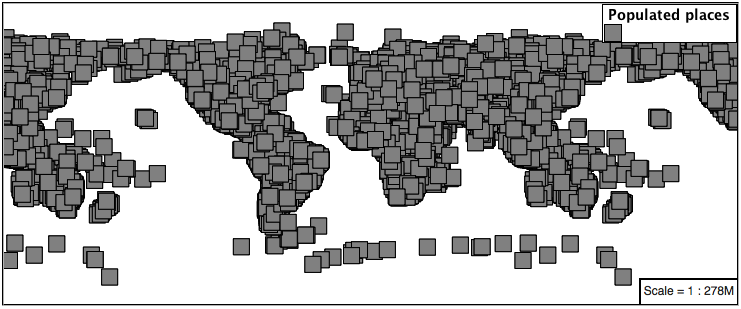
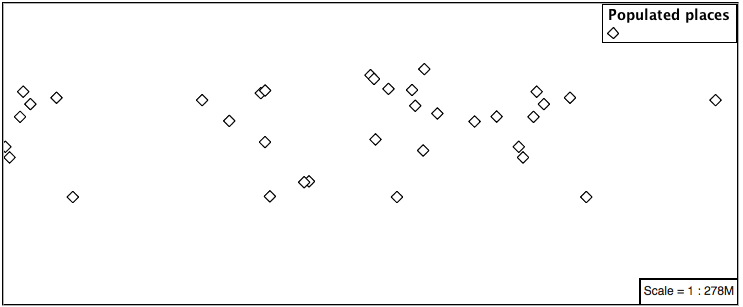
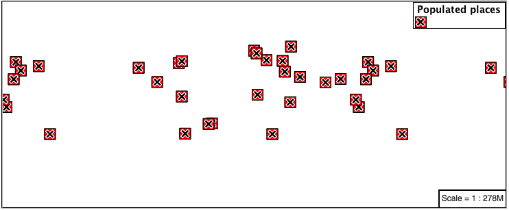
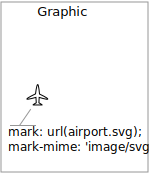

# Points

The next stop of the CSS styling tour is the representation of points.


Review of point symbology:

-   Points are used to represent a location only, and do not form a shape. The visual width of lines do not change depending on scale.
-   SLD uses a **PointSymbolizer** record how the shape of a line is drawn.
-   Labeling of points is anchored to the point location.

As points have no inherent shape of their own, emphasis is placed on marking locations with an appropriate symbol.

Reference:

-   [Point Symbology](../../css/properties.md#css_properties_point) (User Manual | CSS Property Listing)
-   [Points](../../css/cookbook/point.md) (User Manual | CSS Cookbook)
-   [Styled Marks](../../css/styledmarks.md) (User Manual | CSS Styling )
-   [Point](../../sld/reference/pointsymbolizer.md) (User Manual | SLD Reference )

This exercise makes use of the `ne:populated_places` layer.

1.  Navigate to the **Styles** page.

2.  Click **Add a new style** and choose the following:

    Name:

    :   ``point_example``

    Workspace:

    :   ``No workspace``

    Format:

    :   ``CSS``

3.  Replace the initial CSS definition with the following and click **apply**:

    ``` css
    * {
      mark: symbol(circle);
    }
    ```

4.  And use the **Layer Preview** tab to preview the result.

    

## Mark

Points are represented with the mandatory property **mark**.


The SLD standard provides "well-known" symbols for use with point symbology: `circle`, `square`, `triangle`, `arrow`, `cross`, `star`, and `x`.

1.  As a **key property** the presence **mark** triggers the generation of an appropriate PointSymbolizer.

    ``` css
    * {
     mark: symbol(square);
    }
    ```

2.  Map Preview:

    

3.  Before we continue we will use a selector to cut down the amount of data shown to a reasonable level.

    ``` css
    [ SCALERANK < 1 ] {
      mark: symbol(square);
    }
    ```

4.  Resulting in a considerably cleaner image:

    

5.  Additional properties are available to control a mark's presentation:

    The **mark-size** property is used to control symbol size.

    The **mark-rotation** property controls orientation, accepting input in degrees.

    Trying these two settings together:

    ``` css
    [ SCALERANK < 1 ] {
      mark: symbol(square);
      mark-size: 8;
      mark-rotation: 45;
    }
    ```

6.  Results in each location being marked with a diamond:

    

7.  Now that we have assigned our point location a symbol we can make use of a **pseudo-selector** to style the resulting shape.

    **:symbol** - provides styling for all the symbols in the CSS document.

    **:mark** - provides styling for all the mark symbols in the CSS document.

    This form of pseudo-selector is used for all marks:

    ``` css
    [ SCALERANK < 1 ] {
      mark: symbol(square);
      mark-size: 8;
      mark-rotation: 45;
    }
    :mark{
       fill: white;
       stroke: black;
    }
    ```

8.  Updating the mark to a white square with a black outline.

    

9.  The second approach is used to individual configure symbols in the same document.

    **:nth-symbol(1)** - if needed we could specify which symbol in the document we wish to modify.

    **:nth-mark(1)** - provides styling for the first mark symbol in the CSS document.

    Using this approach marks can be composed of multiple symbols, each with its own settings:

    ``` css
    [ SCALERANK < 1 ] {
      mark: symbol(square),symbol(cross);
      mark-size: 16,14;
      mark-rotation: 0,45;
    }
    :nth-mark(1){
       fill: red;
       stroke: black;
    }
    :nth-mark(2){
       fill: black;
       stroke: white;
    }
    ```

10. Producing an interesting compound symbol effect:

    

## Graphic

Symbols can also be supplied by an external graphic,



This technique was shown with the initial <file:%60airport.svg>` CSS example.

1.  To use an external graphic two pieces of information are required.

    **mark** property is defined with a **url** reference to image.

    **mark-mime** property is used to tell the rendering engine what file format to expect

    This technique is used to reference files placed in the styles directory.

    ``` css
    [ SCALERANK < 1 ] {
      mark: url(port.svg);
      mark-mime: "image/svg";
    }
    ```

2.  Drawing the provided shape in each location:

    

3.  The **mark** property **url** reference can also be used to reference external images. We can make use of the GeoServer logo.

    ``` css
    [ SCALERANK < 1 ] {
         mark: url("http://localhost:8080/geoserver/web/wicket/resource/org.geoserver.web.GeoServerBasePage/img/logo.png");
         mark-mime: "image/png";
         mark-size: 16;
    }
    ```

4.  As shown in the map preview.

    

5.  SVG external graphics styles can also be declared in the CSS code.

    Using the **symbol** function in the **mark** property.

    The styles declarations have to icluded in the **:mark** pseudo-class.

    ``` scss
    /* @title red triangle with blue stroke */
    *{
       mark: symbol('https://www.svgrepo.com/show/488433/triangle.svg');
       mark-mime: "image/svg";
       mark-size: 25;
       :mark {
          fill: #ff3300;
          stroke: blue;
          stroke-width: 5px;
       }
    }
    ```

6.  Will result in a modified style for an external SVG graphic resource.

    

## Label

Labeling is now familiar from our experience with LineString and Polygons.


The key properties **mark** and **label** are required to label Point locations.

1.  Replace `point_example` with the following:

    ``` css
    [ SCALERANK < 1 ] {
      mark: symbol(circle);
      label: [NAME];
    }
    ```

2.  Confirm the result in `Map` preview.

    

3.  Each label is drawn starting from the provided point - which is unfortunate as it assures each label will overlap with the symbol used. To fix this limitation we will make use of the SLD controls for label placement:

    **label-anchor** provides two values expressing how a label is aligned with respect to the starting label position.

    **label-offset** is be used to provide an initial displacement using and x and y offset. For points this offset is recommended to adjust the label position away for the area used by the symbol.

    !!! note

        The property **label-anchor** defines an anchor position relative to the bounding box formed by the resulting label. This anchor position is snapped to the label position generated by the point location and displacement offset.

4.  Using these two facilities together we can center our labels below the symbol, taking care that the displacement used provides an offset just outside the area required for the symbol size.

    ``` css
    [ SCALERANK < 1 ] {
      mark: symbol(circle);
      mark-size: 10;

      label: [NAME];
      label-offset: 0 -12;
      label-anchor: 0.5 1.0;

      font-fill: black;
    }
    ```

5.  Each label is now placed under the mark.

    

6.  One remaining issue is the overlap between labels and symbols.

    GeoServer provides a vendor specific parameter to allow symbols to take part in label conflict resolution, preventing labels from overlapping any symbols. This severely limits the area available for labeling and is best used in conjunction with a large maximum displacement vendor option.

    **mark-label-obstacle** vendor parameter asks the rendering engine to avoid drawing labels over top of the indicated symbol.

    **label-max-displacement** vendor parameter provides the rendering engine a maximum distance it is allowed to move labels during conflict resolution.

    **label-padding** vendor parameter tells the rendering engine to provide a minimum distance between the labels on the map, ensuring they do not overlap.

    Update our example to use these settings:

    ``` css
    [ SCALERANK < 1 ] {
      mark: symbol(circle);
      mark-size: 10;

      label: [NAME];
      label-offset: 0 -12;
      label-anchor: 0.5 1.0;

      font-fill: black;

      mark-label-obstacle: true;
      label-max-displacement: 100;
      label-padding: 2;
    }
    ```

7.  Resulting in a considerably cleaner image:

    

## Dynamic Styling

1.  We will quickly use **scalerank** to select content based on @scale selectors.

    ``` css
    [@scale < 4000000] {
       mark: symbol(circle);
    }
    [@scale > 4000000] [@scale < 8000000] [SCALERANK < 7] {
       mark: symbol(circle);
    }

    [@scale > 8000000] [@scale < 17000000] [SCALERANK < 5] {
       mark: symbol(circle);
    }

    [@scale > 17000000] [@scale < 35000000] [SCALERANK < 4] {
       mark: symbol(circle);
    }

    [@scale > 35000000] [@scale < 70000000][SCALERANK < 3] {
       mark: symbol(circle);
    }

    [@scale > 70000000] [@scale < 140000000][SCALERANK < 2] {
       mark: symbol(circle);
    }

    [@scale > 140000000] [SCALERANK < 1] {
      mark: symbol(circle);
    }

    * {
      mark-size: 6;
    }
    ```

2.  Click **Submit** to update the **Map** after each step.

    

3.  To add labeling we must use both the **key properties** mark and label in each scale selector, using rule cascading to define the mark-size and font information once.

    ``` css
    [@scale < 4000000] {
       mark: symbol(circle);
       label: [NAME];
    }
    [@scale > 4000000] [@scale < 8000000] [SCALERANK < 7] {
       mark: symbol(circle);
       label: [NAME];
    }

    [@scale > 8000000] [@scale < 17000000] [SCALERANK < 5] {
       mark: symbol(circle);
       label: [NAME];
    }

    [@scale > 17000000] [@scale < 35000000] [SCALERANK < 4] {
       mark: symbol(circle);
       label: [NAME];
    }

    [@scale > 35000000] [@scale < 70000000][SCALERANK < 3] {
       mark: symbol(circle);
       label: [NAME];
    }

    [@scale > 70000000] [@scale < 140000000][SCALERANK < 2] {
       mark: symbol(circle);
       label: [NAME];
    }

    [@scale > 140000000] [SCALERANK < 1] {
       mark: symbol(circle);
       label: [NAME];
    }

    * {
      mark-size: 6;

      font-fill: black;
      font-family: "Arial";
      font-size: 10;
    }
    ```

    

4.  We will use **label-offset** and **label-anchor** to position the label above each symbol.

    Add the following two lines to the ``*`` selector:

    ``` {.css emphasize-lines="8,9"}
    * {
      mark-size: 6;

      font-fill: black;
      font-family: "Arial";
      font-size: 10;

      label-anchor: 0.5 0;
      label-offset: 0 6;
    }
    ```

    

5.  A little bit of work with vendor specific parameters will prevent our labels from colliding with each symbol, while giving the rendering engine some flexibility in how far it is allowed to relocate a label.

    Add the following vendor options to the ``*`` selector:

    ``` {.css emphasize-lines="11-13"}
    * {
      mark-size: 6;

      font-fill: black;
      font-family: "Arial";
      font-size: 10;

      label-anchor: 0.5 0;
      label-offset: 0 6;

      mark-label-obstacle: true;
      label-max-displacement: 90;
      label-padding: 2;
    }
    ```

    

6.  Now that we have clearly labeled our cities, zoom into an area you are familiar with and we can look at changing symbology on a case-by-case basis.

    We have used expressions previous to generate an appropriate label. Expressions can also be used for many other property settings.

    The `ne:populated_places` layer provides several attributes specifically to make styling easier:

    -   **SCALERANK**: we have already used this attribute to control the level of detail displayed
    -   **LABELRANK**: hint used for conflict resolution, allowing important cities such as capitals to be labeled even when they are close to a larger neighbor.
    -   **FEATURECLA**: used to indicate different types of cities. We will check for ``Admin-0 capital`` cities.

    The first thing we will do is calculate the **mark-size** using a quick expression:

        [10-(SCALERANK/2)]

    This expression should result in sizes between 5 and 9 and will need to be applied to both **mark-size** and **label-offset**.

    Rather than the "first come first served" default to resolve labeling conflicts we can manually provide GeoServer with a label priority. The expression provided is calculated for each label, in the event of a conflict the label with the highest priority takes precedence.

    The LABELRANK attribute goes from 1 through 10 and needs to be flipped around before use as a GeoServer label priority:

        [10 - LABELRANK]

    This expression will result in values between 0 and 10 and will be used for the **label-priority**.

    ``` {.css emphasize-lines="2,9"}
    * {
      mark-size: [10-(SCALERANK/2)];

      font-fill: black;
      font-family: "Arial";
      font-size: 10;

      label-anchor: 0.5 0;
      label-offset: 0 [10-(SCALERANK/2)];

      mark-label-obstacle: true;
      label-max-displacement: 90;
      label-padding: 2;
      label-priority: [10 - LABELRANK];
    }
    ```

    

7.  Next we can use `FEATURECLA` to check for capital cities.

    Adding a selector for capital cities at the top of the file:

    ``` css
    /* capitals */
    [@scale < 70000000]
    [FEATURECLA = 'Admin-0 capital']  {
       mark: symbol(star);
       label: [NAME];
    }
    [@scale > 70000000] [SCALERANK < 2]
    [FEATURECLA = 'Admin-0 capital']  {
       mark: symbol(star);
       label: [NAME];
    }
    ```

    And updating the populated places selectors to ignore capital cities:

    ``` css
    /* populated places */
    [@scale < 4000000]
    [FEATURECLA <> 'Admin-0 capital'] {
       mark: symbol(circle);
       label: [NAME];
    }
    [@scale > 4000000] [@scale < 8000000] [SCALERANK < 7]
    [FEATURECLA <> 'Admin-0 capital'] {
       mark: symbol(circle);
       label: [NAME];
    }

    [@scale > 8000000] [@scale < 17000000] [SCALERANK < 5]
    [FEATURECLA <> 'Admin-0 capital'] {
       mark: symbol(circle);
       label: [NAME];
    }

    [@scale > 17000000] [@scale < 35000000] [SCALERANK < 4]
    [FEATURECLA <> 'Admin-0 capital'] {
       mark: symbol(circle);
       label: [NAME];
    }

    [@scale > 35000000] [@scale < 70000000][SCALERANK < 3]
    [FEATURECLA <> 'Admin-0 capital'] {
       mark: symbol(circle);
       label: [NAME];
    }

    [@scale > 70000000] [@scale < 140000000][SCALERANK < 2]
    [FEATURECLA <> 'Admin-0 capital'] {
       mark: symbol(circle);
       label: [NAME];
    }

    [@scale > 140000000] [SCALERANK < 1]
    [FEATURECLA <> 'Admin-0 capital'] {
       mark: symbol(circle);
       label: [NAME];
    }
    ```

    

8.  Finally we can fill in the capital city symbols using a combination of a selector to detect capital cities, and pseudo selector to provide mark styling.

    ``` css
    [FEATURECLA = 'Admin-0 capital'] :mark {
      fill: black;
    }

    :symbol {
      fill: gray;
      stroke: black;
    }
    ```

    

9.  If you would like to check your work the final file is here: [point_example.css](../files/point_example.css)

## Bonus

!!! abstract "Instructor Notes"

    The exercise section does not review the examples above, instead it explores the use of:
    
    -   scale and attribute selectors
    -   recode to map from attribute to symbol
    -   interpolate to change size by population

### Challenge Geometry Location {: #css.point.q1 }

!!! abstract "Instructor Notes"

    As usual Explore invites readers to reapply the material covered in a slightly different context or dataset.
    
    The use of selectors using the roads **type** attribute provides this opportunity.

1.  The **mark** property can be used to render any geometry content.

2.  **Challenge:** Try this yourself by rendering a polygon layer using a **mark** property.

    !!! note

        Answer `discussed <ysld.point.a1>`{.interpreted-text role="ref"} at the end of the workbook.

### Explore Dynamic Symbolization {: #css.point.q2 }

1.  We went to a lot of work to set up selectors to choose between symbol(star) and symbol(circle) for capital cities.

    This approach is straightforward when applied in isolation:

    ``` css
    [FEATURECLA = 'Admin-0 capital'] {
       mark: symbol(star);
    }
    [FEATURECLA <> 'Admin-0 capital'] {
       mark: symbol(circle);
    }
    ```

    When combined with checking another attribute, or checking @scale as in our example, this approach can quickly lead to many rules which can be difficult to keep straight.

2.  Taking a closer look both `symbol()` and `url()` can actually be expressed using a string:

    ``` css
    [FEATURECLA = 'Admin-0 capital'] {
       mark: symbol("star");
    }
    ```

    Which is represented in SLD as:

    ``` xml
    <sld:PointSymbolizer>
      <sld:Graphic>
         <sld:Mark>
            <sld:WellKnownName>star</sld:WellKnownName>
            <sld:Fill/>
            <sld:Stroke/>
         </sld:Mark>
      </sld:Graphic>
    </sld:PointSymbolizer>
    ```

3.  GeoServer recognizes this limitation of SLD Mark and ExternalGraphic and provides an opportunity for dynamic symbolization.

    This is accomplished by embedding a small CQL expression in the string passed to symbol or url. This sub-expression is isolated with ``\${ }`` as shown:

    ``` css
    * {
       mark: symbol(
         "${if_then_else(equalTo(FEATURECLA,'Admin-0 capital'),'star','circle')}"
       );
    }
    ```

    Which is represented in SLD as:

    ``` xml
    <sld:PointSymbolizer>
      <sld:Graphic>
         <sld:Mark>
            <sld:WellKnownName>${if_then_else(equalTo(FEATURECLA,'Admin-0 capital'),'star','circle')}</sld:WellKnownName>
            <sld:Fill/>
            <sld:Stroke/>
         </sld:Mark>
      </sld:Graphic>
    </sld:PointSymbolizer>
    ```

4.  **Challenge:** Use this approach to rewrite the *Dynamic Styling* example.

    !!! note

        Answer `provided <ysld.point.a2>`{.interpreted-text role="ref"} at the end of the workbook.

> 1.  Challenge: Use the **Interpolate** function to smoothly change **mark-size** based on city population.

### Challenge Layer Group {: #css.point.q3 }

1.  Use a **Layer Group** to explore how symbology works together to form a map.

    -   ne:NE1
    -   ne:states_provincces_shp
    -   ne: populated_places

2.  To help start things out here is a style for `ne:states_provinces_shp`:

    ``` css
    * {     
       fill: white,[
        recode(mapcolor9,
          1,'#8dd3c7', 2,'#ffffb3', 3,'#bebada',
          4,'#fb8072', 5,'#80b1d3', 6,'#fdb462',
          7,'#b3de69', 8,'#fccde5', 9,'#d9d9d9')
       ];
       fill-opacity: 05%,50%;

       stroke: black;
       stroke-width: 0.25;
       stroke-opacity: 50%;
    }
    ```

3.  This background is relatively busy and care must be taken to ensure both symbols and labels are clearly visible.

4.  **Challenge:** Do your best to style populated_places over this busy background.

    Here is an example with labels for inspiration:

    

    !!! note

        Answer `provided <ysld.point.a3>`{.interpreted-text role="ref"} at the end of the workbook.

### Explore True Type Fonts

1.  In addition to image formats GeoServer can make use other kinds of graphics, such as True Type fonts:

    ``` css
    * {
       mark: symbol("ttf://Webdings#0x0064");
    }
    :mark {
       stroke: blue;
    }
    ```

2.  Additional fonts dropped in the **`styles`** directory are available for use.

### Explore Custom Graphics

1.  The GeoServer rendering engine allows Java developers to hook in additional symbol support.

    This facility is used by GeoServer to offer the shapes used for pattern fills. Community extensions allow the use of simple custom shapes and even charts.

2.  Support has been added for custom graphics using the WKT Geometry representation.

    ``` css
    * {
       mark: symbol("wkt://MULTILINESTRING((-0.25 -0.25, -0.125 -0.25), (0.125 -0.25, 0.25 -0.25), (-0.25 0.25, -0.125 0.25), (0.125 0.25, 0.25 0.25))");
    }
    :mark {
       stroke: blue;
    } 
    ```
