# Polygons {: #styling_workshop_css_polygon }

Next we look at how CSS styling can be used to represent polygons.

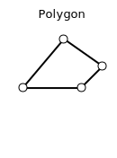
*Polygon Geometry*

Review of polygon symbology:

-   Polygons offer a direct representation of physical extent or the output of analysis.

-   The visual appearance of polygons reflects the current scale.

-   Polygons are recorded as a LinearRing describing the polygon boundary. Further LinearRings can be used to describe any holes in the polygon if present.

    The Simple Feature for SQL Geometry model (used by GeoJSON) represents these areas as Polygons, the ISO 19107 geometry model (used by GML3) represents these areas as Surfaces.

-   SLD uses a **PolygonSymbolizer** to describe how the shape of a polygon is drawn. The primary characteristic documented is the **Fill** used to shade the polygon interior. The use of a **Stroke** to describe the polygon boundary is optional.

-   Labeling of a polygon is anchored to the centroid of the polygon. GeoServer provides a vendor option to allow labels to line wrap to remain within the polygon boundaries.

For our Polygon exercises we will try and limit our CSS documents to a single rule, in order to showcase the properties used for rendering.

Reference:

-   [Polygon Symbology](../../css/properties.md#css_properties_polygon) (User Manual | CSS Property Listing)
-   [Polygons](../../css/cookbook/polygon.md) (User Manual | CSS Cookbook)
-   [Polygons](../../sld/reference/polygonsymbolizer.md) (User Manual | SLD Reference )

This exercise makes use of the `ne:states_provinces_shp` layer.

1.  Navigate to **Styles**.

2.  Create a new style `le`.

      --------------------- -------------------------------------------------
      Name:                 `le`

      Workspace:            `ce`

      Format:               `SS`
      --------------------- -------------------------------------------------

    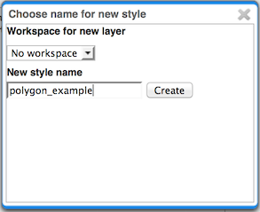

3.  Enter the following style and click ****Apply`` to save:

    ``` css
    * { fill: lightgrey; }
    ```

4.  Click on the tab **Layer Preview** to preview.

    

5.  Set `ne:states_provinces_shp` as the preview layer.

    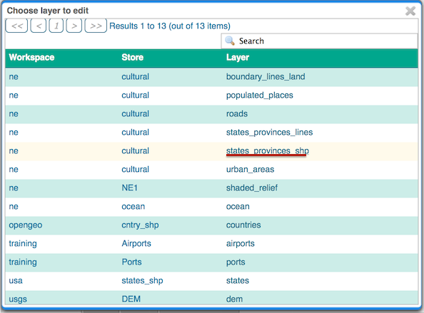

## Stroke and Fill

The **key property** for polygon data is **fill**.

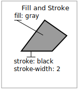

The **fill** property is used to provide the color, or pattern, used to draw the interior of a polygon.

1.  Replace the contents of `polygon_example` with the following **fill** example:

    ``` css
    * {
       fill: gray;
    }
    ```

2.  The **Map** tab can be used preview the change:

    

3.  To draw the boundary of the polygon the **stroke** property is used:

    The **stroke** property is used to provide the color, or pattern, for the polygon boundary. It is effected by the same parameters (and vendor specific parameters) as used for LineStrings.

    ``` {.css emphasize-lines="3,4"}
    * {
       fill: gray;
       stroke: black;
       stroke-width: 2;
    }
    ```

    !!! note

        Technically the boundary of a polygon is a specific case of a LineString where the first and last vertex are the same, forming a closed LinearRing.

4.  The effect of adding **stroke** is shown in the map preview:

    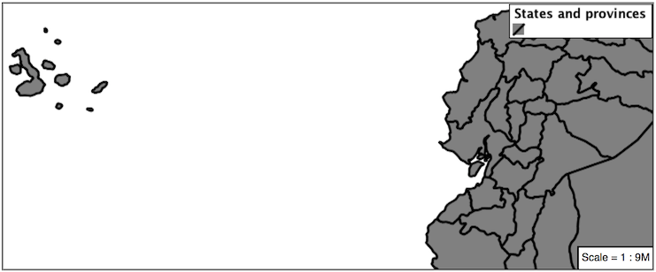

5.  An interesting technique when styling polygons in conjunction with background information is to control the fill opacity.

    The **fill-opacity** property is used to adjust transparency (provided as range from 0.0 to 1.0). Use of **fill-opacity** to render polygons works well in conjunction with a raster base map. This approach allows details of the base map to shown through.

    The **stroke-opacity** property is used in a similar fashion, as a range from 0.0 to 1.0.

    ``` {.css emphasize-lines="3,6"}
    * {
       fill: white;
       fill-opacity: 50%;
       stroke: lightgrey;
       stroke-width: 0.25;
       stroke-opacity: 50%;
    }
    ```

6.  As shown in the map preview:

    

7.  This effect can be better appreciated using a layer group.

    

    Where the transparent polygons is used lighten the landscape provided by the base map.

    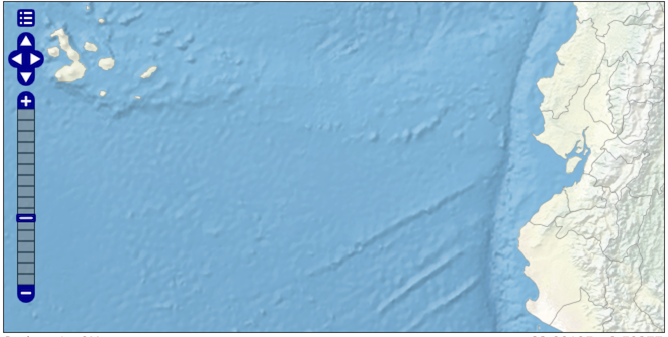

!!! abstract "Instructor Notes"

    In this example we want to ensure readers know the key property for polygon data.
    
    It is also our first example of using opacity.

## Pattern

In addition to color, the **fill** property can also be used to provide a pattern.

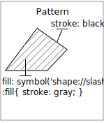

The fill pattern is defined by repeating one of the built-in symbols, or making use of an external image.

1.  We have two options for configuring a **fill** with a repeating graphic:

    Using **url** to reference to an external graphic. Used in conjunction with **fill-mime** property.

    Use of **symbol** to access a predefined shape. SLD provides several well-known shapes (circle, square, triangle, arrow, cross, star, and x). GeoServer provides additional shapes specifically for use as fill patterns.

    Update `le` with the following built-in symbol as a repeating fill pattern:

    ``` {.css emphasize-lines="2"}
    * {
       fill: symbol(square);
    }
    ```

2.  The map preview (and legend) will show the result:

    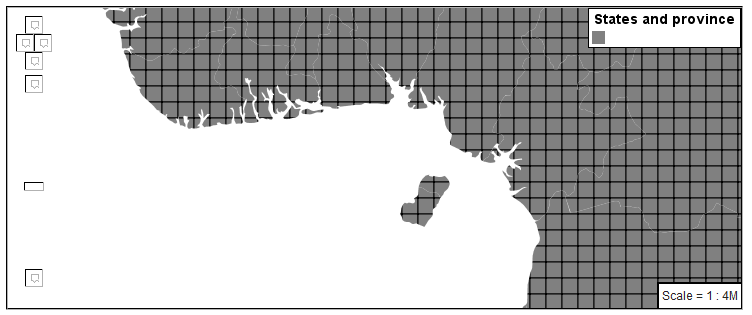

3.  Add a black stroke:

    ``` {.css emphasize-lines="3"}
    * {
       fill: symbol(square);
       stroke: black;
    }
    ```

4.  To outline the individual shapes:

    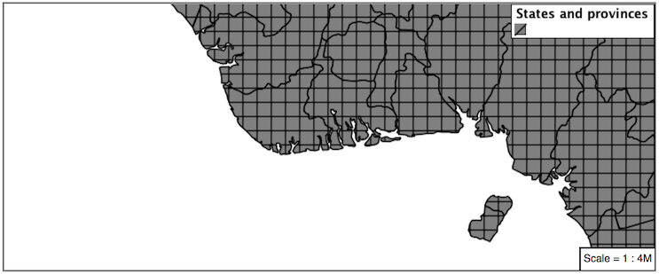

5.  Additional fill properties allow control over the orientation and size of the symbol.

    The **fill-size** property is used to adjust the size of the symbol prior to use.

    The **fill-rotation** property is used to adjust the orientation of the symbol.

    Adjust the size and rotation as shown:

    ``` {.css emphasize-lines="3,4"}
    * {
       fill: symbol(square);
       fill-size: 22px;
       fill-rotation: 45;
       stroke: black;
    }
    ```

6.  The size of each symbol is increased, and each symbol rotated by 45 degrees.

    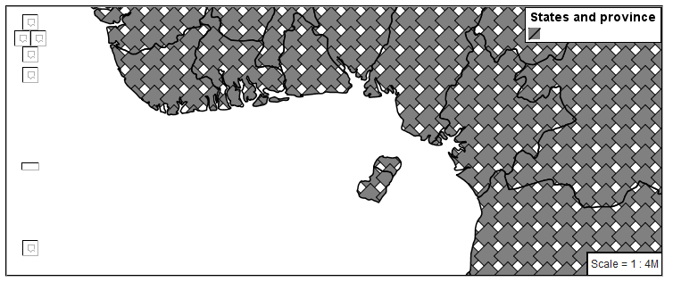

    !!! note

        Does the above look correct? There is an open request [GEOT-4642](https://osgeo-org.atlassian.net/browse/GEOT-4642) to rotate the entire pattern, rather than each individual symbol.

    !!! abstract "Instructor Notes"

        Prior to GeoServer 2.5 a **toRadians** call was required as described in [GEOT-4641](https://jira.codehaus.org/browse/GEOT-4641).
    
        ``` css
        * {
           fill: symbol(square);
           fill-size: 22px;
           fill-rotation: [toRadians(45)];
        }
        ```

7.  The size and rotation properties just affect the size and placement of the symbol, but do not alter the symbol's design. In order to control the color we need to make use of a **pseudo-selector**. We have two options for referencing to our symbol above:

    **:symbol** provides styling for all the symbols in the CSS document.

    **:fill** provides styling for all the fill symbols in the CSS document.

8.  Replace the contents of `polygon_example` with the following:

    ``` css
    * {
       fill: symbol(square);
    }
    :fill {
       fill: green;
       stroke: darkgreen;
    }
    ```

9.  This change adjusts the appearance of our grid of squares.

    

10. If you have more than one symbol:

    **:nth-symbol(1)** is used to specify which symbol in the document we wish to modify.

    **:nth-fill(1)** provides styling for the indicated fill symbol

    To rewrite our example to use this approach:

    ``` css
    * {
       fill: symbol(square);
    }
    :nth-fill(1) {
       fill: green;
       stroke: darkgreen;
    }
    ```

11. Since we only have one fill in our CSS document the map preview looks identical.

    

12. The well-known symbols are more suited for marking individual points. Now that we understand how a pattern can be controlled it is time to look at the patterns GeoServer provides.

    |                   |                                          |
    |-------------------|------------------------------------------|
    | shape://horizline | horizontal hatching                      |
    | shape://vertline  | vertical hatching                        |
    | shape://backslash | right hatching pattern                   |
    | shape://slash     | left hatching pattern                    |
    | shape://plus      | vertical and horizontal hatching pattern |
    | shape://times     | cross hatch pattern                      |

    Update the example to use **shape://slash** for a pattern of left hatching.

    ``` css
    * {
       fill: symbol('shape://slash');
       stroke: black;
    }
    :fill {
      stroke: gray;
    }
    ```

13. This approach is well suited to printed output or low color devices.

    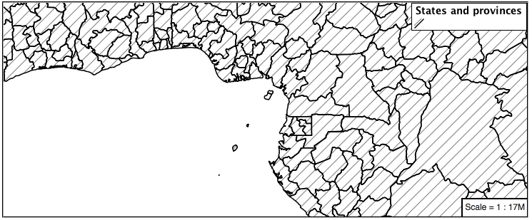

14. To control the size of the symbol produced use the **fill-size** property.

    ``` css
    * {
       fill: symbol('shape://slash');
       fill-size: 8;
       stroke: black;
    }
    :fill {
       stroke: green;
    }
    ```

15. This results in a tighter pattern shown:

    

16. Another approach (producing the same result is to use the **size** property on the appropriate pseudo-selector.

    ``` css
    * {
       fill: symbol('shape://slash');
       stroke: black;
    }
    :fill {
       stroke: green;
       size: 8;
    }
    ```

17. This produces the same visual result:

    > 

18. Multiple fills can be combined by supplying more than one fill as part of the same rule.

    Note the use of a comma to separate fill-size values (including the first fill-size value which is empty). This was the same approach used when combining strokes.

    ``` css
    * {
       fill: #DDDDFF, symbol('shape://slash');
       fill-size: '','8';
       stroke: black;
    }
    :fill {
       stroke: black;
       stroke-width: 0.5;
    }
    ```

19. The resulting image has a solid fill, with a pattern drawn overtop.

    

## Label

Labeling polygons follows the same approach used for LineStrings.

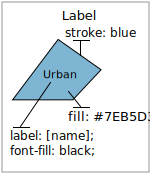

The key properties **fill** and **label** are used to enable Polygon label generation.

1.  By default labels are drawn starting at the centroid of each polygon.

    

2.  Try out **label** and **fill** together by replacing our `polygon_example` with the following:

    ``` css
    * {
      stroke: blue;
      fill: #7EB5D3;
      label: [name];
      font-fill: black;
    }
    ```

3.  Each label is drawn from the lower-left corner as shown in the `Map` preview.

    

4.  We can adjust how the label is drawn at the polygon centroid.

    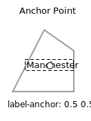

    The property **label-anchor** provides two numbers expressing how a label is aligned with respect to the centroid. The first value controls the horizontal alignment, while the second value controls the vertical alignment. Alignment is expressed between 0.0 and 1.0 as shown in the following table.

      ---------- --------- --------- ---------
                 Left      Center    Right

      Top        0.0 1.0   0.5 1.0   1.0 1.0

      Middle     0.0 0.5   0.5 0.5   1.0 0.5

      Bottom     0.0 0.0   0.5 0.0   1.0 0.0
      ---------- --------- --------- ---------

    Adjusting the **label-anchor** is the recommended approach to positioning your labels.

5.  Using the **label-anchor** property we can center our labels with respect to geometry centroid.

    To align the center of our label we select 50% horizontally and 50% vertically, by filling in 0.5 and 0.5 below:

    ``` {.css emphasize-lines="5"}
    * {  stroke: blue;
         fill: #7EB5D3;
         label: [name];
         font-fill: black;
         label-anchor: 0.5 0.5;
    }
    ```

6.  The labeling position remains at the polygon centroid. We adjust alignment by controlling which part of the label we are "snapping" into position.

    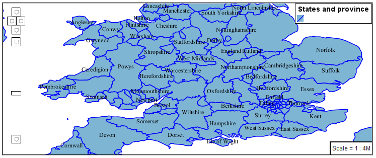

7.  The property **label-offset** can be used to provide an initial displacement using and x and y offset.

    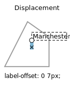

8.  This offset is used to adjust the label position relative to the geometry centroid resulting in the starting label position.

    ``` {.css emphasize-lines="5"}
    * {  stroke: blue;
         fill: #7EB5D3;
         label: [name];
         font-fill: black;
         label-offset: 0 7;
    }
    ```

9.  Confirm this result in the map preview.

    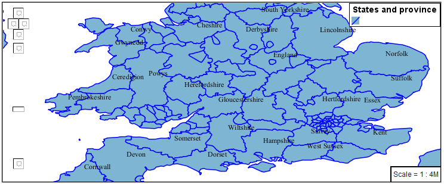

10. These two settings can be used together.

    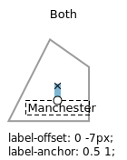

    The rendering engine starts by determining the label position generated from the geometry centroid and the **label-offset** displacement. The bounding box of the label is used with the **label-anchor** setting align the label to this location.

    **Step 1**: starting label position = centroid + displacement

    **Step 2**: snap the label anchor to the starting label position

11. To move our labels down (allowing readers to focus on each shape) we can use displacement combined with followed by horizontal alignment.

    ``` {.css emphasize-lines="5,6"}
    * {  stroke: blue;
         fill: #7EB5D3;
         label: [name];
         font-fill: black;
         label-anchor: 0.5 1;
         label-offset: 0 -7;
     }
    ```

12. As shown in the map preview.

    

## Legibility

When working with labels a map can become busy very quickly, and difficult to read.

1.  GeoServer provides extensive vendor parameters directly controlling the labelling process.

    Many of these parameters focus on controlling conflict resolution (when labels would otherwise overlap).

2.  Two common properties for controlling labeling are:

    **label-max-displacement** indicates the maximum distance GeoServer should displace a label during conflict resolution.

    **label-auto-wrap** allows any labels extending past the provided width will be wrapped into multiple lines.

3.  Using these together we can make a small improvement in our example:

    ``` {.css emphasize-lines="7,8"}
    * {  stroke: blue;
         fill: #7EB5D3;
         label: [name];
         font-fill: black;
         label-anchor: 0.5 0.5;

         label-max-displacement: 40;
         label-auto-wrap: 70;
       }
    ```

4.  As shown in the following preview.

    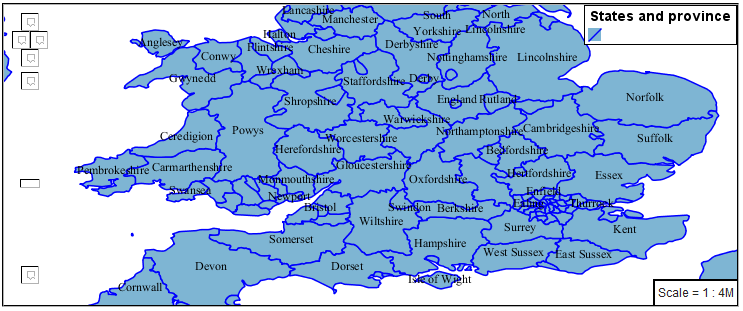

5.  Even with this improved spacing between labels, it is difficult to read the result against the complicated line work.

    Use of a halo to outline labels allows the text to stand out from an otherwise busy background. In this case we will make use of the fill color, to provide some space around our labels. We will also change the font to Arial.

    ``` {.css emphasize-lines="8-10"}
    * {  stroke: blue;
         fill: #7EB5D3;
         label: [name];
         label-anchor: 0.5 0.5;
         font-fill: black;
         font-family: "Arial";
         font-size: 14;
         halo-radius: 2;
         halo-color: #7EB5D3;
         halo-opacity:0.8;

         label-max-displacement: 40;
         label-auto-wrap: 70;
       }
    ```

6.  By making use of **halo-opacity** we still allow stroke information to show through, but prevent the stroke information from making the text hard to read.

    

7.  And advanced technique for manually taking control of conflict resolution is the use of the **label-priority**.

    This property takes an expression which is used in the event of a conflict. The label with the highest priority "wins."

8.  The Natural Earth dataset we are using includes a **labelrank** intended to control what labels are displayed based on zoom level.

    The values for **labelrank** go from 0 (for zoomed out) to 20 (for zoomed in). To use this value for **label-priority** we need to swap the values around so a **scalerank** of 1 is given the highest priority.

    ``` {.css emphasize-lines="14"}
    * {  stroke: blue;
         fill: #7EB5D3;
         label: [name];
         label-anchor: 0.5 0.5;
         font-fill: black;
         font-family: "Arial";
         font-size: 14;
         halo-radius: 2;
         halo-color: #7EB5D3;
         halo-opacity:0.8;

         label-max-displacement: 40;
         label-auto-wrap: 70;
         label-priority: [20-labelrank];
       }
    ```

9.  In the following map `East Flanders` will take priority over `Zeeland` when the two labels overlap.

    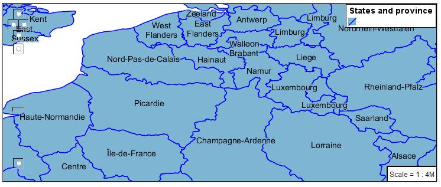

## Theme

A thematic map (rather than focusing on representing the shape of the world) uses elements of style to illustrate differences in the data under study. This section is a little more advanced and we will take the time to look at the generated SLD file.

!!! abstract "Instructor Notes"

    This instruction section follows our pattern with LineString. Building on the examples and exploring how selectors can be used.
    
    -   For LineString we explored the use of @scale, in this section we are going to look at theming by attribute.
    -   We also unpack how cascading occurs, and what the result looks like in the generated XML.
    -   care is being taken to introduce the symbology encoding functions as an option for theming ( placing equal importance on their use).
    
    Checklist:
    
    -   filter vs function for theming
    -   Cascading

1.  We can use a site like [ColorBrewer](http://www.colorbrewer2.com) to explore the use of color theming for polygon symbology. In this approach the fill color of the polygon is determined by the value of the attribute under study.

    

    This presentation of a dataset is known as "theming" by an attribute.

2.  For our `ne:states_provinces_shp` dataset, a **mapcolor9** attribute has been provided for this purpose. Theming by **mapcolor9** results in a map where neighbouring countries are visually distinct.

    +----------------------------+---------+---------+
    | > Qualitative 9-class Set3 |         |         |
    +----------------------------+---------+---------+
    | #8dd3c7                    | #fb8072 | #b3de69 |
    +----------------------------+---------+---------+
    | #ffffb3                    | #80b1d3 | #fccde5 |
    +----------------------------+---------+---------+
    | #bebada                    | #fdb462 | #d9d9d9 |
    +----------------------------+---------+---------+

    If you are unfamiliar with theming you may wish to visit <http://colorbrewer2.org> to learn more. The **i** icons provide an adequate background on theming approaches for qualitative, sequential and diverging datasets.

3.  The first approach we will take is to directly select content based on **colormap**, providing a color based on the **9-class Set3** palette above:

    ``` css
    [mapcolor9=1] {
       fill: #8dd3c7;
    }
    [mapcolor9=2] {
       fill: #ffffb3;
    }
    [mapcolor9=3] {
       fill: #bebada;
    }
    [mapcolor9=4] {
       fill: #fb8072;
    }
    [mapcolor9=5] {
       fill: #80b1d3;
    }
    [mapcolor9=6] {
       fill: #fdb462;
    }
    [mapcolor9=7] {
       fill: #b3de69;
    }
    [mapcolor9=8] {
       fill: #fccde5;
    }
    [mapcolor9=9] {
       fill: #d9d9d9;
    }
    * {
      stroke: gray;
      stroke-width: 0.5;
    }
    ```

4.  The **Map** tab can be used to preview this result.

    

5.  This CSS makes use of cascading to avoid repeating the **stroke** and **stroke-width** information multiple times.

    As an example the ``mapcolor9=2`` rule, combined with the `*` rule results in the following collection of properties:

    ``` css
    [mapcolor9=2] {
      fill: #ffffb3;
      stroke: gray;
      stroke-width: 0.5;
    }
    ```

6.  Reviewing the generated SLD shows us this representation:

    ``` xml
    <sld:Rule>
       <ogc:Filter>
          <ogc:PropertyIsEqualTo>
             <ogc:PropertyName>mapcolor9</ogc:PropertyName>
             <ogc:Literal>2</ogc:Literal>
          </ogc:PropertyIsEqualTo>
       </ogc:Filter>
       <sld:PolygonSymbolizer>
          <sld:Fill>
             <sld:CssParameter name="fill">#ffffb3</sld:CssParameter>
          </sld:Fill>
       </sld:PolygonSymbolizer>
       <sld:LineSymbolizer>
          <sld:Stroke>
             <sld:CssParameter name="stroke">#808080</sld:CssParameter>
             <sld:CssParameter name="stroke-width">0.5</sld:CssParameter>
          </sld:Stroke>
       </sld:LineSymbolizer>
    </sld:Rule>
    ```

7.  There are three important functions, defined by the Symbology Encoding specification, that are often easier to use for theming than using rules.

    -   **Recode**: Used the theme qualitative data. Attribute values are directly mapped to styling property such as **fill** or **stroke-width**.
    -   **Categorize**: Used the theme quantitative data. Categories are defined using min and max ranges, and values are sorted into the appropriate category.
    -   **Interpolate**: Used to smoothly theme quantitative data by calculating a styling property based on an attribute value.

    Theming is an activity, producing a visual result allow map readers to learn more about how an attribute is distributed spatially. We are free to produce this visual in the most efficient way possible.

8.  Swap out **mapcolor9** theme to use the **Recode** function:

    ``` css
    * {
      fill:[
        recode(mapcolor9,
          1,'#8dd3c7', 2,'#ffffb3', 3,'#bebada',
          4,'#fb8072', 5,'#80b1d3', 6,'#fdb462',
          7,'#b3de69', 8,'#fccde5', 9,'#d9d9d9')
      ]; 
      stroke: gray;
      stroke-width: 0.5;
    }
    ```

9.  The **Map** tab provides the same preview.

    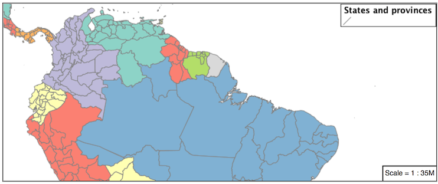

10. The **Generated SLD** tab shows where things get interesting. Our generated style now consists of a single **Rule**:

    ``` xml
    <sld:Rule>
       <sld:PolygonSymbolizer>
          <sld:Fill>
             <sld:CssParameter name="fill">
                <ogc:Function name="Recode">
                   <ogc:PropertyName>mapcolor9</ogc:PropertyName>
                   <ogc:Literal>1</ogc:Literal>
                      <ogc:Literal>#8dd3c7</ogc:Literal>
                   <ogc:Literal>2</ogc:Literal>
                      <ogc:Literal>#ffffb3</ogc:Literal>
                   <ogc:Literal>3</ogc:Literal>
                      <ogc:Literal>#bebada</ogc:Literal>
                   <ogc:Literal>4</ogc:Literal>
                      <ogc:Literal>#fb8072</ogc:Literal>
                   <ogc:Literal>5</ogc:Literal>
                      <ogc:Literal>#80b1d3</ogc:Literal>
                   <ogc:Literal>6</ogc:Literal>
                      <ogc:Literal>#fdb462</ogc:Literal>
                   <ogc:Literal>7</ogc:Literal>
                      <ogc:Literal>#b3de69</ogc:Literal>
                   <ogc:Literal>8</ogc:Literal>
                      <ogc:Literal>#fccde5</ogc:Literal>
                   <ogc:Literal>9</ogc:Literal>
                      <ogc:Literal>#d9d9d9</ogc:Literal>
             </ogc:Function>
             </sld:CssParameter>
          </sld:Fill>
       </sld:PolygonSymbolizer>
       <sld:LineSymbolizer>
          <sld:Stroke>
             <sld:CssParameter name="stroke">#808080</sld:CssParameter>
             <sld:CssParameter name="stroke-width">0.5</sld:CssParameter>
          </sld:Stroke>
       </sld:LineSymbolizer>
    </sld:Rule>
    ```

## Bonus

The following optional explore and challenge activities offer a chance to review and apply the ideas introduced here. The challenge activities require a bit of creativity and research to complete.

In a classroom setting you are encouraged to team up into groups, with each group taking on a different challenge.

### Explore Antialiasing {: #css.polygon.q1 }

1.  When we rendered our initial preview, without a stroke, thin white gaps (or slivers) are visible between our polygons.

    

    This effect is made more pronounced by the rendering engine making use of the Java 2D sub-pixel accuracy. This technique is primarily used to prevent an aliased (stair-stepped) appearance on diagonal lines.

2.  Clients can turn this feature off using a GetMap format option:

        format_options=antialiasing=off;

    The **LayerPreview** provides access to this setting from the Open Layers **Options Toolbar**:

    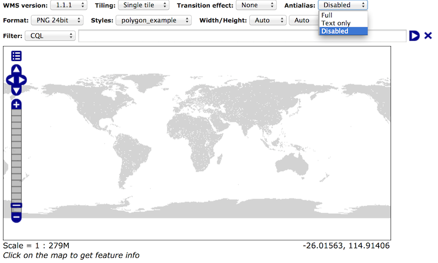

3.  **Explore:** Experiment with **fill** and **stroke** settings to eliminate slivers between polygons.

    !!! note

        Answer `provided <css.polygon.a1>`{.interpreted-text role="ref"} at the end of the workbook.

### Explore Categorize {: #css.polygon.q2 }

!!! abstract "Instructor Notes"

    This section reviews use of the Symbology Encoding Categorize function for something else other than color. Goal is to have readers reach for SE Functions as often as selectors when styling.
    
    Additional exercise ideas:
    
    -   Control size using Interpolate: While Recode offers an alternative for selectors (matching discrete values) Interpolate brings something new to the table - gradual color (or value) progression. The best of example of this is controlling width using the `ne:rivers` data layer (which is not yet available).

1.  The **Categorize** function can be used to generate property values based on quantitative information. Here is an example using Categorize to color states according to size.

    ``` css
    * {
       fill: [
          Categorize(Shape_Area,
             '#08519c', 0.5,
             '#3182bd', 1,
             '#6baed6', 5,
             '#9ecae1', 60,
             '#c6dbef', 80,
             '#eff3ff')
       ];
    }
    ```

    

2.  An exciting use of the GeoServer **shape** symbols is the theming by changing the **fill-size** used for pattern density.

3.  **Explore:** Use the **Categorize** function to theme by **datarank**.

    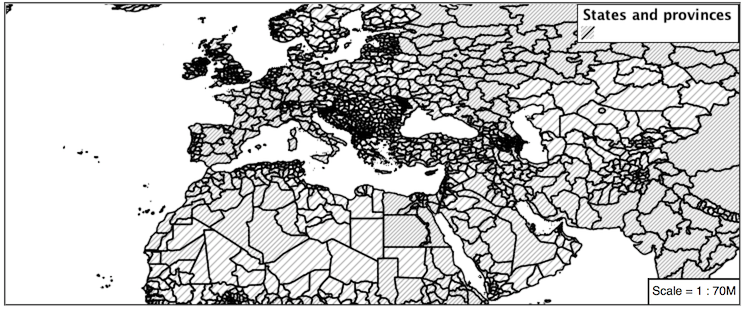

    !!! note

        Answer `provided <css.polygon.a2>`{.interpreted-text role="ref"} at the end of the workbook.

### Challenge Goodness of Fit {: #css.polygon.q3 }

1.  A subject we touched on during labeling was the conflict resolution GeoServer performs to ensure labels do not overlap.

2.  In addition to the vendor parameter for max displacement you can experiment with different values for "goodness of fit". These settings control how far GeoServer is willing to move a label to avoid conflict, and under what terms it simply gives up:

        label-fit-goodness: 0.3;
        label-max-displacement: 130;

3.  You can also experiment with turning off this facility completely:

        label-conflict-resolution: false;

4.  **Challenge:** Construct your own example using max displacement and fit-goodness.

### Challenge Halo {: #css.polygon.q4 }

1.  The halo example used the fill color and opacity for a muted halo, while this improved readability it did not bring attention to our labels.

    A common design choice for emphasis is to outline the text in a contrasting color.

2.  **Challenge:** Produce a map that uses a white halo around black text.

    !!! note

        Answer `provided <css.polygon.a4>`{.interpreted-text role="ref"} at the end of the workbook.

### Challenge Theming using Multiple Attributes {: #css.polygon.q5 }

1.  A powerful tool is theming using multiple attributes. This is an important concept allowing map readers to perform "integration by eyeball" (detecting correlations between attribute values information).

2.  **Challenge:** Combine the **mapcolor9** and **datarank** examples to reproduce the following map.

    

    !!! note

        Answer `provided <css.polygon.a5>`{.interpreted-text role="ref"} at the end of the workbook.

### Challenge Use of Z-Index {: #css.polygon.q6 }

> 1.  Earlier we looked at using **z-index** to simulate line string casing. The line work was drawn twice, once with thick line, and then a second time with a thinner line. The resulting effect is similar to text halos - providing breathing space around complex line work allowing it to stand out.
>
> 2.  **Challenge:** Use what you know of LineString **z-index** to reproduce the following map:
>
>     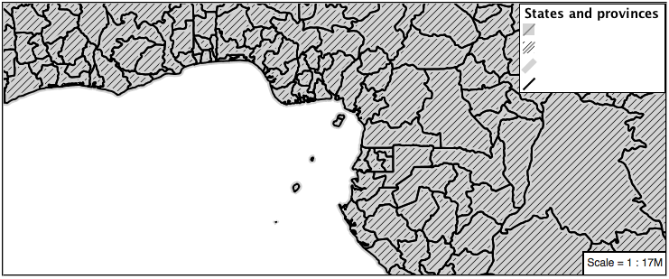
>
> ::: note
> ::: title
> Note
> :::
>
> Answer `provided <css.polygon.a6>`{.interpreted-text role="ref"} at the end of the workbook.
> :::
