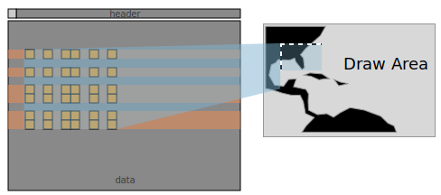
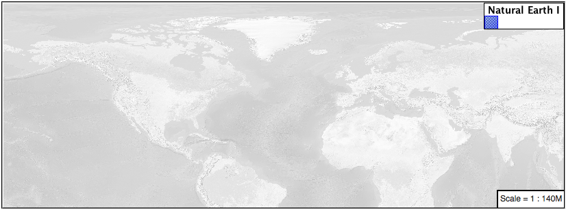
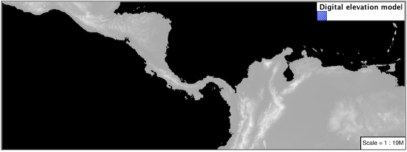
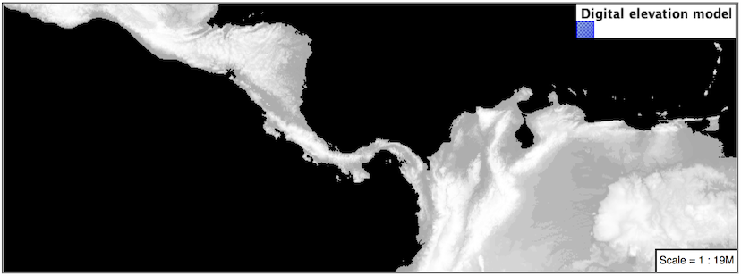
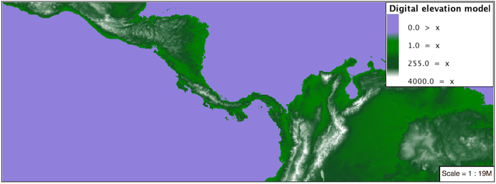
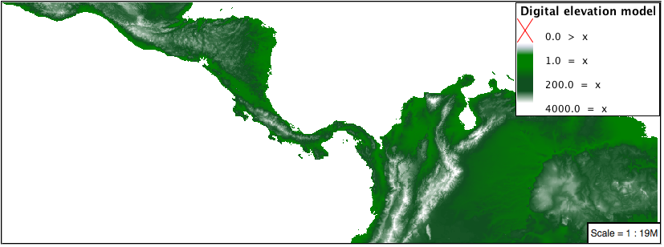
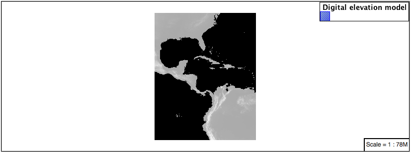
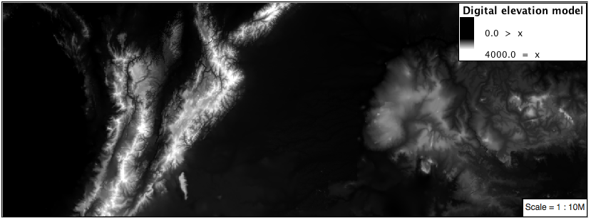
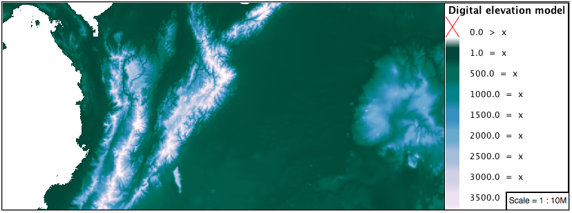
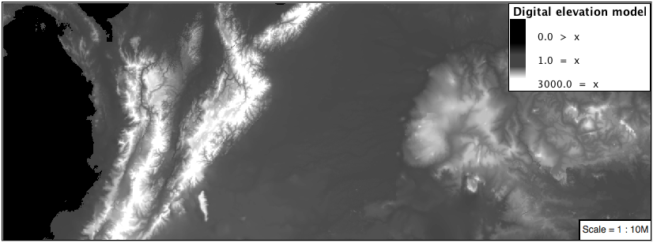

# Rasters {: #styling_workshop_css_raster }

Finally we will look at using CSS styling for the portrayal of raster data.


*Raster Symbology*

Review of raster symbology:

-   Raster data is **Grid Coverage** where values have been recorded in a regular array. In OGC terms a **Coverage** can be used to look up a value or measurement for each location.

-   When queried with a "sample" location:

    -   A grid coverage can determine the appropriate array location and retrieve a value. Different techniques may be used interpolate an appropriate value from several measurements (higher quality) or directly return the "nearest neighbor" (faster).
    -   A vector coverages would use a point-in-polygon check and return an appropriate attribute value.
    -   A scientific model can calculate a value for each sample location

-   Many raster formats organize information into bands of content. Values recorded in these bands and may be mapped into colors for display (a process similar to theming an attribute for vector data).

    For imagery the raster data is already formed into red, green and blue bands for display.

-   As raster data has no inherent shape, the format is responsible for describing the orientation and location of the grid used to record measurements.

These raster examples use a digital elevation model consisting of a single band of height measurements. The imagery examples use an RGB image that has been hand coloured for use as a base map.

Reference:

-   [Raster Symbology](../../css/properties.md#css_properties_raster) (User Manual | CSS Property Listing )
-   [Rasters](../../css/cookbook/raster.md) (User Manual | CSS Cookbook );
-   [Point](../../sld/reference/rastersymbolizer.md) (User Manual | SLD Reference )

The exercise makes use of the `usgs:dem` and `ne:ne1` layers.

## Image

The **raster-channels** is the **key property** for display of images and raster data. The value `to` is recommended, allowing the image format to select the appropriate red, green and blue channels for display.

1.  Navigate to the **Styles** page.

2.  Click **Add a new style** and choose the following:

      --------------------- -------------------------------------------------
      Name:                 `le`

      Workspace:            `ce`

      Format:               `SS`
      --------------------- -------------------------------------------------

3.  Replace the initial CSS definition with:

    ``` css
    * {
      raster-channels: auto;
    }
    ```

4.  And use the **Layer Preview** tab to preview the result.

    

5.  If required a list three band numbers can be supplied (for images recording in several wavelengths) or a single band number can be used to view a grayscale image.

    ``` css
    * {
      raster-channels: 2;
    }
    ```

6.  Isolating just the green band (it will be drawn as a grayscale image):

    

## DEM

A digital elevation model is an example of raster data made up of measurements, rather than colors information.

The `usgs:dem` layer used for this exercise:

1.  Return to the **Styles** page.

2.  Click **Add a new style** and choose the following:

      --------------------- -------------------------------------------------
      Name:                 `le`

      Workspace:            `ce`

      Format:               `SS`
      --------------------- -------------------------------------------------

3.  When we use the **raster-channels** property set to `to` the rendering engine will select our single band of raster content, and do its best to map these values into a grayscale image. Replace the content of the style with:

    ``` css
    * {
      raster-channels: auto;
    }
    ```

4.  Use the **Layer Preview** tab to preview the result. The range produced in this case from the highest and lowest values.

    

5.  We can use a bit of image processing to emphasis the generated color mapping by making use **raster-contrast-enhancement**.

    ``` css
    * {
      raster-channels: 1;
      raster-contrast-enhancement: histogram;
    }
    ```

6.  Image processing of this sort should be used with caution as it does distort the presentation (in this case making the landscape look more varied then it is in reality.

    

### Color Map

The approach of mapping a data channel directly to a color channel is only suitable to quickly look at quantitative data.

For qualitative data (such as land use) or simply to use color, we need a different approach:

1.  Apply the following CSS to our ``usgs:DEM`` layer:

    ``` css
    * {
      raster-channels: auto;
      raster-color-map: color-map-entry(#9080DB, 0)
                        color-map-entry(#008000, 1)
                        color-map-entry(#105020, 255)
                        color-map-entry(#FFFFFF, 4000);
    }
    ```

2.  Resulting in this artificial color image:

    

3.  An opacity value can also be used with **color-map-entry**.

    ``` css
    * {
      raster-channels: auto;
      raster-color-map: color-map-entry(#9080DB, 0, 0.0)
                        color-map-entry(#008000, 1, 1.0)
                        color-map-entry(#105020, 200, 1.0)
                        color-map-entry(#FFFFFF, 4000, 1.0);
    }
    ```

4.  Allowing the areas of zero height to be transparent:

    

5.  Raster format for GIS work often supply a "no data" value, or contain a mask, limiting the dataset to only the locations with valid information.

### Custom

We can use what we have learned about color maps to apply a color brewer palette to our data.

This exploration focuses on accurately communicating differences in value, rather than strictly making a pretty picture. Care should be taken to consider the target audience and medium used during palette selection.

1.  Restore the `raster_example` CSS style to the following:

    ``` css
    * {
      raster-channels: auto;
    }
    ```

2.  Producing the following map preview.

    

3.  To start with we can provide our own grayscale using two color map entries.

    ``` css
    * {
      raster-channels: auto;
      raster-color-map: color-map-entry(#000000, 0)
                        color-map-entry(#FFFFFF, 4000);
    }
    ```

4.  Use the **Map** tab to zoom in and take a look.

    This is much more direct representation of the source data. We have used our knowledge of elevations to construct a more accurate style.

    

5.  While our straightforward style is easy to understand, it does leave a bit to be desired with respect to clarity.

    The eye has a hard time telling apart dark shades of black (or bright shades of white) and will struggle to make sense of this image. To address this limitation we are going to switch to the ColorBrewer **9-class PuBuGn** palette. This is a sequential palette that has been hand tuned to communicate a steady change of values.

    

6.  Update your style with the following:

    ``` css
    * {
      raster-channels: auto;
      raster-color-map:
         color-map-entry(#014636,   0)
         color-map-entry(#016c59, 500)
         color-map-entry(#02818a,1000)
         color-map-entry(#3690c0,1500)
         color-map-entry(#67a9cf,2000)
         color-map-entry(#a6bddb,2500)
         color-map-entry(#d0d1e6,3000)
         color-map-entry(#ece2f0,3500)
         color-map-entry(#fff7fb,4000);
    }
    ```

    

7.  A little bit of work with alpha (to mark the ocean as a no-data section):

    ``` css
    * {
      raster-channels: auto;
      raster-color-map:
         color-map-entry(#014636,   0,0)
         color-map-entry(#014636,   1)
         color-map-entry(#016c59, 500)
         color-map-entry(#02818a,1000)
         color-map-entry(#3690c0,1500)
         color-map-entry(#67a9cf,2000)
         color-map-entry(#a6bddb,2500)
         color-map-entry(#d0d1e6,3000)
         color-map-entry(#ece2f0,3500)
         color-map-entry(#fff7fb,4000);
    }
    ```

8.  And we are done:

    

### Bonus

## Explore Contrast Enhancement {: #css.raster.q1 }

1.  A special effect that is effective with grayscale information is automatic contrast adjustment.

2.  Make use of a simple contrast enhancement with `usgs:dem`:

    ``` css
    * {
        raster-channels: auto;
        raster-contrast-enhancement: normalize;
    }
    ```

3.  Can you explain what happens when zoom in to only show a land area (as indicated with the bounding box below)?

    

    !!! note

        Discussion `provided <ysld.raster.a1>`{.interpreted-text role="ref"} at the end of the workbook.

## Challenge Intervals {: #css.raster.q2 }

1.  The **raster-color-map-type** property dictates how the values are used to generate a resulting color.

    -   `mp` is used for quantitative data, providing a smooth interpolation between the provided color values.
    -   `ls` provides categorization for quantitative data, assigning each range of values a solid color.
    -   `es` is used for qualitative data, each value is required to have a **color-map-entry** or it will not be displayed.

2.  **Challenge:** Update your DEM example to use **intervals** for presentation. What are the advantages of using this approach for elevation data?

    !!! note

        Answer `provided <ysld.raster.a2>`{.interpreted-text role="ref"} at the end of the workbook.

    !!! abstract "Instructor Notes"

        By using intervals it becomes very clear how relatively flat most of the continent is. The ramp presentation provided lots of fascinating detail which distracted from this fact.
    
        Here is style for you to cut and paste:
    
        ``` css
        * {
          raster-channels: auto;
          raster-color-map:
             color-map-entry(#014636,   0,0)
             color-map-entry(#014636,   1)
             color-map-entry(#016c59, 500)
             color-map-entry(#02818a,1000)
             color-map-entry(#3690c0,1500)
             color-map-entry(#67a9cf,2000)
             color-map-entry(#a6bddb,2500)
             color-map-entry(#d0d1e6,3000)
             color-map-entry(#ece2f0,3500)
             color-map-entry(#fff7fb,4000);
          raster-color-map-type: intervals;
        }
        ```
    
        

## Explore Image Processing

Additional properties are available to provide slight image processing during visualization.

!!! note

    In this section are we going to be working around a preview issue where only the top left corner of the raster remains visible during image processing. This issue has been reported as [GEOS-6213](https://osgeo-org.atlassian.net/browse/GEOS-6213).

Image processing can be used to enhance the output to highlight small details or to balance images from different sensors allowing them to be compared.

1.  The **raster-contrast-enhancement** property is used to turn on a range of post processing effects. Settings are provided for `ze` or `am` or `ne`;

    ``` css
    * {
        raster-channels: auto;
        raster-contrast-enhancement: normalize;
    }
    ```

2.  Producing the following image:

    

3.  The **raster-gamma** property is used adjust the brightness of **raster-contrast-enhancement** output. Values less than 1 are used to brighten the image while values greater than 1 darken the image.

    ``` css
    * {
       raster-channels: auto;
       raster-contrast-enhancement: none;
       raster-gamma: 1.5;
    }
    ```

4.  Providing the following effect:

    

## Challenge Clear Digital Elevation Model Presentation {: #css.raster.q3 }

1.  Now that you have seen the data on screen and have a better understanding how would you modify our initial gray-scale example?

2.  **Challenge:** Use what you have learned to present the `usgs:dem` clearly.

    !!! note

        Answer `provided <ysld.raster.a3>`{.interpreted-text role="ref"} at the end of the workbook.

    !!! abstract "Instructor Notes"

        The original was a dark mess, students will hopefully make use of the mid-tones (or even check color brewer) in order to fix this. I have left the ocean dark so the mountains can stand out more.
    
        ``` css
        * {
          raster-channels: auto;
          raster-color-map: color-map-entry(#000000, 0)
                            color-map-entry(#444444, 1)
                            color-map-entry(#FFFFFF, 3000);
        }
        ```
    
        

## Challenge Raster Opacity {: #css.raster.q4 }

1.  There is a quick way to make raster data transparent, **raster-opacity** property works in the same fashion as with vector data. The raster as a whole will be drawn partially transparent allow content from other layers to provide context.

2.  **Challenge:** Can you think of an example where this would be useful?

    !!! note

        Discussion `provided <ysld.raster.a4>`{.interpreted-text role="ref"} at the end of the workbook.
