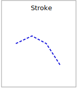
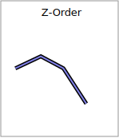
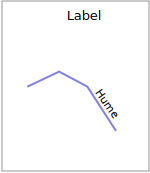
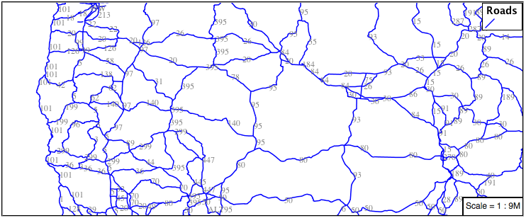
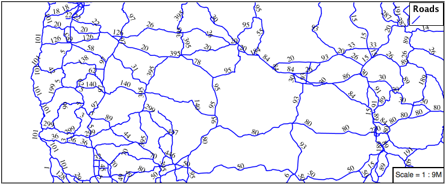
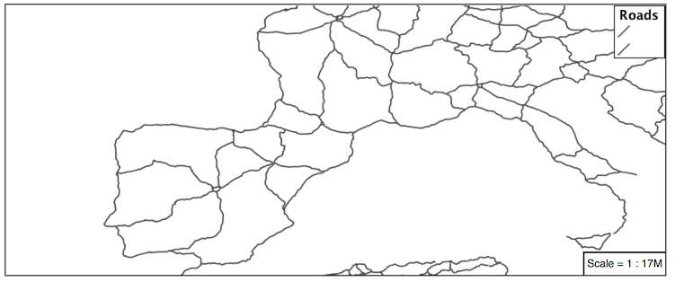

# Lines

We will start our tour of MBStyle styling by looking at the representation of lines.


*LineString Geometry*

Review of line symbology:

-   Lines can be used to represent either abstract concepts with length but not width such as networks and boundaries, or long thin features with a didth that is too smallt o represent on the map. This means that **the visual width of line symbols do not normally change depending on scale.**
-   Lines are recorded as LineStrings or Curves depending on the geometry model used.
-   SLD uses a **LineSymbolizer** to record how the shape of a line is drawn. The primary characteristic documented is the **Stroke** used to draw each segment between vertices.
-   Labeling of line work is anchored to the midpoint of the line. GeoServer provides a vendor option to allow label rotation aligned with line segments.

For our exercises we are going to be using simple MBStyle documents, often consisting of a single layer, in order to focus on the properties used for line symbology.

Each exercise makes use of the `ne:roads` layer.

Reference:

-   [MBStyle Reference](../../mbstyle/reference/index.md)
-   [MapBox Style Spec Line Layer](https://www.mapbox.com/mapbox-gl-js/style-spec/#layers-line)
-   [LineString](../../sld/reference/linesymbolizer.md) (User Manual | SLD Reference )

## Line

A line layer is represented by the `ne` type.


*Basic Stroke Properties*

1.  Navigate to the **Styles** page.

2.  Click **Add a new style** and choose the following:

      -------------------------- -------------------------------------------------
      New style name:            `le`

      Workspace for new layer:   Leave blank

      Format:                    `le`
      -------------------------- -------------------------------------------------

3.  Fill in the style editor

    ``` json
    {
      "version": 8,
      "name": "line_example",
      "layers": [
          {
              "id": "line_example",
              "source-layer": "ne:roads",
              "type": "line",
          }
      ]
    }
    ```

4.  Click **Apply**

5.  Click **Layer Preview** to see your new style applied to a layer.

    You can use this tab to follow along as the style is edited, it will refresh each time **Apply** is pressed.

    

6.  You can see the equivalent SLD by requesting ``http://localhost:8080/geoserver/rest/styles/line_example.sld?pretty=true`` which will currently show the default line symbolizer we created.

    ``` xml
    <?xml version="1.0" encoding="UTF-8"?><sld:StyledLayerDescriptor xmlns="http://www.opengis.net/sld" xmlns:sld="http://www.opengis.net/sld" xmlns:gml="http://www.opengis.net/gml" xmlns:ogc="http://www.opengis.net/ogc" version="1.0.0">
      <sld:NamedLayer>
        <sld:Name>line_example</sld:Name>
        <sld:UserStyle>
          <sld:Name>line_example</sld:Name>
          <sld:FeatureTypeStyle>
            <sld:Name>name</sld:Name>
            <sld:Rule>
              <sld:LineSymbolizer/>
            </sld:Rule>
          </sld:FeatureTypeStyle>
        </sld:UserStyle>
      </sld:NamedLayer>
    </sld:StyledLayerDescriptor>
    ```

We only specified the line layer, so all of the boilerplate around was generated for us.

1.  Additional properties cane be used fine-tune appearance. Use **line-color** to specify the colour and width of the line.

    ``` {.json emphasize-lines="3"}
    {
      "paint": {
        "line-color": "blue"
      }
    }
    ```

2.  **line-width** lets us make the line wider

    ``` {.json emphasize-lines="4"}
    {
      "paint": {
        "line-color": "blue",
        "line-width": 2
      }
    }
    ```

3.  **line-dasharray** applies a dot dash pattern.

    ``` {.json emphasize-lines="5"}
    {
      "paint": {
        "line-color": "blue",
        "line-width": 2,
        "line-dasharray": [5, 2]
      }
    }
    ```

4.  Check the **Map** tab to preview the result.

    

## Multiple Layers

Providing two strokes is often used to provide a contrasting edge (called casing) to thick lines. This can be created using two layers.



1.  Start by filling in a bit of boilerplate that we'll be using

    ``` json
    {
      "version": 8,
      "name": "line_example",
      "layers": [
        {
          "id": "line_example",
          "source-layer": "ne:roads",
          "type": "line",
          "paint": {
            "line-color": "#8080E6",
            "line-width": 3,
          }
        }
      ]
    }
    ```

2.  Add a second layer to the rule

    ``` {.json emphasize-lines="6-12"}
    {
      "version": 8,
      "name": "line_example",
      "layers": [
        {
          "id": "line_casing",
          "source-layer": "ne:roads",
          "type": "line",
          "paint": {
            "line-color": "black",
            "line-width": 5,
          }
        },
        {
          "id": "line_center",
          "source-layer": "ne:roads",
          "type": "line",
          "paint": {
            "line-color": "#8080E6",
            "line-width": 3,
          }
        }
      ]
    }
    ```

    The wider black line is first so it is drawn first, then the thinner blue line drawn second and so over top of the black line. This is called the painter's algorithm.

    

## Label

Our next example is significant as it introduces how text labels are generated.


*Use of Label Property*

This is also our first example making use of a dynamic style (where a value comes from an attribute from your data).

1.  To enable LineString labeling we add a `ol` layer with a ``text-field``.

    Update `line_example` with the following:

    ``` {.json emphasize-lines="15-20"}
    {
      "version": 8,
      "name": "line_example",
      "layers": [
        {
          "id": "line",
          "source-layer": "ne:roads",
          "type": "line",
          "paint": {
            "line-color": "blue",
            "line-width": 1,
          }
        },
        {
          "id": "label",
          "source-layer": "ne:roads",
          "type": "symbol",
          "layout": {
            "text-field": "{name}"
          }
        }
      ]
    }
    ```

2.  The SLD standard documents the default label position for each kind of Geometry. For LineStrings the initial label is positioned on the midway point of the line.

    

3.  We have used a feature property calculate a value for the label. The **label** is generated dynamically from the `me` attribute. Feature properties are supplied within curly braces, and must match the name of a property of the feature type.

    ``` {.json emphasize-lines="19"}
    {
     "version": 8,
     "name": "line_example",
     "layers": [
       {
         "id": "line",
         "source-layer": "ne:roads",
         "type": "line",
         "paint": {
           "line-color": "blue",
           "line-width": 1,
         }
       },
       {
         "id": "label",
         "source-layer": "ne:roads",
         "type": "symbol",
         "layout": {
           "text-field": "{name}"
         }
       }
     ]
    }
    ```

4.  Additional keys can be supplied to fine-tune label presentation:

    ``` {.json emphasize-lines="20,21,24"}
    {
      "version": 8,
      "name": "line_example",
      "layers": [
        {
          "id": "line",
          "source-layer": "ne:roads",
          "type": "line",
          "paint": {
            "line-color": "blue",
            "line-width": 1,
          }
        },
        {
          "id": "label",
          "source-layer": "ne:roads",
          "type": "symbol",
          "layout": {
            "text-field": "{name}",
            "symbol-placement": "line",
            "text-offset": [0, -8]
          }
          "paint": {
            "text-color": "black"
          }
        }
      ]
    }
    ```

5.  The **text-color** property is set to `ck` to provide the colour of the text. Notice how this is a **paint** property, unlike all the others which are **layout** properties.

    ``` {.json emphasize-lines="24"}
    {
      "version": 8,
      "name": "line_example",
      "layers": [
        {
          "id": "line",
          "source-layer": "ne:roads",
          "type": "line",
          "paint": {
            "line-color": "blue",
            "line-width": 1,
          }
        },
        {
          "id": "label",
          "source-layer": "ne:roads",
          "type": "symbol",
          "layout": {
            "text-field": "{name}",
            "symbol-placement": "line",
            "text-offset": [0, -8]
          }
          "paint": {
            "text-color": "black"
          }
        }
      ]
    }
    ```

6.  The **symbol-placement** property is used to set how the label is placed with respect to the line. By default it is `nt` which causes the label to be placed next to the midpoint as it would be for a point feature. When set to `ne` it is placed along the line instead. **text-offset** specifies how far from the anchor the label should be placed, in both the x and y directions.

    ``` {.json emphasize-lines="20,21"}
    {
      "version": 8,
      "name": "line_example",
      "layers": [
        {
          "id": "line",
          "source-layer": "ne:roads",
          "type": "line",
          "paint": {
            "line-color": "blue",
            "line-width": 1,
          }
        },
        {
          "id": "label",
          "source-layer": "ne:roads",
          "type": "symbol",
          "layout": {
            "text-field": "{name}",
            "symbol-placement": "line",
            "text-offset": [0, -8]
          }
          "paint": {
            "text-color": "black"
          }
        }
      ]
    }
    ```

    

## How Labeling Works

The rendering engine collects all the generated labels during the rendering of each layer. Then, during labeling, the engine sorts through the labels performing collision avoidance (to prevent labels overlapping). Finally the rendering engine draws the labels on top of the map. Even with collision avoidance you can spot areas where labels are so closely spaced that the result is hard to read.

1.  The parameter **text-padding** provides additional space around our label for use in collision avoidance.

    ``` {.json emphasize-lines="22"}
    {
      "version": 8,
      "name": "line_example",
      "layers": [
        {
          "id": "line",
          "source-layer": "ne:roads",
          "type": "line",
          "paint": {
            "line-color": "blue",
            "line-width": 1,
          }
        },
        {
          "id": "label",
          "source-layer": "ne:roads",
          "type": "symbol",
          "layout": {
            "text-field": "{name}",
            "symbol-placement": "line",
            "text-offset": [0, -8],
            "text-padding": "10"
          }
          "paint": {
            "text-color": "black"
          }
        }
      ]
    }
    ```

2.  Each label is now separated from its neighbor, improving legibility.

    

## Zoom

This section explores the use of rules with filters and zoom restrictions.

1.  Replace the `le` MBStyle definition with:

    ``` json
    {
      "version": 8,
      "name": "line_example",
      "layers": [
        {
          "id": "line_example",
          "source-layer": "ne:roads",
          "type": "line",
          "filter": ["<", "scalerank", 4],
          "paint": {
            "line-color": "black",
            "line-width": 1
          }
        }
      ]
    }
    ```

2.  And use the **Map** tab to preview the result.

    

3.  The **scalerank** attribute is provided by the Natural Earth dataset to allow control of the level of detail based on scale. Our filter short-listed all content with scalerank 4 or lower, providing a nice quick preview when we are zoomed out.

4.  In addition to testing feature attributes, selectors can also be used to check the state of the rendering engine.

    Replace your MBStyle with the following:

    ``` json
    {
      "version": 8,
      "name": "line_example",
      "layers": [
        {
          "id": "line_black",
          "source-layer": "ne:roads",
          "type": "line",
          "maxzoom": 3,
          "paint": {
            "line-color": "black",
            "line-width": 1
          }
        },
        {
          "id": "line_blue",
          "source-layer": "ne:roads",
          "type": "line",
          "minzoom": 3,
          "paint": {
            "line-color": "blue",
            "line-width": 1
          }
        }
      ]
    }
    ```

5.  As you adjust the scale in the **Map** preview (using the mouse scroll wheel) the color will change between black and blue. You can read the current scale in the bottom right corner, and the legend will change to reflect the current style.

    

6.  Putting these two ideas together allows control of level detail based on scale:

    ``` json
    {
      "version": 8,
      "name": "line_example",
      "layers": [
        {
          "id": "line_else",
          "source-layer": "ne:roads",
          "type": "line",
          "filter": [">", "scalerank", 7],
          "minzoom": 7,
          "paint": {
            "line-color": "#888888",
            "line-width": 1
          }
        },
        {
          "id": "line_7",
          "source-layer": "ne:roads",
          "type": "line",
          "filter": ["==", "scalerank", 7],
          "minzoom": 6,
          "paint": {
            "line-color": "#777777",
            "line-width": 1
          }
        },
        {
          "id": "line_6",
          "source-layer": "ne:roads",
          "type": "line",
          "filter": ["==", "scalerank", 6],
          "minzoom": 5,
          "paint": {
            "line-color": "#444444",
            "line-width": 1
          }
        },
        {
          "id": "line_5_1",
          "source-layer": "ne:roads",
          "type": "line",
          "filter": ["==", "scalerank", 5],
          "minzoom": 4,
          "maxzoom": 7
          "paint": {
            "line-color": "#000055",
            "line-width": 1
          }
        },
        {
          "id": "line_5_2",
          "source-layer": "ne:roads",
          "type": "line",
          "filter": ["==", "scalerank", 5],
          "minzoom": 7,
          "paint": {
            "line-color": "#000055",
            "line-width": 2
          }
        },
        {
          "id": "line_5_1",
          "source-layer": "ne:roads",
          "type": "line",
          "filter": ["<=", "scalerank", 4],
          "maxzoom": 5,
          "paint": {
            "line-color": "black",
            "line-width": 1
          }
        },
        {
          "id": "line_5_2",
          "source-layer": "ne:roads",
          "type": "line",
          "filter": ["<=", "scalerank", 4],
          "minzoom": 5,
          "maxzoom": 7
          "paint": {
            "line-color": "black",
            "line-width": 2
          }
        },
        {
          "id": "line_5_4",
          "source-layer": "ne:roads",
          "type": "line",
          "filter": ["<=", "scalerank", 4],
          "minzoom": 7,
          "paint": {
            "line-color": "black",
            "line-width": 4
          }
        }
      ]
    }
    ```

7.  When a rule has both a filter and a scale, it will trigger when both are true.

    

## Bonus

Finished early? Here are some opportunities to explore what we have learned, and extra challenges requiring creativity and research.

In a classroom setting please divide the challenges between teams (this allows us to work through all the material in the time available).

!!! abstract "Instructor Notes"

    As usual the Explore section invites readers to reapply the material covered in a slightly different context or dataset.
    
    The use of selectors using the roads **type** attribute provides this opportunity.

### Challenge Classification {: #mbstyle.line.q1 }

1.  The roads **type** attribute provides classification information.

    You can **Layer Preview** to inspect features to determine available values for type.

2.  **Challenge:** Create a new style adjust road appearance based on **type**.

    

    !!! note

        The available values are 'Major Highway','Secondary Highway','Road' and 'Unknown'.

    !!! note

        Answer `provided <mbstyle.line.a1>`{.interpreted-text role="ref"} at the end of the workbook.

### Challenge One Rule Classification {: #mbstyle.line.q2 }

1.  You can save a lot of typing by doing your classification in an expression using arithmetic or the `de` function

2.  **Challenge:** Create a new style and classify the roads based on their scale rank using expressions in a single rule instead of multiple rules with filters.

    !!! note

        Answer `provided <mbstyle.line.a2>`{.interpreted-text role="ref"} at the end of the workbook.

### Challenge Label Shields {: #mbstyle.line.q3 }

1.  The traditional presentation of roads in the US is the use of a shield symbol, with the road number marked on top.

2.  *Challenge:* Have a look at the documentation for putting a graphic on a text symbolizer in SLD and reproduce this technique in MBStyle.

    

    !!! note

        Answer `provided <mbstyle.line.a3>`{.interpreted-text role="ref"} at the end of the workbook.
