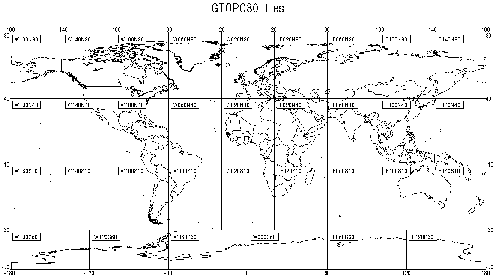
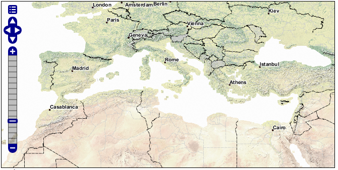

# Course Data

## Natural Earth

The Natural Earth dataset is a free collection of vector and raster data published by the North American Cartographic Information Society to encourage mapping.

For this course we will be using the [Natural Earth](http://www.naturalearthdata.com/) cultural and physical vector layers backed by a raster shaded relief dataset.

*Natural Earth*

The quickstart Natural Earth styling has been exported from QGIS and cleaned up in uDig for use in GeoServer.

## Digital Elevation Model

A digital elevation model records height information for visualisation and analysis. We are using a dataset derived from the USGS GTOPO30 dataset.

*Digital Elevation Model*

The GeoServer "dem" styling has been used for this dataset.

## Configuration

!!! note

    In a classroom setting GeoServer has been preconfigured with the appropriate data directory.

To set up GeoServer yourself:

1.  Download and unzip the following into your data directory:

    -   [styling-workshop-vector.zip](http://echobase.boundlessgeo.com/~jgarnett/GeoServerStyling/styling-workshop-vector.zip)
    -   [styling-workshop-raster.zip](styling-workshop-raster.zip)

    This will produce a **`raster`** and **`vector`** folder referenced in the following steps.

    Optional default SLD styles:

    -   [styling-workshop-sld.zip](http://echobase.boundlessgeo.com/~jgarnett/GeoServerStyling/styling-workshop-sld.zip)

2.  Use the **Importer** to add and publish -

    the following TIF Coverage Stores:

    -   dem/W100N40.TIF
    -   ne/ne1/NE1_HR_LC_SR.tif

    the following directories of shape files:

    -   ne/ne1/physical
    -   ne/ne1/cultural

    

3.  Cleaning up the published vector layers:

    -   Layer names have been shortened for publication - the **`ne_10m_admin_1_states_provinces_lines_ship.shp`** is published named `states_provinces_shp`
    -   Use `EPSG:4326` as the spatial reference system
    -   Optional: Appropriate SLD styles have been provided (from the uDig project)

    

4.  To clean up the published raster layers:

    -   The NE1 GeoTiff is styled with the default `raster` style
    -   The usgs:dem GeoTiff is styled with the default `DEM` style

    

5.  Optional: create a `basemap` group layer consisting of:

    

    This offers a combined layer, forming a cohesive base map.

    
