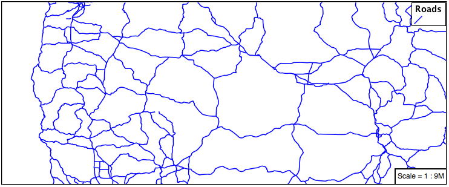
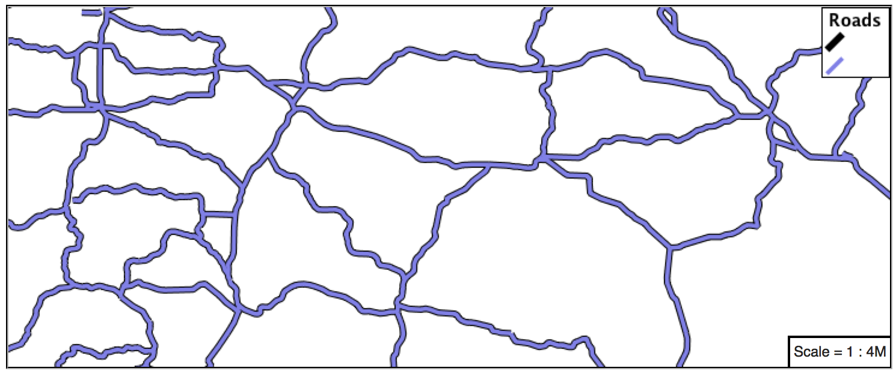
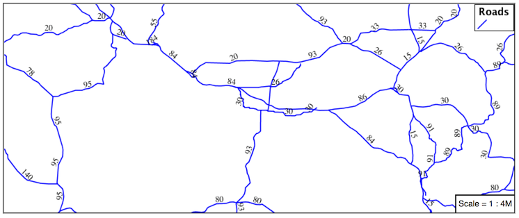
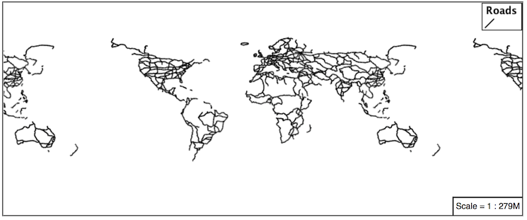
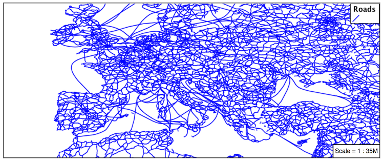
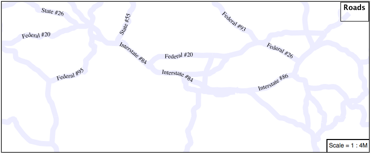

# Lines

We will start our tour of YSLD styling by looking at the representation of lines.


*LineString Geometry*

Review of line symbology:

-   Lines can be used to represent either abstract concepts with length but not width such as networks and boundaries, or long thin features with a width that is too small to represent on the map. This means that **the visual width of line symbols do not normally change depending on scale.**
-   Lines are recorded as LineStrings or Curves depending on the geometry model used.
-   SLD uses a **LineSymbolizer** to record how the shape of a line is drawn. The primary characteristic documented is the **Stroke** used to draw each segment between vertices.
-   Labeling of line work is anchored to the midpoint of the line. GeoServer provides a vendor option to allow label rotation aligned with line segments.

For our exercises we are going to be using simple YSLD documents, often consisting of a single rule, in order to focus on the properties used for line symbology.

Each exercise makes use of the `ne:roads` layer.

Reference:

-   [YSLD Reference](../../ysld/reference/index.md)
-   [YSLD Reference Line symbolizer](../../ysld/reference/symbolizers/line.md) (User Manual | YSLD Reference)
-   [LineString](../../sld/reference/linesymbolizer.md) (User Manual | SLD Reference )

## Line

A line symbolizer is represented by a ``line`` key. You can make a completely default symbolizer by giving it an empty map

``` yaml
line:
```


*Basic Stroke Properties*

!!! note


1.  Navigate to the **Styles** page.

2.  Click **Add a new style** and choose the following:

    New style name:

    :   ``line_example``

    Workspace for new layer:

    :   Leave blank

    Format:

    :   ``YSLD``

3.  Choose **line** from the `Generate a default style` dropdown and click **generate**.

4.  The style editor should look like below:

    ``` yaml
    title: dark yellow line
    symbolizers:
    - line:
        stroke-width: 1.0
        stroke-color: '#99cc00'
    ```

!!! note

    The title and value for **stroke-color** may be different.

1.  Click **Apply**

2.  Click **Layer Preview** to see your new style applied to a layer.

    You can use this tab to follow along as the style is edited, it will refresh each time **Apply** is pressed.

    

3.  You can see the equivalent SLD by requesting ``http://localhost:8080/geoserver/rest/styles/line_example.sld?pretty=true`` which will currently show the default line symbolizer we created.

    ``` xml
    <?xml version="1.0" encoding="UTF-8"?><sld:StyledLayerDescriptor xmlns="http://www.opengis.net/sld" xmlns:sld="http://www.opengis.net/sld" xmlns:gml="http://www.opengis.net/gml" xmlns:ogc="http://www.opengis.net/ogc" version="1.0.0">
     <sld:NamedLayer>
      <sld:Name>line_example</sld:Name>
      <sld:UserStyle>
        <sld:Name>line_example</sld:Name>
        <sld:Title>dark yellow line</sld:Title>
        <sld:FeatureTypeStyle>
          <sld:Name>name</sld:Name>
          <sld:Rule>
            <sld:LineSymbolizer>
              <sld:Stroke>
                <sld:CssParameter name="stroke">#99CC00</sld:CssParameter>
              </sld:Stroke>
            </sld:LineSymbolizer>
          </sld:Rule>
        </sld:FeatureTypeStyle>
      </sld:UserStyle>
     </sld:NamedLayer>
    </sld:StyledLayerDescriptor>
    ```

We only specified the line symbolizer, so all of the boilerplate around was generated for us.

1.  Additional properties can be used fine-tune appearance. Use **stroke-color** to specify the colour of the line.

    ``` {.yaml emphasize-lines="2"}
    line:
      stroke-color: blue
    ```

2.  **stroke-width** lets us make the line wider

    ``` {.yaml emphasize-lines="3"}
    line:
      stroke-color: blue
    stroke-width: 2px
    ```

3.  **stroke-dasharray** applies a dot dash pattern.

    ``` {.yaml emphasize-lines="4"}
    line:
      stroke-color: blue
    stroke-width: 2px
      stroke-dasharray: 5 2
    ```

4.  Check the **Layer Preview** tab to preview the result.

    

!!! note

    The GeoServer rendering engine is quite sophisticated and allows the use of units of measure (such as ``m`` or ``ft``). While we are using pixels in this example, real world units will be converted using the current scale, allowing for lines that change width with the scale.

## Multiple Symbolizers

Providing two strokes is often used to provide a contrasting edge (called casing) to thick lines. This can be created using two symbolizers.


1.  Start by filling in a bit of boilerplate that we'll be using

    ``` yaml
    feature-styles:
    - rules:
      - symbolizers:
        - line:
            stroke-color: '#8080E6'
            stroke-width: 3px
    ```

    The line symbolizer is inside a rule, which is inside a feature style.

2.  Add a second symbolizer to the rule

    ``` {.yaml emphasize-lines="4,5,6"}
    feature-styles:
    - rules:
      - symbolizers:
        - line:
            stroke-color: black
            stroke-width: 5px
        - line:
            stroke-color: '#8080E6'
            stroke-width: 3px
    ```

    The wider black line is first so it is drawn first, then the thinner blue line drawn second and so over top of the black line. This is called the painter's algorithm.

3.  If you look carefully you can see a problem with our initial attempt. The junctions of each line show that the casing outlines each line individually, making the lines appear randomly overlapped. Ideally we would like to control this process, only making use of this effect for overpasses.

    

    This is because the black and blue symbolizers are being drawn on a feature by feature basis. For nice line casing, we want all of the black symbols, and then all of the blue symbols.

4.  Create a new feature style and move the second symbolizer there.

    ``` {.yaml emphasize-lines="2,3,4,5,6"}
    feature-styles:
    - rules:
      - symbolizers:
        - line:
            stroke-color: black
            stroke-width: 5px
    - rules:
      - symbolizers:
        - line:
            stroke-color: '#8080E6'
            stroke-width: 3px
    ```

    Again we are using painter's algorithm order: the first feature style is drawn first then the second so the second is drawn on top of the first. The difference is that for each feature style, all of the features are drawn before the next feature style is drawn.

5.  If you look carefully you can see the difference.

    

6.  By using **feature styles** we have been able to simulate line casing.

    

## Label

Our next example is significant as it introduces how text labels are generated.


*Use of Label Property*

This is also our first example making use of a dynamic style (where a value comes from an attribute from your data).

1.  To enable LineString labeling we add a ``text`` symbolizer witrh a ``label``.

    Update `line_example` with the following:

    ``` {.yaml emphasize-lines="5,6"}
    symbolizers:
    - line:
        stroke-color: blue
        stroke-width: 1px
    - text:
        label: ${name}
    ```

2.  The SLD standard documents the default label position for each kind of Geometry. For LineStrings the initial label is positioned on the midway point of the line.

    

3.  We have used an expression to calculate a property value for label. The **label** is generated dynamically from the ``name`` attribute. Expressions are supplied within curly braces preceded with a dollar sign, and use Extended Constraint Query Language (ECQL) syntax.

    ``` {.yaml emphasize-lines="6"}
    symbolizers:
    - line:
        stroke-color: blue
        stroke-width: 1px
    - text:
        label: ${name}
    ```

4.  Additional keys can be supplied to fine-tune label presentation:

    ``` {.yaml emphasize-lines="7,8,9"}
    symbolizers:
    - line:
        stroke-color: blue
        stroke-width: 1px
    - text:
        label: ${name}
        fill-color: black
    placement: line
        offset: 7px
    ```

5.  The **fill-color** property is set to ``black`` to provide the colour of the text.

    ``` {.yaml emphasize-lines="7"}
    symbolizers:
    - line:
        stroke-color: blue
        stroke-width: 1px
    - text:
        label: ${name}
        fill-color: black
        placement: line
        offset: 7px
    ```

6.  The **placement** property is used to set how the label is placed with respect to the line. By default it is ``point`` which causes the label to be placed next to the midpoint as it would be for a point feature. When set to ``line`` it is placed along the line instead. **offset** specifies how far from the line the label should be placed.

    ``` {.yaml emphasize-lines="8,9"}
    symbolizers:
    - line:
        stroke-color: blue
        stroke-width: 1px
    - text:
        label: ${name}
        fill-color: black
        placement: line
        offset: 7px
    ```

    

7.  When using point placement, you can shift the position of the label using **displacement** instead of **offset**. This takes an x value and a y value.

    ``` {.yaml emphasize-lines="8"}
    symbolizers:
    - line:
        stroke-color: blue
        stroke-width: 1px
    - text:
        label: ${name}
        fill-color: black
        displacement: [5px, -10px]
    ```

## How Labeling Works

The rendering engine collects all the generated labels during the rendering of each layer. Then, during labeling, the engine sorts through the labels performing collision avoidance (to prevent labels overlapping). Finally the rendering engine draws the labels on top of the map. Even with collision avoidance you can spot areas where labels are so closely spaced that the result is hard to read.

The parameters provided by SLD are general purpose and should be compatible with any rendering engine.

To take greater control over the GeoServer rendering engine we can use "vendor specific" parameters. These hints are used specifically for the GeoServer rendering engine and will be ignored by other systems. In YSLD vendor specific parameters start with the prefix **x-**.

1.  The ability to take control of the labeling process is exactly the kind of hint a vendor specific parameter is intended for.

    Update `line_example` with the following:

    ``` {.yaml emphasize-lines="10"}
    symbolizers:
    - line:
        stroke-color: blue
        stroke-width: 1px
    - text:
        label: ${name}
        fill-color: black
        placement: line
        offset: 7px
    x-label-padding: 10
    ```

2.  The parameter **x-label-padding** provides additional space around our label for use in collision avoidance.

    ``` {.yaml emphasize-lines="10"}
    symbolizers:
    - line:
        stroke-color: blue
        stroke-width: 1px
    - text:
        label: ${name}
        fill-color: black
        placement: line
        offset: 7px
    x-label-padding: 10
    ```

3.  Each label is now separated from its neighbor, improving legibility.

    

## Scale

This section explores the use of rules with filters and scale restrictions.

1.  Replace the ``line_example`` YSLD definition with:

    ``` yaml
    rules:
    - filter: ${scalerank < 4}
      symbolizers:
      - line:
          stroke-color: black
          stroke-width: 1
    ```

2.  And use the **Layer Preview** tab to preview the result.

    

3.  The **scalerank** attribute is provided by the Natural Earth dataset to allow control of the level of detail based on scale. Our filter short-listed all content with scalerank 4 or lower, providing a nice quick preview when we are zoomed out.

4.  In addition to testing feature attributes, selectors can also be used to check the state of the rendering engine.

    Replace your YSLD with the following:

    ``` yaml
    rules:
    - scale: [35000000, max]
      symbolizers:
      - line:
          stroke-color: black
          stroke-width: 1
    - scale: [min, 35000000]
      symbolizers:
      - line:
          stroke-color: blue
          stroke-width: 1
    ```

5.  As you adjust the scale in the **Layer Preview** (using the mouse scroll wheel) the color will change between black and blue. You can read the current scale in the bottom right corner, and the legend will change to reflect the current style.

    

6.  Putting these two ideas together allows control of level detail based on scale:

    ``` yaml
    define: &primaryStyle
      stroke-color: black
    define: &primaryFilter ${scalerank <= 4}

    define: &secondaryStyle
      stroke-color: '#000055'
    define: &secondaryFilter ${scalerank = 5}

    rules:

      - else: true
        scale: [min, 9000000]
        symbolizers:
        - line:
            stroke-color: '#888888'
            stroke-width: 1

      - filter: ${scalerank = 7}
        scale: [min, 17000000]
        symbolizers:
        - line:
            stroke-color: '#777777'
            stroke-width: 1

      - filter: ${scalerank = 6}
        scale: [min, 35000000]
        symbolizers:
        - line:
            stroke-color: '#444444'
            stroke-width: 1

      - filter: *secondaryFilter
        scale: [9000000, 70000000]
        symbolizers:
        - line:
            <<: *secondaryStyle
            stroke-width: 1
      - filter: *secondaryFilter
        scale: [min, 9000000]
        symbolizers:
        - line:
            <<: *secondaryStyle
            stroke-width: 2

      - filter: *primaryFilter
        scale: [35000000, max]
        symbolizers:
        - line:
            <<: *primaryStyle
            stroke-width: 1
      - filter: *primaryFilter
        scale: [9000000, 35000000]
        symbolizers:
        - line:
            <<: *primaryStyle
            stroke-width: 2
      - filter: *primaryFilter
        scale: [min, 9000000]
        symbolizers:
        - line:
            <<: *primaryStyle
            stroke-width: 4
    ```

7.  When a rule has both a filter and a scale, it will trigger when both are true.

    The first rule has ``else: true`` instead of a filter. This causes it to be applied after all other rules have been checked if none of them worked.

    Since there are some things we need to specify more than once like the colour and filter for primary and secondary roads, even as they change size at different scales, they are given names with ``define`` so they can be reused. The filters are inserted inline using ``*name`` while the style is inserted as a block with ``<<: *name``

    

## Bonus

Finished early? Here are some opportunities to explore what we have learned, and extra challenges requiring creativity and research.

In a classroom setting please divide the challenges between teams (this allows us to work through all the material in the time available).

!!! abstract "Instructor Notes"

    As usual the Explore section invites readers to reapply the material covered in a slightly different context or dataset.
    
    The use of selectors using the roads **type** attribute provides this opportunity.

### Explore Vendor Option Follow Line

Vendor options can be used to enable some quite spectacular effects, while still providing a style that can be used by other applications.

1.  Update ``line_example`` with the following:

    ``` yaml
    symbolizers:
    - line:
        stroke-color: '#EDEDFF'
        stroke-width: 10
    - text:
        label: '${level} #${name}'
        fill-color: '#000000'
        x-followLine: true
    ```

    The ``\#`` character is the comment character in YAML, so we have to quote strings that contain it like colours and in this expression.

2.  The property **stroke-width** has been used to make our line thicker in order to provide a backdrop for our label.

    ``` {.yaml emphasize-lines="4"}
    symbolizers:
    - line:
        stroke-color: '#EDEDFF'
        stroke-width: 10
    - text:
        label: '${level} #${name}'
        fill-color: '#000000'
        placement: point
        x-followLine: true
    ```

3.  The **label** property combine several CQL expressions together for a longer label.

    ``` {.yaml emphasize-lines="4"}
    symbolizers:
    - line:
        stroke-color: '#EDEDFF'
        stroke-width: 10
    - text:
        label: '${level} #${name}'
        fill-color: '#000000'
        x-followLine: true
    ```

    The expressions in the **label** property:

        ${level} #${name}

    are inserted into the text by combining them with the text between them using **Concatenate** function:

        [Concatenate(level,' #', name)]

    This happens silently in the background.

4.  The property **x-followLine** provides the ability of have a label exactly follow a LineString character by character.

    ``` {.yaml emphasize-lines="8"}
    symbolizers:
    - line:
        stroke-color: '#EDEDFF'
        stroke-width: 10
    - text:
        label: ${level}  ${name}
        fill-color: '#000000'
        x-followLine: true
    ```

5.  The result is a new appearance for our roads.

    

### Challenge Classification {: #ysld.line.q1 }

1.  The roads **type** attribute provides classification information.

    You can **Layer Preview** to inspect features to determine available values for type.

2.  **Challenge:** Create a new style adjust road appearance based on **type**.

    

    note:: The available values are 'Major Highway','Secondary Highway','Road' and 'Unknown'.

    note:: Answer `provided <ysld.line.a1>`{.interpreted-text role="ref"} at the end of the workbook.

### Challenge One Rule Classification {: #ysld.line.q2 }

1.  You can save a lot of typing by doing your classification in an expression using arithmetic or the ``Recode`` function

2.  **Challenge:** Create a new style and classify the roads based on their scale rank using expressions in a single rule instead of multiple rules with filters.

    !!! note

        Answer `provided <ysld.line.a2>`{.interpreted-text role="ref"} at the end of the workbook.

### Challenge Label Shields {: #ysld.line.q3 }

1.  The traditional presentation of roads in the US is the use of a shield symbol, with the road number marked on top.

2.  *Challenge:* Have a look at the documentation for putting a graphic on a text symbolizer in SLD and reproduce this technique in YSLD.

    

    !!! note

        Answer `provided <ysld.line.a3>`{.interpreted-text role="ref"} at the end of the workbook.
