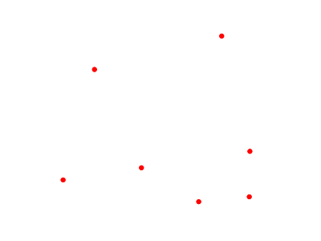
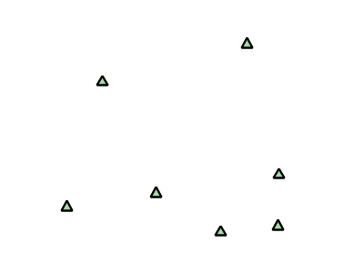
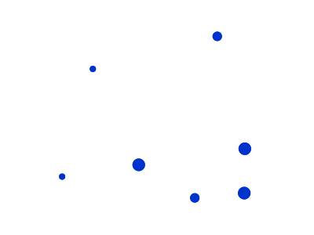
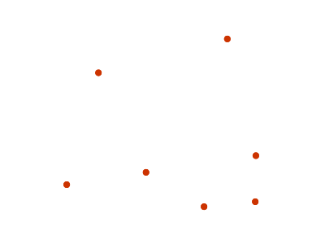

# Points

While points are seemingly the simplest type of shape, possessing only position and no other dimensions, there are many different ways that a point can be styled in YSLD.

## Example points layer {: #ysld_cookbook_points_attributes }

The [points layer](artifacts/ysld_cookbook_point.zip) used for the examples below contains name and population information for the major cities of a fictional country. For reference, the attribute table for the points in this layer is included below.

  ------------------------------------------------------------------------
  `fid` (Feature ID)    `name` (City name)           `pop` (Population)
  --------------------- ---------------------------- ---------------------
  point.1               Borfin                       157860

  point.2               Supox City                   578231

  point.3               Ruckis                       98159

  point.4               Thisland                     34879

  point.5               Synopolis                    24567

  point.6               San Glissando                76024

  point.7               Detrania                     205609
  ------------------------------------------------------------------------

[Download the points shapefile](artifacts/ysld_cookbook_point.zip)

## Simple point {: #ysld_cookbook_points_simplepoint }

This example specifies points be styled as red circles with a diameter of 6 pixels.


*Simple point*

### Code

[Download the "Simple point" YSLD](artifacts/point_simplepoint.ysld)

``` yaml
title: 'YSLD Cook Book: Simple Point'
feature-styles:
- name: name
  rules:
  - symbolizers:
    - point:
        size: 6
        symbols:
        - mark:
            shape: circle
            fill-color: '#FF0000'
```

### Details

There is one rule in one feature style for this YSLD, which is the simplest possible situation. (All subsequent examples will contain one rule and one feature style unless otherwise specified.) Styling points is accomplished via the point symbolizer (**lines 6-11**). **Line 10** specifies the shape of the symbol to be a circle, with **line 11** determining the fill color to be red (`'#FF0000'`). **Line 7** sets the size (diameter) of the graphic to be 6 pixels.

## Simple point with stroke {: #ysld_cookbook_points_simplepointwithstroke }

This example adds a stroke (or border) around the [Simple point](points.md#ysld_cookbook_points_simplepoint), with the stroke colored black and given a thickness of 2 pixels.


*Simple point with stroke*

### Code

[Download the "Simple point with stroke" YSLD](artifacts/point_simplepointwithstroke.ysld)

``` yaml
title: 'YSLD Cook Book: Simple point with stroke'
feature-styles:
- name: name
  rules:
  - symbolizers:
    - point:
        size: 6
        symbols:
        - mark:
            shape: circle
            stroke-color: '#000000'
            stroke-width: 2
            fill-color: '#FF0000'
```

### Details

This example is similar to the [Simple point](points.md#ysld_cookbook_points_simplepoint) example. **Lines 11-12** specify the stroke, with **line 11** setting the color to black (`'#000000'`) and **line 12** setting the width to 2 pixels.

## Rotated square

This example creates a square instead of a circle, colors it green, sizes it to 12 pixels, and rotates it by 45 degrees.


*Rotated square*

### Code

[Download the "Rotated square" YSLD](artifacts/point_rotatedsquare.ysld)

``` yaml
title: 'YSLD Cook Book: Rotated square'
feature-styles:
- name: name
  rules:
  - symbolizers:
    - point:
        size: 12
        rotation: 45
        symbols:
        - mark:
            shape: square
            fill-color: '#009900'
```

### Details

In this example, **line 11** sets the shape to be a square, with **line 12** setting the color to a dark green (`009900`). **Line 7** sets the size of the square to be 12 pixels, and **line 8** sets the rotation to 45 degrees.

## Transparent triangle

This example draws a triangle, creates a black stroke identical to the [Simple point with stroke](points.md#ysld_cookbook_points_simplepointwithstroke) example, and sets the fill of the triangle to 20% opacity (mostly transparent).


*Transparent triangle*

### Code

[Download the "Transparent triangle" YSLD](artifacts/point_transparenttriangle.ysld)

``` yaml
title: 'YSLD Cook Book: Transparent triangle'
feature-styles:
- name: name
  rules:
  - symbolizers:
    - point:
        size: 12
        symbols:
        - mark:
            shape: triangle
            stroke-color: '#000000'
            stroke-width: 2
            fill-color: '#009900'
            fill-opacity: 0.2
```

### Details

In this example, **line 10** once again sets the shape, in this case to a triangle. **Line 13** sets the fill color to a dark green (`'#009900'`) and **line 14** sets the opacity to 0.2 (20% opaque). An opacity value of 1 means that the shape is drawn 100% opaque, while an opacity value of 0 means that the shape is drawn 0% opaque, or completely transparent. The value of 0.2 (20% opaque) means that the fill of the points partially takes on the color and style of whatever is drawn beneath it. In this example, since the background is white, the dark green looks lighter. Were the points imposed on a dark background, the resulting color would be darker. **Lines 11-12** set the stroke color to black (`'#000000'`) and width to 2 pixels. Finally, **line 7** sets the size of the point to be 12 pixels in diameter.

## Point as graphic

This example styles each point as a graphic instead of as a simple shape.


*Point as graphic*

### Code

[Download the "Point as graphic" YSLD](artifacts/point_pointasgraphic.ysld)

``` yaml
title: 'YSLD Cook Book: Point as graphic'
feature-styles:
- name: name
  rules:
  - symbolizers:
    - point:
        size: 32
        symbols:
        - external:
            url: smileyface.png
            format: image/png
```

### Details

This style uses a graphic instead of a simple shape to render the points. In YSLD, this is known as an `external`, to distinguish it from the commonly-used shapes such as squares and circles that are "internal" to the renderer. **Lines 9-11** specify the details of this graphic. **Line 10** sets the path and file name of the graphic, while **line 11** indicates the format (MIME type) of the graphic (image/png). In this example, the graphic is contained in the same directory as the YSLD, so no path information is necessary in **line 10**, although a full URL could be used if desired. **Line 7** determines the size of the displayed graphic; this can be set independently of the dimensions of the graphic itself, although in this case they are the same (32 pixels). Should a graphic be rectangular, the `size` value will apply to the *height* of the graphic only, with the width scaled proportionally.


*Graphic used for points*

## Point with default label {: #ysld_cookbook_points_pointwithdefaultlabel }

This example shows a text label on the [Simple point](points.md#ysld_cookbook_points_simplepoint) that displays the "name" attribute of the point. This is how a label will be displayed in the absence of any other customization.


*Point with default label*

### Code

[Download the "Point with default label" YSLD](artifacts/point_pointwithdefaultlabel.ysld)

``` yaml
title: 'YSLD Cook Book: Point with default label'
feature-styles:
- name: name
  rules:
  - symbolizers:
    - point:
        size: 6
        symbols:
        - mark:
            shape: circle
            fill-color: '#FF0000'
    - text:
        label: ${name}
        fill-color: '#000000'
        font-family: Serif
        font-size: 10
        font-style: normal
        font-weight: normal
        placement: point
```

### Details

**Lines 2-11**, which contain the point symbolizer, are identical to the [Simple point](points.md#ysld_cookbook_points_simplepoint) example above. The label is set in the text symbolizer on **lines 12-19**. **Line 13** determines what text to display in the label, which in this case is the value of the "name" attribute. (Refer to the attribute table in the [Example points layer](points.md#ysld_cookbook_points_attributes) section if necessary.) **Line 15** sets the text color. All other details about the label are set to the renderer default, which here is Times New Roman font, font color black, and font size of 10 pixels. The bottom left of the label is aligned with the center of the point.

## Point with styled label {: #ysld_cookbook_points_pointwithstyledlabel }

This example improves the label style from the [Point with default label](points.md#ysld_cookbook_points_pointwithdefaultlabel) example by centering the label above the point and providing a different font name and size.


*Point with styled label*

### Code

[Download the "Point with styled label" YSLD](artifacts/point_pointwithstyledlabel.ysld)

``` yaml
title: 'YSLD Cook Book: Point with styled label'
feature-styles:
- name: name
  rules:
  - symbolizers:
    - point:
        size: 6
        symbols:
        - mark:
            shape: circle
            fill-color: '#FF0000'
    - text:
        label: ${name}
        fill-color: '#000000'
        font-family: Arial
        font-size: 12
        font-style: normal
        font-weight: bold
        placement: point
        anchor: [0.5,0.0]
        displacement: [0,5]
```

### Details

In this example, **lines 2-11** are identical to the [Simple point](points.md#ysld_cookbook_points_simplepoint) example above. The `<TextSymbolizer>` on **lines 12-21** contains many more details about the label styling than the previous example, [Point with default label](points.md#ysld_cookbook_points_pointwithdefaultlabel). **Line 13** once again specifies the "name" attribute as text to display. **Lines 15-18** set the font information: **line 15** sets the font family to be "Arial", **line 16** sets the font size to 12, **line 17** sets the font style to "normal" (as opposed to "italic" or "oblique"), and **line 18** sets the font weight to "bold" (as opposed to "normal"). **Lines 19-21** determine the placement of the label relative to the point. The `anchor` (**line 20**) sets the point of intersection between the label and point, which here sets the point to be centered (0.5) horizontally axis and bottom aligned (0.0) vertically with the label. There is also `displacement` (**line 21**), which sets the offset of the label relative to the line, which in this case is 0 pixels horizontally and 5 pixels vertically . Finally, **line 14** sets the font color of the label to black (`'#000000'`).

The result is a centered bold label placed slightly above each point.

## Point with rotated label

This example builds on the previous example, [Point with styled label](points.md#ysld_cookbook_points_pointwithstyledlabel), by rotating the label by 45 degrees, positioning the labels farther away from the points, and changing the color of the label to purple.


*Point with rotated label*

### Code

[Download the "Point with rotated label" YSLD](artifacts/point_pointwithrotatedlabel.ysld)

``` yaml
title: 'YSLD Cook Book: Point with rotated label'
feature-styles:
- name: name
  rules:
  - symbolizers:
    - point:
        size: 6
        symbols:
        - mark:
            shape: circle
            fill-color: '#FF0000'
    - text:
        label: ${name}
        fill-color: '#990099'
        font-family: Arial
        font-size: 12
        font-style: normal
        font-weight: bold
        placement: point
        anchor: [0.5,0.0]
        displacement: [0,25]
        rotation: -45
```

### Details

This example is similar to the [Point with styled label](points.md#ysld_cookbook_points_pointwithstyledlabel), but there are three important differences. **Line 21** specifies 25 pixels of vertical displacement. **Line 22** specifies a rotation of "-45" or 45 degrees counter-clockwise. (Rotation values increase clockwise, which is why the value is negative.) Finally, **line 14** sets the font color to be a shade of purple (`'#99099'`).

Note that the displacement takes effect before the rotation during rendering, so in this example, the 25 pixel vertical displacement is itself rotated 45 degrees.

## Attribute-based point

This example alters the size of the symbol based on the value of the population ("pop") attribute.


*Attribute-based point*

### Code

[Download the "Attribute-based point" YSLD](artifacts/point_attribute.ysld)

``` yaml
title: 'YSLD Cook Book: Attribute-based point'
feature-styles:
- name: name
  rules:
  - name: SmallPop
    title: 1 to 50000
    filter: ${pop < '50000'}
    symbolizers:
    - point:
        size: 8
        symbols:
        - mark:
            shape: circle
            fill-color: '#0033CC'
  - name: MediumPop
    title: 50000 to 100000
    filter: ${pop >= '50000' AND pop < '100000'}
    symbolizers:
    - point:
        size: 12
        symbols:
        - mark:
            shape: circle
            fill-color: '#0033CC'
  - name: LargePop
    title: Greater than 100000
    filter: ${pop >= '100000'}
    symbolizers:
    - point:
        size: 16
        symbols:
        - mark:
            shape: circle
            fill-color: '#0033CC'
```

### Details

!!! note

    Refer to the [Example points layer](points.md#ysld_cookbook_points_attributes) to see the attributes for this data. This example has eschewed labels in order to simplify the style, but you can refer to the example [Point with styled label](points.md#ysld_cookbook_points_pointwithstyledlabel) to see which attributes correspond to which points.

This style contains three rules. Each rule varies the style based on the value of the population ("pop") attribute for each point, with smaller values yielding a smaller circle, and larger values yielding a larger circle.

The three rules are designed as follows:

  --------------------------------------------------------------------------
  Rule order     Rule name             Population (`pop`)     Size
  -------------- --------------------- ---------------------- --------------
  1              SmallPop              Less than 50,000       8

  2              MediumPop             50,000 to 100,000      12

  3              LargePop              Greater than 100,000   16
  --------------------------------------------------------------------------

The order of the rules does not matter in this case, since each shape is only rendered by a single rule.

The first rule, on **lines 5-14**, specifies the styling of those points whose population attribute is less than 50,000. **Line 7** sets this filter, denoting the attribute ("pop") to be "less than" the value of 50,000. The symbol is a circle (**line 13**), the color is dark blue (`'#0033CC'`, on **line 15**), and the size is 8 pixels in diameter (**line 18**).

The second rule, on **lines 15-24**, specifies a style for points whose population attribute is greater than or equal to 50,000 and less than 100,000. The population filter is set on **line 17**. This filter specifies two criteria instead of one: a "greater than or equal to" and a "less than" filter. These criteria are joined by `AND`, which mandates that both filters need to be true for the rule to be applicable. The size of the graphic is set to 12 pixels on **line 20**. All other styling directives are identical to the first rule.

The third rule, on **lines 25-34**, specifies a style for points whose population attribute is greater than or equal to 100,000. The population filter is set on **line 27**, and the only other difference is the size of the circle, which in this rule (**line 30**) is 16 pixels.

The result of this style is that cities with larger populations have larger points.

## Zoom-based point

This example alters the style of the points at different zoom levels.


*Zoom-based point: Zoomed in*


*Zoom-based point: Partially zoomed*


*Zoom-based point: Zoomed out*

### Code

[Download the "Zoom-based point" YSLD](artifacts/point_zoom.ysld)

``` yaml
title: 'YSLD Cook Book: Zoom-based point'
feature-styles:
- name: name
  rules:
  - name: Large
    scale: [min,1.6e8]
    symbolizers:
    - point:
        size: 12
        symbols:
        - mark:
            shape: circle
            fill-color: '#CC3300'
  - name: Medium
    scale: [1.6e8,3.2e8]
    symbolizers:
    - point:
        size: 8
        symbols:
        - mark:
            shape: circle
            fill-color: '#CC3300'
  - name: Small
    scale: [3.2e8,max]
    symbolizers:
    - point:
        size: 4
        symbols:
        - mark:
            shape: circle
            fill-color: '#CC3300'
```

### Details

It is often desirable to make shapes larger at higher zoom levels when creating a natural-looking map. This example styles the points to vary in size based on the zoom level (or more accurately, scale denominator). Scale denominators refer to the scale of the map. A scale denominator of 10,000 means the map has a scale of 1:10,000 in the units of the map projection.

!!! note

    Determining the appropriate scale denominators (zoom levels) to use is beyond the scope of this example.

This style contains three rules. The three rules are designed as follows:

  --------------------------------------------------------------------------------------
  Rule order        Rule name         Scale denominator                Point size
  ----------------- ----------------- -------------------------------- -----------------
  1                 Large             1:160,000,000 or less            12

  2                 Medium            1:160,000,000 to 1:320,000,000   8

  3                 Small             Greater than 1:320,000,000       4
  --------------------------------------------------------------------------------------

The order of these rules does not matter since the scales denominated in each rule do not overlap.

The first rule (**lines 5-13**) is for the smallest scale denominator, corresponding to when the view is "zoomed in". The scale rule is set on **line 6**, so that the rule will apply to any map with a scale denominator of 160,000,000 or less. The rule draws a circle (**line 12**), colored red (`#CC3300` on **line 13**) with a size of 12 pixels (**line 9**).

The second rule (**lines 14-22**) is the intermediate scale denominator, corresponding to when the view is "partially zoomed". The scale rules is set on **line 15**, so that the rule will apply to any map with a scale denominator between 160,000,000 and 320,000,000. (The lower bound is inclusive and the upper bound is exclusive, so a zoom level of exactly 320,000,000 would *not* apply here.) Aside from the scale, the only difference between this rule and the first is the size of the symbol, which is set to 8 pixels on **line 18**.

The third rule (**lines 23-31**) is the largest scale denominator, corresponding to when the map is "zoomed out". The scale rule is set on **line 24**, so that the rule will apply to any map with a scale denominator of 320,000,000 or more. Again, the only other difference between this rule and the others is the size of the symbol, which is set to 4 pixels on **line 27**.

The result of this style is that points are drawn larger as one zooms in and smaller as one zooms out.
