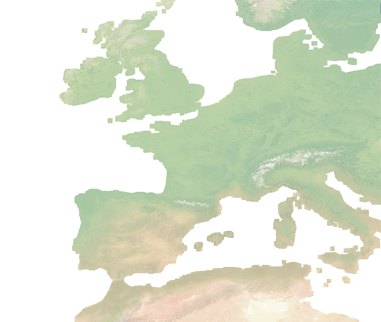
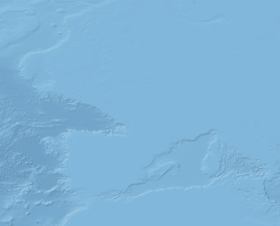
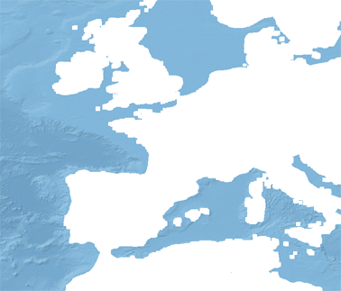
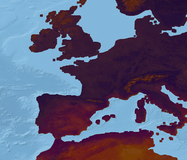

# Feature Styles

In YSLD, a Feature Style is a block of styling [Rules](rules.md). The Feature Style is applied to a single feature type and drawn in an off-screen buffer.


*The feature style element*

**The purpose of a Feature Style is to specify drawing order.** The buffer for the first Feature Style will be drawn first, while buffer for the second Feature Style will be processed after that, etc. When drawing is complete the buffers will composed into the final drawn map.

A Feature Style is a **top-level element** in a YSLD style.

Consider the following hierarchy:

-   Feature Style 1
    -   Rule 1a
    -   Rule 1b
-   Feature Style 2
    -   Rule 2a
    -   Rule 2b
    -   Rule 2c

In this case, the rules contained inside Feature Style 1 will be processed and their [symbolizers](symbolizers/index.md) drawn first. After Rule 1a and 1b are processed, the renderer will move on to Feature Style 2, where Rule 2a, 2b, and 2c will then be processed and their symbolizers drawn.


*Feature style order*

## Drawing order

The order of feature styles is significant, and also the order of rules inside feature styles is significant.

Rules inside a feature style are all applied to each feature at once. After all of the rules in a feature style have been applied to each feature, the next feature style will start again, applying rules to each feature.

The off-screen buffer for each feature style is merged together during composition. These buffers are merged in the order defined by the feature styles. In this way, **using multiple feature styles is a way of specifying z-order**.

Consider the same hierarchy as above. Given a layer that contains three features, the rules will be applied as follows:

Feature style 1 will draw an off-screen buffer:

1.  Rule 1a is applied to the first feature, followed by rule 1b
2.  Rule 1a is applied to the second feature, followed by rule 1b
3.  Rule 1a is applied to the third feature, followed by rule 1b


*Feature style 1 buffer*

Feature style 2 will draw an off-screen buffer:

1.  Rule 2a is applied to the first feature, followed by rule 2b and then rule 2c
2.  Rule 2a is applied to the second feature, followed by rule 2b and then rule 2c
3.  Rule 2a is applied to the third feature, followed by rule 2b and then rule 2c


*Feature style 2 buffer*

This final map is produced by composition:

1.  The buffer for feature style 1 is drawn
2.  The buffer for feature style 2 is drawn
3.  Any labeling is drawn on top


*Composition of both feature styles*

**If you need a rule to apply on top of other rules, use a second feature style.** A useful case for this is for lines representing bridges or overpasses. In order to ensure that the bridge lines always display on "top" of other lines (which in a display that includes, they would need to be applied using a second feature style.)

## Syntax

The following is the basic syntax of a feature style. Note that the contents of the block are not all expanded here.

``` yaml
feature-styles:
- name: <text>
  title: <text>
  abstract: <text>
  transform:
    ...
  rules:
  - ...
  x-ruleEvaluation: <text>
  x-composite: <text>
  x-composite-base: <boolean>
  x-inclusion: <text>
```

where:

| Property    | Required? | Description                                                                                                            | Default value |
|-------------|-----------|------------------------------------------------------------------------------------------------------------------------|---------------|
| `name`      | No        | Internal reference to the feature style. It is recommended that the value be **lower case** and contain **no spaces**. | Blank         |
| `title`     | No        | Human-readable name of the feature style. Exposed as a name for the group of rules contained in the feature style.     | Blank         |
| `abstract`  | No        | Longer description of the feature style.                                                                               | Blank         |
| `transform` | No        | [Rendering transformation](transforms.md) information.                                                                | N/A           |
| `rules`     | Yes       | List of styling [rules](rules.md).                                                                                    | N/A           |

The following properties are equivalent to SLD "vendor options".

| Property           | Required? | Description                                                                                                                                                                                                                                                                                                                                                                                                                                                                                                                  | Default value |
|--------------------|-----------|------------------------------------------------------------------------------------------------------------------------------------------------------------------------------------------------------------------------------------------------------------------------------------------------------------------------------------------------------------------------------------------------------------------------------------------------------------------------------------------------------------------------------|---------------|
| `x-ruleEvaluation` | No        | When equals to `first` - stops rule evaluation after the first match. Can make the rendering more efficient by reducing the number of rules that need to be traversed by features, as well as simplyfing the rule filters.                                                                                                                                                                                                                                                                                                   | `all`         |
| `x-composite`      | No        | Allows for both alpha compositing and color blending options between buffers. There are many options; [see below](featurestyles.md#ysld_reference_featurestyles_composite).                                                                                                                                                                                                                                                                                                                                                 | N/A           |
| `x-composite-base` | No        | Allows the rendering engine to use that feature-style as a "base", and will compose all subsequent feature-styles and layers on top of it, until another base is found. Once the full set of layers against a base is composed, then the base itself will be composed against the next set of composed layers using its own compositing operator, if present. This is useful to fine-tune the use of `x-composite`, and to make sure that only the desired content is composited/blended and not all of the drawn content. | `false`       |
| `x-inclusion`      | No        | Define if rule should be included in style for `legendOnly` or `mapOnly` (see [Rendering Selection](../../sld/extensions/rendering-selection.md))                                                                                                                                                                                                                                                                                                                                                                           | `normal`      |

## Compositing and blending {: #ysld_reference_featurestyles_composite }

By default, multiple feature styles are drawn with one buffer on top of the other. However, using the `x-composite` and `x-composite-base` options, one can customize the way that buffers are displayed.

The following two tables show the possible alpha compositing and color blending values for the `x-composite` option. Note that in the tables below, **source** refers to the buffer that is drawn on top, while **destination** refers to the buffer that the source is drawn on top of.

!!! info "Todo"

    Add image showing source and destination

**Alpha compositing**

Alpha compositing controls how buffers are merged using the transparent areas of each buffer.

Value

:   Description

`copy`

:   Only the source will be present in the output.

    

`destination`

:   Only the destination will be present in the output.

    

`source-over`

:   The source is drawn over the destination, and the destination is visible where the source is transparent. Opposite of `destination-over`. This is the default value for x-composite.

    

`destination-over`

:   The source is drawn below the destination, and is visible only when the destination is transparent. Opposite of `source-over`.

    

`source-in`

:   The source is visible only when overlapping some non-transparent pixel of the destination. This allows the background map to act as a mask for the layer/feature being drawn. Opposite of `destination-in`.

    

`destination-in`

:   The destination is retained only when overlapping some non transparent pixel in the source. This allows the layer/feature to be drawn to act as a mask for the background map. Opposite of `source-in`.

    

`source-out`

:   The source is retained only in areas where the destination is transparent. This acts as a reverse mask when compared to `source-in`.

    

`destination-out`

:   The destination is retained only in areas where the source is transparent. This acts as a reverse mask when compared to `destination-in`.

    

`source-atop`

:   The destination is drawn fully, while the source is drawn only where it intersects the destination.

    

`destination-atop`

:   The source is drawn fully, and the destination is drawn over the source only where it intersects it.

    

`xor`

:   "Exclusive Or" mode. Each pixel is rendered only if either the source or the destination is not blank, but not both.

    

**Color blending**

Color blending allows buffers to be mixed during composition.

Value

:   Description

`multiply`

:   The source color is multiplied by the destination color and replaces the destination. The resulting color is always at least as dark as either the source or destination color. Multiplying any color with black results in black. Multiplying any color with white preserves the original color.

    

`screen`

:   Multiplies the complements of the source and destination color values, then complements the result. The end result color is always at least as light as either of the two constituent colors. Screening any color with white produces white; screening with black leaves the original color unchanged.

    

`overlay`

:   Multiplies the colors depending on the destination color value. Source colors overlay the destination while preserving highlights and shadows. The backdrop color is not replaced but is mixed with the source color to reflect the lightness or darkness of the backdrop.

    

`darken`

:   Selects the darker of the destination and source colors. The destination is replaced with the source only where the source is darker.

    

`lighten`

:   Selects the lighter of the destination and source colors. The destination is replaced with the source only where the source is lighter.

    

`color-dodge`

:   Brightens the destination color to reflect the source color. Drawing with black produces no changes.

    

`color-burn`

:   Darkens the destination color to reflect the source color. Drawing with white produces no change.

    

`hard-light`

:   Multiplies the colors, depending on the source color value. The effect is similar to shining a harsh spotlight on the destination.

    

`soft-light`

:   Darkens or lightens the colors, depending on the source color value. The effect is similar to a diffused spotlight on the destination.

    

`difference`

:   Subtracts the darker of the two constituent colors from the lighter color. White inverts the destination color; black produces no change.

    

`exclusion`

:   Produces an effect similar to that of difference but lower in contrast. White inverts the destination color; black produces no change.

    

!!! note

    For more details about the compositing and blending options, please see [Composite and blending modes](../../sld/extensions/composite-blend/modes.md).

## Short syntax

When a style has a single feature style, it is possible to omit the syntax for the feature style and start at the first parameter inside.

So the following complete styles are both equivalent:

``` yaml
feature-styles:
- rules:
  - name: rule1
    scale: [min,50000]
    symbolizers:
    - line:
        stroke-color: '#000000'
        stroke-width: 2
  - name: rule2
    scale: [50000,max]
    symbolizers:
    - line:
        stroke-color: '#000000'
        stroke-width: 1
```

``` yaml
rules:
- name: rule1
  scale: [min,50000]
  symbolizers:
  - line:
      stroke-color: '#000000'
      stroke-width: 2
- name: rule2
  scale: [50000,max]
  symbolizers:
  - line:
      stroke-color: '#000000'
      stroke-width: 1
```

## Examples

### Road casing

This example shows how a smaller line can be drawn on top of a larger line, creating the effect of lines being drawn with a border or "casing":

``` yaml
feature-styles:
- name: outer
  title: Outer line
  rules:
  - name: outer_rule
    symbolizers:
    - line:
        stroke-color: '#808080'
        stroke-width: 8
- name: inner
  title: Inner line
  rules:
  - name: inner_rule
    symbolizers:
    - line:
        stroke-color: '#44FF88'
        stroke-width: 6
```

To draw the inner lines always on top of the outer lines we need to control the **z-order**. The `outer_rule` is encased in its own feature style and drawn into a distinct "Outer line" buffer. Next the `inner_rule` is encased in its own feature style and drawn into a distinct "Inner line" buffer.


*Feature style buffers*

During composition these two off-screen buffers are combined into the final map.


*Final map composition*

When drawn, the outer line has a width of 8 pixels and the inner line has a width of 6 pixels, so the line "border" is 1 pixel (on each side).


*Example showing road casing*

### First match

Given a style that has many rules with distinct outcomes, it may be advantageous to employ `x-ruleEvaluation: first` so as to improve rendering efficiency and simplify those rules.

This first example shows the standard way of creating rules for a dataset. There are villages, towns, and cities (`type = 'village'`, `type = 'town'` or `type = 'city'`) and they have an `industry` which could be either `fishing` or other values.

!!! note

    In order to simplify this example, the specifics of the point symbolizers have been replaced by [Define and reuse YAML Variables](variables.md). In a real-world example, these would need to be defined in the YSLD as well.

``` {.yaml emphasize-lines="15"}
feature-styles:
- name: without_first_match
  rules:
  - name: fishing_town
    filter: ${type = 'town' AND industry = 'fishing'}
    symbolizers:
    - point:
        <<: *fishingtown
  - name: fishing_city
    filter: ${type = 'city' AND industry = 'fishing'}
    symbolizers:
    - point:
        <<: *fishingcity
  - name: other_towns_cities
    filter: ${type IN ('town', 'city') AND industry <> 'fishing'}
    symbolizers:
    - point:
        <<: *othertownscities
  - name: other
    else: true
    symbolizers:
    - point:
        <<: *allotherplaces
```

Using the `x-ruleEvaluation: first` parameter, the style is simplified:

``` {.yaml emphasize-lines="3,16"}
feature-styles:
- name: with_first_match
  x-ruleEvaluation: first
  rules:
  - name: fishing_town
    filter: ${type = 'town' AND industry = 'fishing'}
    symbolizers:
    - point:
        <<: *fishingtown
  - name: fishing_city
    filter: ${type = 'city' AND industry = 'fishing'}
    symbolizers:
    - point:
        <<: *fishingcity
  - name: other_towns_cities
    filter: ${type IN ('town', 'city')}
    symbolizers:
    - point:
        <<: *othertownscities
  - name: other
    else: true
    symbolizers:
    - point:
        <<: *allotherplaces
```

Specifically, the third rule no longer needs the extra `AND industry <> 'fishing'`, because the previous two rules imply that any features remaining by this rule have that condition.

### Layer mask

Given two layers (in this case, two three-band rasters), one can mask or "knock out" the other, making visible what's beneath.


*Top/source layer*


*Bottom/destination layer*

!!! note

    Screenshots show data provided by [Natural Earth](http://naturalearthdata.com).

Layer 1 (top/source):

``` {.yaml emphasize-lines="7"}
feature-styles:
- rules:
  - title: Top/source
    symbolizers:
    - raster:
        opacity: 1.0
  x-composite: xor
```

Layer 2 (bottom/destination):

``` yaml
feature-styles:
- rules:
  - title: Bottom/destination
    symbolizers:
    - raster:
        opacity: 1.0
```


*Layer as mask*

### Color inversion

Given the same two layers as the previous example, one can display the difference of the colors of layers, which can have the effect of a color "inversion".

Layer 1 (top/source):

``` {.yaml emphasize-lines="7"}
feature-styles:
- rules:
  - title: Top/source
    symbolizers:
    - raster:
        opacity: 1.0
  x-composite: difference
```

Layer 2 (bottom/destination):

``` yaml
feature-styles:
- rules:
  - title: Bottom/destination
    symbolizers:
    - raster:
        opacity: 1.0
```


*Layer as color inversion*
