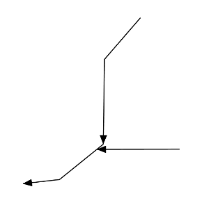
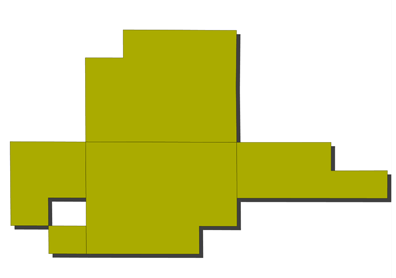
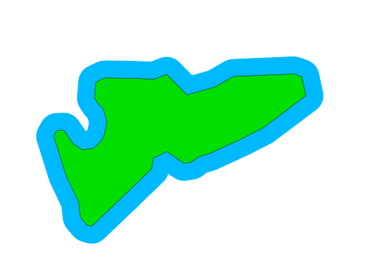
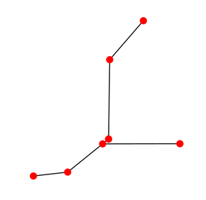
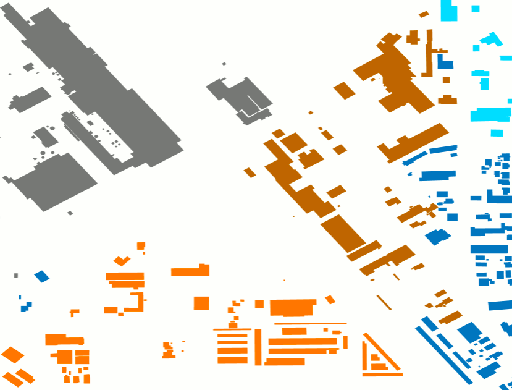
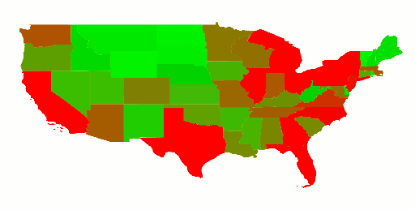

# Functions {: #ysld_reference_functions }

Functions are additional operations that can be employed when calculating values for YSLD parameters. In most cases, a value for a parameter can be the output (result) of a function.

Functions can be used in most places in a style document.

## Syntax

Functions aren't a parameter to itself, but instead are used as a part of the values of a parameter, or indeed in any expression. So the syntax is very general, for example:

    <parameter>: ${<function>}

Functions are evaluated at rendering time, so the output is passed as the parameter value and then rendered accordingly.

## List of functions

A reference list of functions can be found in the [GeoServer User Manual](../../../geoserver/filter/function_reference.html) and is also available in raw form in the [GeoTools User Manual Function List](https://docs.geotools.org/latest/userguide/library/main/function_list.html).

The functions can be broken up loosely into categories such as geometric, math, and string functions.

### Theming functions {: #ysld_reference_functions_theming }

There are three important functions that are often easier to use for theming than using rules, and can vastly simplify your style documents: **Recode**, **Categorize**, and **Interpolate**.

**Recode**: Attribute values are directly mapped to styling properties:

    recode(attribute,value1,result1,value2,result2,value3,result3,...)

This is equivalent to creating multiple rules with similar filters:

    rules:
    - ...
      filter: ${attribute = value1}
      - ...
        <property>: result1
    - ...
      filter: ${attribute = value2}
      - ...
        <property>: result2
    - ...
      filter: ${attribute = value3}
      - ...
        <property>: result3

**Categorize**: Categories are defined using minimum and maximum ranges, and attribute values are sorted into the appropriate category:

    categorize(attribute,category0,value1,category1,value2,category2,...,belongsTo)

This would create a situation where the `attribute` value, if less than `value1` will be given the result of `category0`; if between `value1` and `value2`, will be given the result of `category1`; if between `value2` and `value3`, will be given the result of `category2`, etc. Values must be in ascending order.

The `belongsTo` argument is optional, and can be either `succeeding` or `preceding`. It defines which interval to use when the lookup value equals the `attribute` value. If the `attribute` value is equal to `value1` and `suceeding` is used, then the result will be `category1`. If `preceding` is used then the result will be `category0`. The default is `succeeding`.

This is equivalent to creating the following multiple rules:

    rules:
    - ...
      filter: ${attribute < value1}
      - ...
        <property>: category0
    - ...
      filter: ${attribute >= value1 AND attribute < value2}
      - ...
        <property>: category1
    - ...
      filter: ${attribute >= value2}
      - ...
        <property>: category2

**Interpolate**: Used to smoothly theme quantitative data by calculating a styling property based on an attribute value. This is similar to Categorize, except that the values are continuous and not discrete:

    interpolate(attribute,value1,entry1,value2,entry2,...,mode,method)

This would create a situation where the `attribute` value, if equal to `value1` will be given the result of `entry1`; if halfway between `value1` and `value2` will be given a result of halfway in between `entry1` and `entry2`; if three-quarters between `value1` and `value2` will be given a result of three-quarters in between `entry1` and `entry2`, etc.

The `mode` argument is optional, and can be either `linear`, `cosine`, or `cubic`. It defines the interpolation algorithm to use, and defaults to `linear`.

The `method` argument is optional, and can be either `numeric` or `color`. It determines whether `entry1`, `entry2`, \... are numbers or colors, and defaults to `numeric`.

There is no equivalent to this function in vector styling. The closest to this in raster styling is the color ramp.

The three theming functions can be neatly summarized by this table:

| Function    | Type of input | Type of output |
|-------------|---------------|----------------|
| Recode      | Discrete      | Discrete       |
| Categorize  | Continuous    | Discrete       |
| Interpolate | Continuous    | Continuous     |

## Examples

### Display rotated arrows at line endpoints

The `startPoint(geom)` and `endPoint(geom)` functions take a geometry as an argument and returns the start and end points of the geometry respectively. The `startAngle(geom)` and `endAngle(geom)` functions take a geometry as an argument and return the angle of the line terminating at the start and end points of the geometry respectively. These functions can be used to display an arrow at the end of a line geometry, and rotate it to match the direction of the line:

    feature-styles:
    - rules:
      - symbolizers:
          - line:
              stroke-width: 1
          - point:
              geometry: ${endPoint(geom)}
              rotation: ${endAngle(geom)}
              size: 24
              symbols:
              - mark:
                  shape: 'shape://carrow'
                  fill-color: '#000000'

*Endpoint arrows*

### Drop shadow

The `offset(geom, x, y)` function takes a geometry and two values, and displaces the geometry by those values in the `x` and `y` directions. This can be used to create a drop-shadow effect:

    feature-styles:
    - name: shadow
      rules:
      - symbolizers:
        - polygon:
            stroke-width: 0.0
            fill-color: '#000000'
            fill-opacity: 0.75
            geometry: ${offset(geom, 0.0001, -0.0001)}
    - name: fill
      rules:
      - symbolizers:
        - polygon:
          stroke-width: 0.0
          fill-color: '#00FFFF'

*Drop shadow*

### Different-colored outline

The `buffer(geom, buffer)` function takes a geometry and a value as arguments, and returns a polygon geometry with a boundary equal to the original geometry plus the value. This can be used to generate an extended outline filled with a different color, for example to style a shoreline:

    feature-styles:
    - name: shoreline
      rules:
      - polygon:
          fill-color: '#00BBFF'
          geometry: ${buffer(geom, 0.00025)}
    - name: land
      rules:
      - polygon:
          fill-color: '#00DD00'

*Buffered outline*

See also:

-   [convexHull(geom)](../../../geoserver/filter/function_reference.html#geometric-functions)
-   [octagonalEnvelope(geom)](../../../geoserver/filter/function_reference.html#geometric-functions)
-   [mincircle(geom)](../../../geoserver/filter/function_reference.html#geometric-functions)
-   [minrectangle(geom)](../../../geoserver/filter/function_reference.html#geometric-functions)
-   [minimumdiameter(geom)](../../../geoserver/filter/function_reference.html#geometric-functions)

### Display vertices of a line

The `vertices(geom)` function takes a geometry and returns a collection of points representing the vertices of the geometry. This can be used to convert a polygon or line geometry into a point geometry:

    point:
      geometry: vertices(geom)

*Endpoint arrows*

See also:

-   [boundary(geom)](../../../geoserver/filter/function_reference.html#geometric-functions)
-   [centroid(geom)](../../../geoserver/filter/function_reference.html#geometric-functions)

### Angle between two points

The `atan2(x, y)` function calculates the arctangent of (y/x) and so is able to determine the angle (in radians) between two points. This function uses the signs of the x and y values to determine the computed angle, so it is preferable over `atan()`. The `getX(point_geom)` and `getY(point_geom)` extracts the `x` and `y` ordinates from a geometry respectively, while `toDegrees(value)` converts from radians to degrees:

    point:
      symbols:
      - mark:
          shape: triangle
      rotation: ${toDegrees(atan2(
        getX(startPoint(the_geom))-getX(endPoint(the_geom)),
        getY(startPoint(the_geom))-getY(endPoint(the_geom))))}

See also:

-   [sin(value)](../../../geoserver/filter/function_reference.html#math-functions)
-   [cos(value)](../../../geoserver/filter/function_reference.html#math-functions)
-   [tan(value)](../../../geoserver/filter/function_reference.html#math-functions)
-   [asin(value)](../../../geoserver/filter/function_reference.html#math-functions)
-   [acos(value)](../../../geoserver/filter/function_reference.html#math-functions)
-   [atan(value)](../../../geoserver/filter/function_reference.html#math-functions)
-   [toRadians(value)](../../../geoserver/filter/function_reference.html#math-functions)
-   [pi()](../../../geoserver/filter/function_reference.html#math-functions)

### Scale objects based on a large range of values

The `log(value)` function returns the natural logarithm of the provided value. Use `log(value)/log(base)` to specify a different base.

For example, specifying `log(population)/log(2)` will make the output increase by 1 when the value of population doubles. This allows one to display relative sizes on a consistent scale while still being able to represent very small and very large populations:

    point:
      symbols:
      - mark:
          shape: circle
      size: ${log(population)/log(2)}

See also:

-   [exp(val)](../../../geoserver/filter/function_reference.html#math-functions)
-   [pow(base,exponent)](../../../geoserver/filter/function_reference.html#math-functions)
-   [sqrt(val)](../../../geoserver/filter/function_reference.html#math-functions)

### Combine several strings into one

The `Concatenate(string1, string2, ...)` function takes any number of strings and combines them to form a single string. This can be used to display more than one attribute within a single label:

    text:
      label: ${Concatenate(name, ', ', population)}

### Capitalize words

The `strCapitalize(string)` function takes a single string and capitalizes the first letter of each word in the string. This could be used to capitalize labels created from lower case text:

    text:
      label: ${strCapitalize(name)}

See also:

-   [strToLowerCase(string)](../../../geoserver/filter/function_reference.html#string-functions)
-   [strToUpperCase(string)](../../../geoserver/filter/function_reference.html#string-functions)

### Color based on discrete values

In certain cases, theming functions can be used in place of filters to produce similar output much more simply. For example, the Recode function can take an attribute and output a different value based on an attribute value. So instead of various filters, the entire constructions can be done in a single line. For example, this could be used to color different types of buildings:

    feature-styles:
    - name: name
      rules:
      - symbolizers:
        - polygon:
            fill-color: 
              ${recode(zone, 
              'I-L', '#FF7700', 
              'I-H', '#BB6600', 
              'C-H', '#0077BB', 
              'C-R', '#00BBDD', 
              'C-C', '#00DDFF', 
              '', '#777777')}

In the above example, the attribute is `zone` , and then each subsequent pair consists of an attribute value followed by a color.

*Recode Function*

### Color based on categories

The Categorize function returns a different value depending on which range (category) an attribute value matches. This can also make a style much more simple by reducing the number of filters. This example uses `categorize` to color based on certain values of the `YEARBLT` attribute:

    feature-styles:
    - name: name
      rules:
      - symbolizers:
         - polygon:
            stroke-color: '#000000'
            stroke-width: 0.5
            fill-color:
              ${categorize(YEARBLT, '#DD4400', 
              1950,'#AA4400',
              1960,'#886600',
              1970,'#668800',
              1980,'#44BB00',
              1990,'#22DD00',
              2000,'#00FF00')}

*Categorize Function*

### Choropleth map

The `interpolate` function can be used to create a continuous set of values by interpolating between attribute values. This can be used to create a choropleth map which shows different colors for regions based on some continuous attribute such as area or population:

    feature-styles:
    - name: name
      rules:
      - title: fill-graphic
        symbolizers:  
        - polygon:
            stroke-width: 1
            fill-color: ${interpolate(PERSONS, 0.0, '#00FF00', 1e7,'#FF0000', 'color')}

*Choropleth Map*
