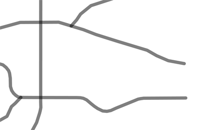
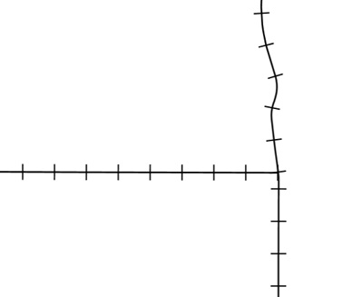
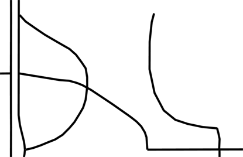
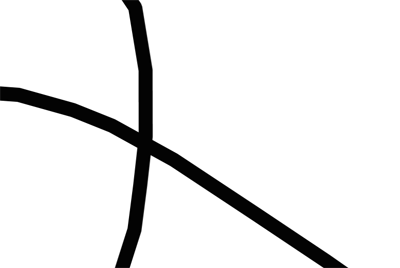
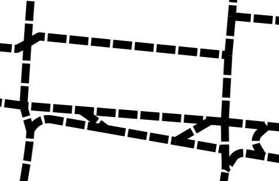

# Line symbolizer

The line symbolizer is used to style linear (1-dimensional) features. It is in some ways the simplest of the symbolizers because it only contains facilities for the stroke (outline) of a feature.

## Syntax

The full syntax of a line symbolizer is:

    symbolizers:
    - line:
        stroke-color: <color>
        stroke-width: <expression>
        stroke-opacity: <expression>
        stroke-linejoin: <expression>
        stroke-linecap: <expression>
        stroke-dasharray: <float list>
        stroke-dashoffset: <expression>
        stroke-graphic: 
          <graphic_options>
        stroke-graphic-fill: 
          <graphic_options>
        offset: <expression>
        geometry: <expression>
        uom: <text>
        x-labelObstacle: <boolean>
        x-composite-base: <boolean>
        x-composite: <text>
        x-inclusion: <text>

where:



  -------------------------------------------------------------------------------------------------------------------------------
  Property       Required?   Description                                                                          Default value
  -------------- ----------- ------------------------------------------------------------------------------------ ---------------
  `offset`       No          Value in pixels for moving the drawn line relative to the location of the feature.   `0`

  -------------------------------------------------------------------------------------------------------------------------------









## Examples

### Basic line with styled ends

The `linejoin` and `linecap` properties can be used to style the joins and ends of any stroke. This example draws lines with partially transparent black lines with rounded ends and sharp (mitred) corners:

    feature-styles:
    - rules:
      - symbolizers:
        - line:
            stroke-color: '#000000'
            stroke-width: 8
            stroke-opacity: 0.5
            stroke-linejoin: mitre
            stroke-linecap: round


*Basic line with styled ends*

### Railroad pattern

!!! info "Todo"

    Fix this example

Many maps use a hatched pattern to represent railroads. This can be accomplished by using two line symbolizers, one solid and one dashed. Specifically, the `stroke-dasharray` property is used to create a dashed line of length 1 every 24 pixels:

    name: railroad
    feature-styles:
    - name: name
      rules:
      - symbolizers:
        - line:
            stroke-color: '#000000'
            stroke-width: 1
        - line:
            stroke-color: '#000000'
            stroke-width: 12
            stroke-dasharray: '1 24'


*Railroad pattern*

### Specifying sizes in units

The units for `stroke-width`, `size`, and other similar attributes default to pixels, meaning that graphics remain a constant size at different zoom levels. Alternately, units (feet or meters) can be specified for values, so graphics will scale as you zoom in or out. This example draws roads with a fixed width of 8 meters:

``` yaml
feature-styles:
- rules:
  - symbolizers:
    - line:
        stroke-color: '#000000'
        stroke-width: '8 m'
```


*Line width measured in meters (zoomed out)*


*Line width measured in meters (zoomed in)*

The default unit of measure for the symbolizer is defined using `uom`. This example uses a default of meters to supply distances for `stroke-width` and `stroke-dasharray` using meters.

``` yaml
line:
  uom: metre
  stroke-color: '#000000'
  stroke-width: '8'
  stroke-dasharray: '20 3'
```


*Line width and spacing in meters*
