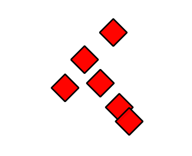
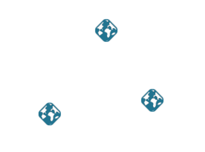
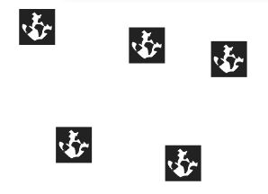
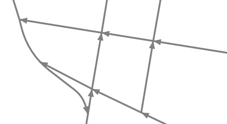

# Point symbolizer

The point symbolizer is used to style point features or centroids of non-point features.

## Syntax

The full syntax of a point symbolizer is:

    symbolizers:
    - point:
        symbols:
        - external:
            url: <text>
            format: <text>
        - mark:
            shape: <shape>
            fill-color: <color>
            fill-opacity: <expression>
            fill-graphic: 
              <graphic_options>
            stroke-color: <color>
            stroke-width: <expression>
            stroke-opacity: <expression>
            stroke-linejoin: <expression>
            stroke-linecap: <expression>
            stroke-dasharray: <float list>
            stroke-dashoffset: <expression>
            stroke-graphic: 
              <graphic_options>
            stroke-graphic-fill: 
              <graphic_options>
        size: <expression>
        anchor: <tuple>
        displacement: <tuple>
        opacity: <expression>
        rotation: <expression>
        geometry: <expression>
        uom: <text>
        x-labelObstacle: <boolean>
        x-composite-base: <boolean>
        x-composite: <text>
        x-inclusion: <text>

where:





| Property       | Required? | Description                                                                                                                                                                                                                                                                      | Default value |
|----------------|-----------|----------------------------------------------------------------------------------------------------------------------------------------------------------------------------------------------------------------------------------------------------------------------------------|---------------|
| `external`     | No        | Specifies an image to use to style the point.                                                                                                                                                                                                                                    | N/A           |
| `url`          | Yes       | Location of the image. Can either be an actual URL or a file path (relative to where the style file is saved in the GeoServer data directory). Should be enclosed in single quotes.                                                                                              | N/A           |
| `format`       | Yes       | Format of the image. Must be a valid MIME type (such as `image/png` for PNG, `image/jpeg` for JPG, `image/svg+xml` for SVG)                                                                                                                                                      | N/A           |
| `mark`         | No        | Specifies a regular shape to use to style the point.                                                                                                                                                                                                                             | N/A           |
| `shape`        | No        | Shape of the mark. Options are `square`, `circle`, `triangle`, `cross`, `x`, and `star`.                                                                                                                                                                                         | `square`      |
| `size`         | No        | Size of the mark in pixels. If the aspect ratio of the mark is not 1:1 (square), will apply to the *height* of the graphic only, with the width scaled proportionally.                                                                                                           | 16            |
| `anchor`       | No        | Specify the center of the symbol relative to the feature location. Value is an `[x,y]` tuple with decimal values from 0-1, with `[0,0]` meaning that the symbol is anchored to the top left, and `[1,1]` meaning anchored to bottom right.                                       | `[0.5,0.5]`   |
| `displacement` | No        | Specifies a distance to which to move the symbol relative to the feature. Value is an `[x,y]` tuple with values expressed in pixels, so [10,5] will displace the symbol 10 pixels to the right and 5 pixels down.                                                              | `[0,0]`       |
| `opacity`      | No        | Specifies the level of transparency. Value of `0` means entirely transparent, while `1` means entirely opaque. Only affects graphics referenced by the `external` parameter; the opacity of `mark` symbols is controlled by the `fill-opacity` and `stroke-opacity` of the mark. | `1`           |
| `rotation`     | No        | Value (in degrees) or rotation of the mark. Larger values increase counter-clockwise rotation. A value of `180` will make the mark upside-down.                                                                                                                                  | `0`           |



The following properties are equivalent to SLD "vendor options".



Additional "vendor options" properties for [Color compositing and color blending](../../../sld/extensions/composite-blend/index.md):



Additional "vendor options" properties for [Rendering Selection](../../../sld/extensions/rendering-selection.md):



## Examples

### Basic point

A point symbolizer draws a point at the center of any geometry. It is defined by an external image or a symbol, either of which can be sized and rotated. A mark is a pre-defined symbol that can be drawn at the location of a point. Similar to polygons, marks have both a fill and a stroke. This example shows a point symbolizer that draws semi-transparent red diamonds with black outlines:

    feature-styles:
    - name: name
      rules:
      - title: red point
        symbolizers:
        - point:
            symbols:
            - mark:
                shape: square
                fill-color: '#FF0000'
                fill-opacity: 0.75
                stroke-color: '#000000'
                stroke-width: 1.5
                stroke-opacity: 1
            size: 20
            rotation: 45


*Basic point*

### Point as image

Sometimes it may be useful to use an image to represent certain points. This can be accomplished using the `external` symbol property, which requires a `url` and a `format`. The `url` should be enclosed in single quotes. The `format` property is a [MIME type image](http://en.wikipedia.org/wiki/Internet_media_type#Type_image). This example shows a point symbolizer that draws an image centered on each point:

    name: point
    feature-styles:
    - name: name
      rules:
      - symbolizers:
        - point:
            symbols:
            - external:
                url: 'geoserver.png'
                format: image/png
            size: 16


*Point as image*

### Point composition

Using more than one point symbolizer allows the composition of more complex symbology. This example shows two symbolizers along with the `x-composite` parameter in order to *subtract* a shape from a square mark, allowing the background to show through.

``` yaml
symbolizers:
- point:
    symbols:
    - mark:
        shape: square
        fill-color: '#222222'
    size: 40
- point:
    symbols:
    - external:
        url: 'stamp.png'
        format: image/png
    x-composite: xor
    size: 40
```


*Point composition*

### Points as arrow heads

Sometimes it is useful to generate a point using a CQL expression. The following example generates a point at the end of each line in the shape of an arrow, rotated such that it matches the orientation of the line.

``` yaml
name: arrow
symbolizers:
- line:
   stroke-color: '#808080'
   stroke-width: 3
- point:
    geometry: ${endPoint(the_geom)}
    symbols:
    - mark:
        shape: shape://oarrow
        fill-color: '#808080'
    size: 30
    rotation: ${endAngle(the_geom)}
```


*Point as arrow head*
