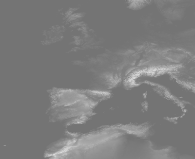
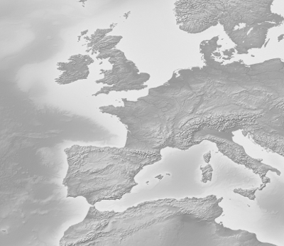
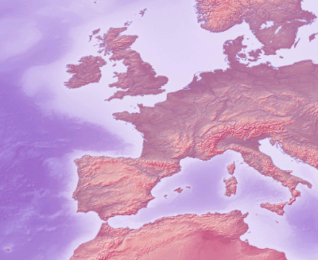
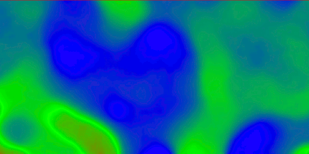
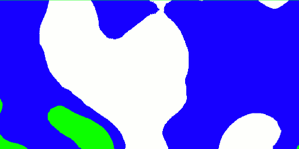
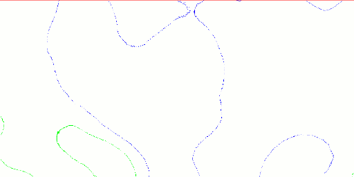

# Raster symbolizer

The raster symbolizer styles raster (coverage) layers. A raster is an array of information with each cell in the array containing one or more values, stored as "bands".

The full syntax of a raster symbolizer is:

    symbolizers:
    - raster:
        opacity: <expression>
        channels:
          gray: 
            <channel_options>
          red:
            <channel_options>
          green:
            <channel_options>
          blue:
            <channel_options>
        color-map:
          type: <ramp|interval|values>
          entries:
          - [color, entry_opacity, band_value, text_label]
        contrast-enhancement: 
          mode: <normalize|histogram>
          gamma: <expression>
        x-inclusion: <text>

where:

  -----------------------------------------------------------------------------------------------------------------------------------------------------------------------------------------------------------------------------------------------------------------------------------------------------------
  Property                 Required?   Description                                                                                                                                                                                                                                            Default value
  ------------------------ ----------- ------------------------------------------------------------------------------------------------------------------------------------------------------------------------------------------------------------------------------------------------------ ---------------
  `opacity`                No          Opacity of the entire display. Valid values are a decimal between `0` (completely transparent) and `1` (completely opaque).                                                                                                                            `1`

  `channels`               No          Selects the band(s) to display and the display method.                                                                                                                                                                                                 N/A

  `gray`                   No          Display a single band as a grayscale image. Cannot be used with `red`, `green`, and `blue`. The `<channel_options>` can be the band name or a mapping containing `name:` and `contrast-enhancement:` (optional).                                       `1`

  `red`                    No          Display three bands as an RGB image. Must be used with `green`, and `blue`. Cannot be used with `gray`. The `<channel_options>` can be the band name or a mapping containing `name:` and `contrast-enhancement:` (optional).                           `1`

  `green`                  No          Display three bands as an RGB image. Must be used with `red`, and `blue`. Cannot be used with `gray`. The `<channel_options>` can be the band name or a mapping containing `name:` and `contrast-enhancement:` (optional).                             `2`

  `blue`                   No          Display three bands as an RGB image. Must be used with `red`, and `green`. Cannot be used with `gray`. The `<channel_options>` can be the band name or a mapping containing `name:` and `contrast-enhancement:` (optional). See examples below.        `3`

  `color-map`              No          Creates a mapping of colors to grid values. Can only be used with a single band.                                                                                                                                                                       N/A

  `type`                   No          Type of color mapping. Options are `ramp`, an interpolated list of values; `interval`, a non-interpolated list of values; and `values`, where values need to match exactly to be drawn.                                                                `ramp`

  `entries`                No          Values for the color mapping. Syntax is a list of tuples.                                                                                                                                                                                              N/A

  `color`                  Yes         Color for the particular color map entry. Value is a standard color value.                                                                                                                                                                             N/A

  `entry_opacity`          Yes         Opacity of the particular color map entry. Valid values are a decimal between `0` (completely transparent) and `1` (completely opaque).                                                                                                                N/A

  `band_value`             Yes         Grid value to use for the particular color map entry. Values are data-dependent. Behavior at or around this value is determined by the color ramp `type`.                                                                                              N/A

  `text_label`             No          Label for the particular color map entry                                                                                                                                                                                                               Blank

  `contrast-enhancement`   No          Modifies the contrast of the display                                                                                                                                                                                                                   N/A

  `mode`                   No          Type of contrast enhancement. Options are `normalize` (stretches contrast so that the smallest and largest values are set to black and white, respectively) or `histogram` (produces equal number of content in the image at each brightness level).   `normalize`

  `gamma`                  No          Multiplier value for contrast adjustment. A value greater than 1 will increase darkness, while a value less than 1 will decrease darkness.                                                                                                             `1`
  -----------------------------------------------------------------------------------------------------------------------------------------------------------------------------------------------------------------------------------------------------------------------------------------------------------

Additional "vendor options" properties for [Color compositing and color blending](../../../sld/extensions/composite-blend/index.md):



Additional "vendor options" properties for [Rendering Selection](../../../sld/extensions/rendering-selection.md):



## Examples

!!! info "Todo"

    All examples need figures

### Enhanced contrast

This example takes a given raster and lightens the output by a factor of 2:

    symbolizers:
    - raster:
        contrast-enhancement: 
          gamma: 0.5

*Lightened image*

### Normalized output

This example takes a given raster and adjusts the contrast so that the smallest values are darkest and the highest values are lightest:

    symbolizers:
    - raster:
        contrast-enhancement: 
          mode: normalize

*Normalized image*

### Band selection

This example takes a raster with multiple bands and outputs band 2 as a grayscale image (This could be used to select a single band in a multi-band image to use with `color-map`):

    name: raster
    feature-styles:
    - name: name
      rules:
      - symbolizers:
        - raster:
            opacity: 1.0
            channels:
              gray: 2

*Grayscale band selection*

### Band selection with contrast

This example takes an RGB raster, doubles the intensity of the red, and normalizes the green band:

    name: raster
    feature-styles:
    - name: name
      rules:
      - symbolizers:
        - raster:
            channels:
              red:
                name: 1
                contrast-enhancement:
                  gamma: .5
              green:
                name: 2
                contrast-enhancement:
                  mode: normalize
              blue:
                name: 3

*Band selection with contrast enhancement*

### Color ramp

This example shows a color ramp from red to green to blue, with raster band values from 0-200:

    symbolizers:
    - raster:
        color-map:
          type: ramp
          entries:
          - ['#FF0000', 1, 0, red]
          - ['#00FF00', 1, 100, green]
          - ['#0000FF', 1, 200, blue]

In this example, the grid values will have the following colors applied:

-   Less than or equal to 0 will have an output color of **solid red**
-   Between 0 and 100 will have an output color **interpolated between red and green**
-   Between 100 and 200 will have an output color **interpolated between green and blue**
-   Greater than 200 will have an output color of **solid blue**

*Color map with ramp*

### Color intervals

The same example as above, but with the `color-map` type set to `intervals`:

    symbolizers:
    - raster:
        color-map:
          type: intervals
          entries:
          - ['#FF0000', 1, 0, red]
          - ['#00FF00', 1, 100, green]
          - ['#0000FF', 1, 200, blue]

In this example, the grid values will have the following colors applied:

-   Less than or equal to 0 will have an output color of **solid red**
-   Between 0 and 100 will have an output color of **solid green**
-   Between 100 and 200 will have an output color of **solid blue**
-   Greater than 200 will **not be colored** at all (transparent)

*Color map with intervals*

### Color values

The same example as above, but with the `color-map` type set to `values`:

    symbolizers:
    - raster:
        color-map:
          type: values
          entries:
          - ['#FF0000', 1, 0, red]
          - ['#00FF00', 1, 100, green]
          - ['#0000FF', 1, 200, blue]

In this example, the grid values will have the following colors applied:

-   Equal to 0 will have an output color of **solid red**
-   Equal to 100 will have an output color of **solid green**
-   Equal to 200 will have an output color of **solid blue**

Any other values (even those in between the above values) will not be colored at all.

*Color map with values*
