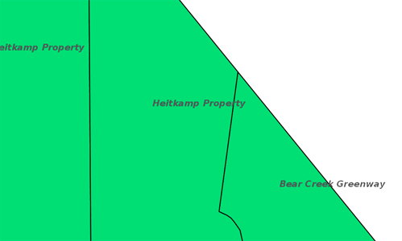
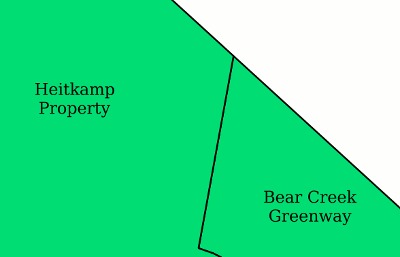
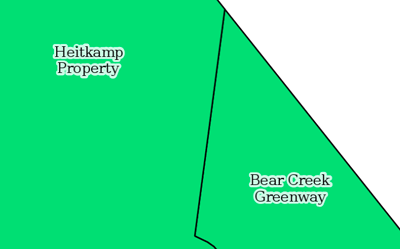
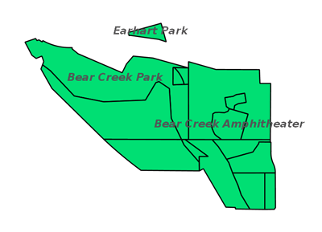
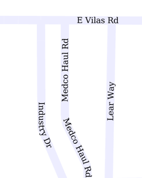
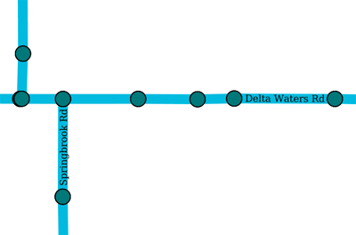
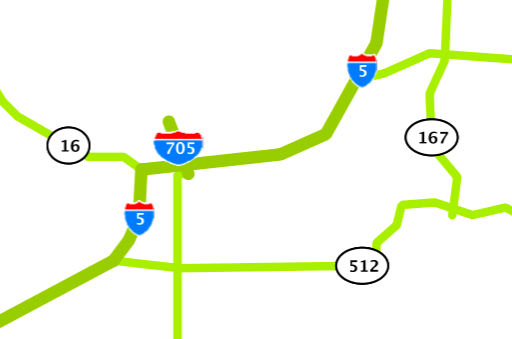

# Text symbolizer {: #ysld_reference_symbolizers_text }

The text symbolizer styles labels of vector features. Labels can consist of text strings and/or graphics.

## Syntax

The full syntax of a text symbolizer is:

    symbolizers:
    - text:
        fill-color: <color>
        fill-opacity: <expression>
        fill-graphic: 
          <graphic_options>
        stroke-graphic: 
          <graphic_options>
        stroke-graphic-fill: 
          <graphic_options>
        label: <expression>
        font-family: <expression>
        font-size: <expression>
        font-style: <expression>
        font-weight: <expression>
        placement: <point|line>
        offset: <expression>
        anchor: <tuple>
        displacement: <tuple>
        rotation: <expression>
        priority: <expression>
        halo:
          radius: <expression>
          fill-color: <color>
          fill-opacity: <expression>
          fill-graphic:
            <graphic_options>
        graphic:
          symbols:
            <graphic_options>
          size: <expression>
          opacity: <expression>
          rotation: <expression>
        geometry: <expression>
        uom: <text>
        x-composite-base: <boolean>
        x-composite: <text>
        x-allowOverruns: <boolean>
        x-autoWrap: <expression>
        x-conflictResolution: <boolean>
        x-followLine: <boolean>
        x-forceLeftToRight: <boolean>
        x-goodnessOfFit: <expression>
        x-graphic-margin: <expression>
        x-graphic-resize: <none|proportional|stretch>
        x-group: <boolean>
        x-labelAllGroup: <boolean>
        x-repeat: <expression>
        x-maxAngleDelta: <expression>
        x-maxDisplacement: <expression>
        x-minGroupDistance: <expression>
        x-partials: <boolean>
        x-polygonAlign: <boolean>
        x-spaceAround: <expression>
        x-underlineText: <boolean>
        x-strikethroughText: <boolean>
        x-charSpacing: <expression>
        x-wordSpacing: <expression>
        x-inclusion: <text>

where:

  -------------------------------------------------------------------------------------------------------------------------------------------------------------------------------------------------------------------------------------------------------------------------------------------------------------------------------------------------------------------------------------------------------------------------------------------------------------------------------------------------------------------------------------------------------------
  Property                Required?   Description                                                                                                                                                                                                                                                                                                                                                                                                                                                                                          Default value
  ----------------------- ----------- ---------------------------------------------------------------------------------------------------------------------------------------------------------------------------------------------------------------------------------------------------------------------------------------------------------------------------------------------------------------------------------------------------------------------------------------------------------------------------------------------------- --------------------
  `fill-color`            No          Color of inside of the label.                                                                                                                                                                                                                                                                                                                                                                                                                                                                        `'#808080'` (gray)

  `fill-opacity`          No          Opacity of fill of the label text. Valid values are a decimal value between `0` (completely transparent) and `1` (completely opaque).                                                                                                                                                                                                                                                                                                                                                                `1`

  `fill-graphic`          No          A design to be used for the fill of the text label. Can either be a mark consisting of a common shape or a URL that points to a graphic. The `<graphic_options>` should consist of a mapping containing `symbols:` followed by an `external:` or `mark:`, with appropriate parameters as detailed in the [Point symbolizer](point.md) section.                                                                                                                                                      None

  `stroke-graphic`        No          A design or pattern to be used along the stroke around the label text. the output will always be a linear repeating pattern, and as such is not tied to the value of `stroke-width`. Can either be a mark consisting of a common shape or a URL that points to a graphic. The `<graphic_options>` should consist of a mapping containing `symbols:` followed by an `external:` or `mark:`, with appropriate parameters. Cannot be used with `stroke-graphic-fill`.                                   N/A

  `stroke-graphic-fill`   No          A design or pattern to be used for the fill of the stroke around the label text. This area that is to be filled is tied directly to the value of `stroke-width`. Can either be a mark consisting of a common shape or a URL that points to a graphic. The `<graphic_options>` should consist of a mapping containing `symbols:` followed by an `external:` or `mark:`, with appropriate parameters as detailed in the [Point symbolizer](point.md) section. Cannot be used with `stroke-graphic`.   N/A
  -------------------------------------------------------------------------------------------------------------------------------------------------------------------------------------------------------------------------------------------------------------------------------------------------------------------------------------------------------------------------------------------------------------------------------------------------------------------------------------------------------------------------------------------------------------

  ---------------------------------------------------------------------------------------------------------------------------------------------------------------------------------------------------------------------------------------------------------------------------------------------------------------------------------------------------------
  Property         Required?   Description                                                                                                                                                                                                                                                                                                  Default value
  ---------------- ----------- ------------------------------------------------------------------------------------------------------------------------------------------------------------------------------------------------------------------------------------------------------------------------------------------------------------ ---------------
  `label`          Yes         Text to display. Often taken from an attribute but any valid expression that constructs a string will do.                                                                                                                                                                                                    N/A

  `font-family`    No          Type of font to be used for the label. Options are system dependent; the full list of fonts available can be found via the GeoServer Server Status page.                                                                                                                                                     `serif`

  `font-size`      No          Size of the font.                                                                                                                                                                                                                                                                                            `10`

  `font-style`     No          Style of the font. Options are `normal`, `italic`, and `oblique`.                                                                                                                                                                                                                                            `normal`

  `font-weight`    No          Weight of the font. Options are `normal` and `bold`.                                                                                                                                                                                                                                                         `normal`

  `placement`      No          Determines whether the label is to be drawn derived from a `point` or a `line`.                                                                                                                                                                                                                              `point`

  `offset`         No          Value (in pixels) for moving the drawn label relative to the location of the feature. A positive value will shift the label in the direction of its top, while a negative value will shift the label in the direction of its bottom. Only valid for when `type` is set to `line`.                            `0`

  `anchor`         No          Specify the center of the symbol relative to the feature location (centroid for lines and polygons). Value is an `[x,y]` tuple with decimal values from 0-1, with `[0,0]` meaning that the symbol is anchored to the bottom left of the label, and `[1,1]` meaning anchored to the top right of the label.   `[0,0]`

  `displacement`   No          Specifies a distance (in pixels) to which to move the label relative to the feature. Value is an `[x,y]` tuple with values expressed in pixels, so [10,5] will displace the label 10 pixels to the right and 5 pixels up. Only valid for when `type` is set to `point`.                                    `[0,0]`

  `rotation`       No          Value (in degrees) or rotation of the label. Larger values increase counter-clockwise rotation. A value of `180` will make the label upside-down. Only valid for when `type` is set to `point`.                                                                                                              `0`

  `priority`       No          The priority used when choosing which labels to display during conflict resolution. Higher priority values take precedence over lower priority values.                                                                                                                                                       1000

  `halo`           No          Creates a shaded area around the label for easier legibility                                                                                                                                                                                                                                                 No halo

  `radius`         No          Size (in pixels) of the halo                                                                                                                                                                                                                                                                                 `1`

  `fill-color`     No          Color of the halo                                                                                                                                                                                                                                                                                            `'#808080'`

  `fill-opacity`   No          Specifies the level of transparency for the halo. Value of `0` means entirely transparent, while `1` means entirely opaque.                                                                                                                                                                                  `1`
  ---------------------------------------------------------------------------------------------------------------------------------------------------------------------------------------------------------------------------------------------------------------------------------------------------------------------------------------------------------

The following properties allow for a graphic to be displayed in addition to just a label. This is used when drawing "shields" (text over top of a graphic) such as in road signs.

  ----------------------------------------------------------------------------------------------------------------------------------------------------------------------------------------------------------------
  Property       Required?   Description                                                                                                                                                        Default value
  -------------- ----------- ------------------------------------------------------------------------------------------------------------------------------------------------------------------ ------------------
  `graphic`      No          Specifies whether a graphic is to be drawn for the label.                                                                                                          N/A (no graphic)

  `symbols`      No          The details of the graphic. Consists of an `external:` or `mark:` section, with appropriate parameters as detailed in the [Point symbolizer](point.md) section.   N/A

  `size`         No          Size of the graphic in pixels. If the aspect ratio is not 1:1 (square), will apply to the *height* of the graphic only, with the width scaled proportionally.      `16`

  `opacity`      No          Specifies the level of transparency for the graphic. Value of `0` means entirely transparent, while `1` means entirely opaque.                                     `1`

  `rotation`     No          Value (in degrees) or rotation of the graphic. Larger values increase counter-clockwise rotation. A value of `180` will make the graphic upside-down.              `0`
  ----------------------------------------------------------------------------------------------------------------------------------------------------------------------------------------------------------------



The following properties are equivalent to SLD "vendor options".

  -----------------------------------------------------------------------------------------------------------------------------------------------------------------------------------------------------------------------------------------------------------------------------------
  Property                 Required?   Description                                                                                                                                                                                                              Default value
  ------------------------ ----------- ------------------------------------------------------------------------------------------------------------------------------------------------------------------------------------------------------------------------ ---------------------
  `x-allowOverruns`        No          Allows labels on lines to move slightly beyond the beginning or end of the line.                                                                                                                                         `true`

  `x-autoWrap`             No          The number of pixels beyond which a label will be wrapped over multiple lines. Cannot use with `x-followLine`.                                                                                                           0

  `x-conflictResolution`   No          Enables conflict resolution, meaning no two labels will be allowed to overlap. Without conflict resolution, symbolizers can overlap with other labels.                                                                   `true`

  `x-followLine`           No          On linear geometries, the label will follow the shape of the current line, as opposed to being drawn at a tangent. Will override                                                                                         `false`

  `x-forceLeftToRight`     No          Forces labels to a readable orientation, otherwise will follow the line orientation, possibly making the label look upside-down. This setting is useful when using symbol fonts to add direction markers along a line.   `false`

  `x-goodnessOfFit`        No          Percentage (expressed as a decimal between 0-1) of the label that must fit inside the geometry to permit the label to be drawn. Works only on polygon features.                                                          0.5

  `x-graphic-margin`       No          Number of pixels between the stretched graphic and the text. Only applies when `x-graphic-resize` is set to `stretch` or `proportional`.                                                                                 0

  `x-graphic-resize`       No          Allows for stretching the graphic underneath a label to fit the label size. Options are `none`, `stretch` or `proportional`. Used in conjunction with `x-graphic-margin`..                                               `none`

  `x-group`                No          Geometries with identical labels will be considered a single entity to be labeled. Used to control repeated labels.                                                                                                      `false`

  `x-labelAllGroup`        No          Used in conjunction with `x-group`. When `true` all items in a group are labeled. When `false`, only the largest geometry in the group is labeled. Valid for lines only.                                                 `false`

  `x-repeat`               No          Desired distance (in pixels) between labels drawn on a group. If zero, only one label will be drawn. Used in conjunction with `x-group`. Valid for lines only.                                                           0

  `x-maxAngleDelta`        No          Maximum allowed angle (in degrees) between two characters in a curved label. Used in conjunction with `x-followLine`. Values higher than `30` may cause loss of legibility of the label.                                 22.5

  `x-maxDisplacement`      No          Distance (in pixels) a label can be displaced from its natural position in an attempt to eliminate conflict with other labels.                                                                                           0

  `x-minGroupDistance`     No          Minimum distance (in pixels) between two labels in the same label group. Used in conjunction with `displacement` or `repeat` to avoid having two labels too close to each other                                          No minimum distance

  `x-partials`             No          Will display partial labels (truncated on the border of the display area).                                                                                                                                               `false`

  `x-polygonAlign`         No          Overrides manual rotation to align label rotation automatically. Valid for polygons only.                                                                                                                                `false`

  `x-spaceAround`          No          Minimum distance (in pixels) between two labels. A negative value specifies the maximum overlap between two labels.                                                                                                      0

  `x-underlineText`        No          Instruct the renderer to underline labels.                                                                                                                                                                               `false`

  `x-strikethroughText`    No          Instruct the renderer to strikethrough labels.                                                                                                                                                                           `false`

  `x-charSpacing`          No          The option controls the amount of space between characters, a positive value increases it, a negative value shrinks it (and will eventually make characters overlap). The value is specified in pixels.                  0

  `x-wordSpacing`          No          The option controls the amount of space between words, for this option only positive values (or zero) are accepted. The value is specified in pixels.                                                                    0
  -----------------------------------------------------------------------------------------------------------------------------------------------------------------------------------------------------------------------------------------------------------------------------------



## Examples

### Basic label

Text symbolizers are used to draw labels on objects. The label text is usually linked to some attribute of the layer. Font options are available in the `font-family`, `font-size`, `font-style`, and `font-weight` properties. The following example draws a label using the `name` attribute of the layer, and with a SansSerif font of size 12, gray color, bold and italic:

    feature-styles:
    - name: name
      rules:
      - title: fill-graphic
        symbolizers:
        - text:
            label: ${name}
            fill-color: '#555555'
            font-family: SansSerif
            font-size: 12
            font-style: italic
            font-weight: bold

*Basic label*

### Label with wrap

Wrapping long labels can improve how well they fit on maps. This can be accomplished using the `x-autoWrap` property. This example wraps lines longer than 70 pixels:

    feature-styles:
    - name: name
      rules:
      - symbolizers:
        - polygon:
            stroke-width: 1
            fill-color: '#00DD77'
        - text:
            label: ${name}
            font-size: 12
            x-autoWrap: 70
            x-maxDisplacement: 100
            anchor: [0.5,-1]

*Label with wrap*

### Label with halo

Surrounding labels with a halo will allow them to be visible even on complex maps with various background features. This can be accomplished using the `halo` family of properties. This example surrounds the label in a partially transparent white halo of radius 2:

    feature-styles:
    - name: name
      rules:
      - symbolizers:  
        - polygon:
            stroke-width: 1
            fill-color: '#00DD77'
        - text:
            label: ${name}
            font-size: 12
            x-autoWrap: 70
            x-maxDisplacement: 100
            halo:
               radius: 2
               fill-color: '#FFFFFF'
               fill-opacity: 0.8
            anchor: [0.5,-1]

*Label with halo*

### Grouped labels

Grouping and other properties can be used to better control where labels are placed. The `x-group` option combines all labels with identical text into a single label. This can be useful to show only a single label for a street rather than having a label on every block of the street. The `x-goodnesOfFit` option determines whether or not to draw labels based on how well they fit into the available space. The `x-maxDisplacement` option determines the maximum distance a label can be moved to avoid overlaps.

The following example uses `x-group` to ensure only one label is drawn for each feature, and sets `x-goodnesOfFit` to zero so that labels will be drawn even if they have a poor fit:

    feature-styles:
    - name: name
      rules:
      - title: fill-graphic
        symbolizers:
        - text:
            label: ${name}
            fill-color: '#555555'
            font-family: SansSerif
            font-size: 12
            font-style: italic
            font-weight: bold
            x-group: true
            x-goodnessOfFit: 0.0
            x-maxDisplacement: 400

*Grouped labels*

### Labels following lines

In order to have a label follow a line (and not be drawn tangent to a line), the `x-followLine` option can be set. Other properties can be used in conjunction with this to achieve the best visual result. The following example has street names following the line of the street, with a maximum angle of 90 degrees, repeating every 150 pixels:

    feature-styles:
    - rules:
      - symbolizers:
        - line:
            stroke-color: '#EDEDFF'
            stroke-width: 10
        - text:
            label: name
            x-followLine: true
            x-maxAngleDelta: 90
            x-maxDisplacement: 400
            x-repeat: 150

*Labels following lines*

### Labels avoiding obstacles

The `x-labelObstacle` option is used to mark a different symbolizer as an obstacle that labels should avoid. This example draws labels and points on a line geometry, and also uses a point symbolizer to draw the vertices of the lines as points. It is those points which are set to be treated as obstacles to be avoided:

    feature-styles:
    - rules:
      - symbolizers:
          - line:
              stroke-color: '#00BBDD'
              stroke-width: 10
    - rules:
      - symbolizers:
          - point:
              geometry: ${vertices(the_geom)}
              x-labelObstacle: true
              symbols:
              - mark:
                  shape: circle
                  stroke-color: '#000000'
                  fill-color: '#007777'
          - text:
              label: ${streetname}
              x-maxDisplacement: 400
              x-followLine: true

*Labels avoiding obstacles*

### Road Shields

The `graphic` option is used to display a symbol behind a label. A common use for this is to display "highway shields" behind road numbers. This example uses a circle `shape` to draw state shields, and an `external` image to draw interstate shields, then draws road names on top. The `x-graphic-resize` and `x-graphic-margin` options are used to resize the graphics to fit the label text:

    feature-styles:
    - name: state
      rules:
      - filter: ${level ilike 'State'}
        symbolizers:
        - line:
            stroke-color: '#AAEE00'
            stroke-width: 4
            stroke-linecap: round
        - text:
            label: ${name}
            anchor: [0.5, 0.5]
            fill-color: black
            font-family: SansSerif
            font-weight: bold
            font-size: 8
            x-graphic-resize: stretch
            x-graphic-margin: 6
            graphic:
              symbols:
              - mark: 
                  shape: circle
                  fill-color: white
                  stroke-color: black 
    - name: interstate
      rules:
      - filter: ${level ilike 'Interstate'}
        symbolizers:
        - line:
            stroke-color: '#99CC00'
            stroke-width: 6
            stroke-linecap: round
        - text:
            label: ${name}
            anchor: [0.5, 0.5]
            fill-color: white
            font-family: SansSerif
            font-weight: bold
            font-size: 8
            x-graphic-resize: stretch
            x-graphic-margin: 6
            graphic:
              symbols:
              - external:
                  url: interstate.png
                  format: image/png

*Road Shields*
