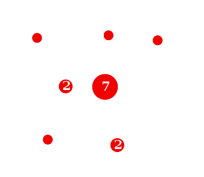

# Transforms {: #ysld_reference_transforms }

YSLD allows for the use of rendering transformations. Rendering transformations are processes on the server that are executed inside the rendering pipeline, to allow for dynamic data transformations. In GeoServer, rendering transformations are typically exposed as WPS processes.

For example, one could create a style that applies to a point layer, and applies a Heatmap process as a rendering transformation, making the output a (raster) heatmap.

Because rendering transformations can change the geometry type, it is important to make sure that the [symbolizer](symbolizers/index.md) used matches the *output* of the rendering transformation, not the input. In the above heatmap example, the appropriate symbolizer would be a raster symbolizer, as the output of a heatmap is a raster.

## Syntax

The full syntax for using a rendering transformation is:

``` yaml
feature-styles
  ...
  transform:
    name: <text>
    params: <options>
  rules:
    ...
```

where:

  --------------------------------------------------------------------------------------------------------------------------------------------------------------------------------
  Property       Required?   Description                                                                                                                           Default value
  -------------- ----------- ------------------------------------------------------------------------------------------------------------------------------------- ---------------
  `name`         Yes         Full name of the rendering transform including any prefixes (such as `vec:Heatmap`)                                                   N/A

  `params`       Yes         All input parameters for the rendering transformation. Content will vary greatly based on the amount and type of parameters needed.   N/A
  --------------------------------------------------------------------------------------------------------------------------------------------------------------------------------

The values in the `params` options typically include values, strings, or attributes. However, it can be useful with a transformation to include environment parameters that concern the position and size of the map when it is rendered. For example, the following are common reserved environment parameters:

  --------------------------------------------------------------------------------
  Environment parameter   Description
  ----------------------- --------------------------------------------------------
  `env('wms_bbox')`       The bounding box of the request

  `env('wms_width')`      The width of the request

  `env('wms_height')`     The height of the request
  --------------------------------------------------------------------------------

With this in mind, the following `params` are assumed unless otherwise specified:

``` yaml
params:
  ...
  outputBBOX: ${env('wms_bbox')}
  outputWidth: ${env('wms_width')}
  outputHeight: ${env('wms_height')}
  ...
```

!!! note

    Be aware that the transform happens *outside* of the [rules](rules.md) and [symbolizers](symbolizers/index.md), but inside the [feature styles](featurestyles.md).

## Examples

### Heatmap

The following uses the `vec:Heatmap` process to convert a point layer to a heatmap raster:

``` yaml
title: Heatmap
feature-styles:
- transform:
    name: vec:Heatmap
    params:
      weightAttr: pop2000
      radiusPixels: 100
      pixelsPerCell: 10
  rules:
  - symbolizers:
    - raster:
        opacity: 0.6
        color-map:
          type: ramp
          entries:
          - ['#FFFFFF',0,0.0,nodata]
          - ['#4444FF',1,0.1,nodata]
          - ['#FF0000',1,0.5,values]
          - ['#FFFF00',1,1.0,values]
```

### Point Stacker

The point stacker transform can be used to combine points that are close together. This transform acts on a point geometry layer, and combines any points that are within a single cell as specified by the `cellSize` parameter. The resulting geometry has attributes `geom` (the geometry), `count` (the number of features represented by this point) and `countUnique` (the number of unique features represented by this point). These attributes can be used to size and label the points based on how many points are combined together:

``` yaml
title: pointstacker
feature-styles:
- transform:
    name: vec:PointStacker
    params:
    cellSize: 100
  rules:
  - symbolizers:
    - point:
        size: ${8*sqrt(count)}
        symbols:
        - mark:
            shape: circle
            fill-color: '#EE0000'
  - filter: count > 1
    symbolizers:
    - text:
          fill-color: '#FFFFFF'
          font-family: Arial
          font-size: 10
          font-weight: bold
          label: ${count}
          placement:
              anchor: [0.5,0.75]
```


*Point stacker*
