# CQL and ECQL

CQL (Common Query Language) is a query language created by the OGC for the [Catalogue Web Services specification](http://www.opengeospatial.org/standards/cat). Unlike the XML-based Filter Encoding language, CQL is written using a familiar text-based syntax. It is thus more readable and better-suited for manual authoring.

However, CQL has some limitations. For example it cannot encode id filters, and it requires an attribute to be on the left side of any comparison operator. For this reason, GeoServer provides an extended version of CQL called ECQL. ECQL removes the limitations of CQL, providing a more flexible language with stronger similarities with SQL.

GeoServer supports the use of both CQL and ECQL in WMS and WFS requests, as well as in GeoServer's SLD [dynamic symbolizers](../../styling/sld/extensions/pointsymbols.md). Whenever the documentation refers to CQL, ECQL syntax can be used as well (and if not, please report that as a bug!).

This tutorial introduces the CQL/ECQL language by example. For a full reference, refer to the [ECQL Reference](../../filter/ecql_reference.md).

## Getting started

The following examples use the `topp:states` sample layer shipped with GeoServer. They demonstrate how CQL filters work by using the WMS `CQL_FILTER vendor parameter<wms_vendor_parameters>`{.interpreted-text role="ref"} to alter the data displayed by WMS requests. The easiest way to follow the tutorial is to open the GeoServer Map Preview for the `topp:states` layer. Click on the *Options* button at the top of the map preview to open the advanced options toolbar. The example filters can be entered in the *Filter: CQL* box.

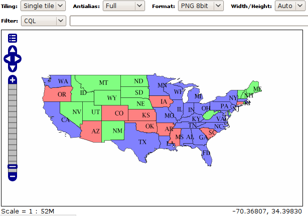
*topp:states preview with advanced toolbar open.*

The attributes used in the filter examples are those included in the layer. For example, the following are the attribute names and values for the Colorado feature:

**Attribute**

:   **states.6**

STATE_NAME

:   Colorado

STATE_FIPS

:   08

SUB_REGION

:   Mtn

STATE_ABBR

:   CO

LAND_KM

:   268659.501

WATER_KM

:   960.364

PERSONS

:   3294394.0

FAMILIES

:   854214.0

HOUSHOLD

:   1282489.0

MALE

:   1631295.0

FEMALE

:   1663099.0

WORKERS

:   1233023.0

DRVALONE

:   1216639.0

CARPOOL

:   210274.0

PUBTRANS

:   46983.0

EMPLOYED

:   1633281.0

UNEMPLOY

:   99438.0

SERVICE

:   421079.0

MANUAL

:   181760.0

P_MALE

:   0.495

P_FEMALE

:   0.505

SAMP_POP

:   512677.0

## Simple comparisons

Let's get started with a simple example. In CQL arithmetic and comparisons are expressed using plain text. The filter `PERSONS > 15000000` will select states that have more than 15 million inhabitants:

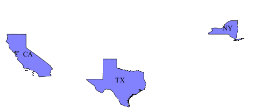
*PERSONS > 15000000*

The full list of comparison operators is: `=`, `<>`, `>`, `>=`, `<`, `<=`.

To select a range of values the BETWEEN operator can be used: `PERSONS BETWEEN 1000000 AND 3000000`:

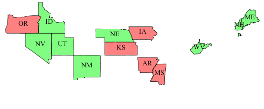
*PERSONS BETWEEN 1000000 AND 3000000*

Comparison operators also support text values. For instance, to select only the state of California, the filter is `STATE_NAME = 'California'`. More general text comparisons can be made using the `LIKE` operator. `STATE_NAME LIKE 'N%'` will extract all states starting with an "N":

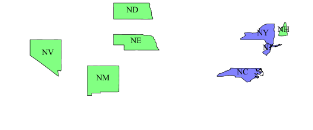
*STATE_NAME LIKE 'N%'*

It is also possible to compare two attributes with each other. `MALE > FEMALE` selects the states in which the male population surpasses the female one (a rare occurrence):

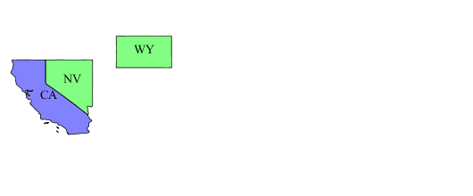
*MALE > FEMALE*

Arithmetic expressions can be computed using the `+, -, *, /` operators. The filter `UNEMPLOY / (EMPLOYED + UNEMPLOY) > 0.07` selects all states whose unemployment ratio is above 7% (remember the sample data is very old, so don't draw any conclusion from the results!)

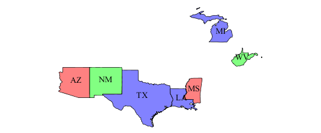
*UNEMPLOY / (EMPLOYED + UNEMPLOY) > 0.07*

## Id and list comparisons

If we want to extract only the states with specific feature ids we can use the `IN` operator without specifying any attribute, as in `IN ('states.1', 'states.12')`:

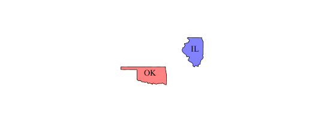
*IN ('states.1', 'states.12')*

If instead we want to extract the states whose name is in a given list we can use the `IN` operator specifying an attribute name, as in `STATE_NAME IN ('New York', 'California', 'Montana', 'Texas')`:

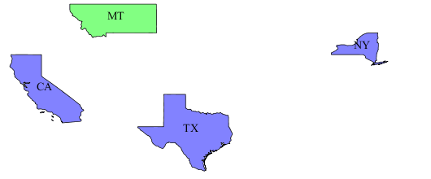
*STATE_NAME IN ('New York', 'California', 'Montana', 'Texas')*

!!! warning

    [Note](https://gis.stackexchange.com/a/475826/68995): ``id`` is one of a few [reserved keywords](https://github.com/geotools/geotools/blob/2058be01323c3dea23d6df4d84b623be7f0b4102/modules/library/cql/src/main/jjtree/ECQLGrammar.jjt#L180) in ECQL and thus an attribute (or database column) named ``id`` must be quoted, e.g. ``"id"``

## Filter functions

CQL/ECQL can use any of the [filter functions](../../filter/function_reference.md) available in GeoServer. This greatly increases the power of CQL expressions.

For example, suppose we want to find all states whose name contains an "m", regardless of letter case. We can use the `strToLowerCase` to turn all the state names to lowercase and then use a like comparison: `strToLowerCase(STATE_NAME) like '%m%'`:

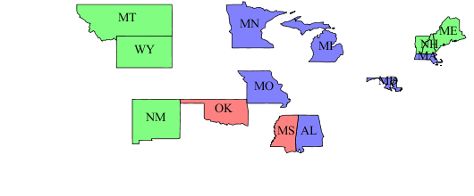
*strToLowerCase(STATE_NAME) like '%m%'*

## Geometric filters

CQL provides a full set of geometric filter capabilities. Say, for example, you want to display only the states that intersect the (-90,40,-60,45) bounding box. The filter will be `BBOX(the_geom, -90, 40, -60, 45)`

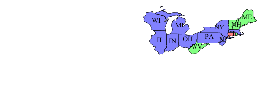
*BBOX(the_geom, -90, 40, -60, 45)*

Conversely, you can select the states that do *not* intersect the bounding box with the filter: `DISJOINT(the_geom, POLYGON((-90 40, -90 45, -60 45, -60 40, -90 40)))`:

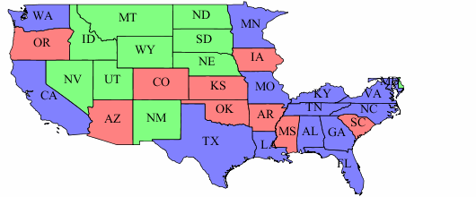
*DISJOINT(the_geom, POLYGON((-90 40, -90 45, -60 45, -60 40, -90 40)))*

The full list of geometric predicates is: `EQUALS`, `DISJOINT`, `INTERSECTS`, `TOUCHES`, `CROSSES`, `WITHIN`, `CONTAINS`, `OVERLAPS`, `RELATE`, `DWITHIN`, `BEYOND`.
