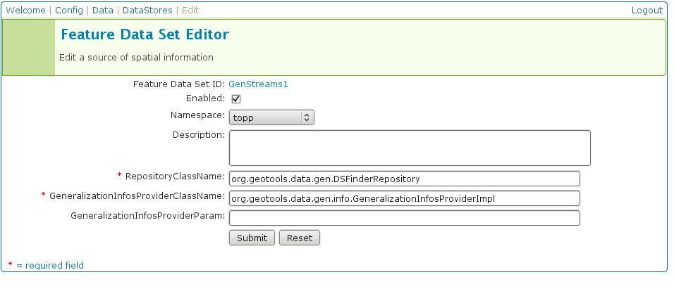
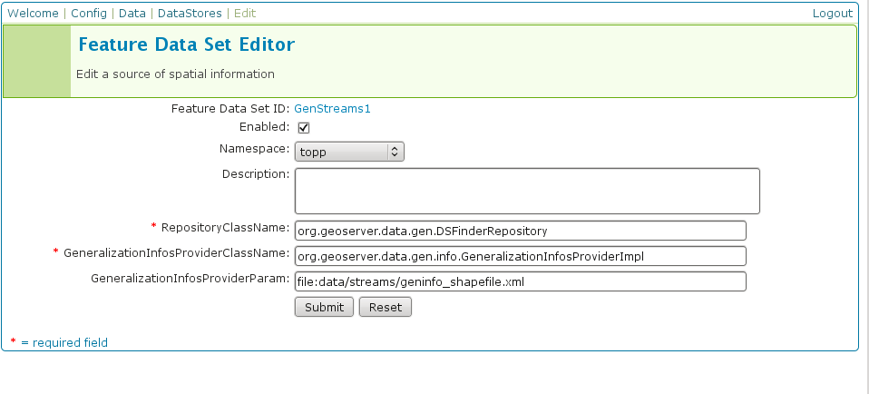
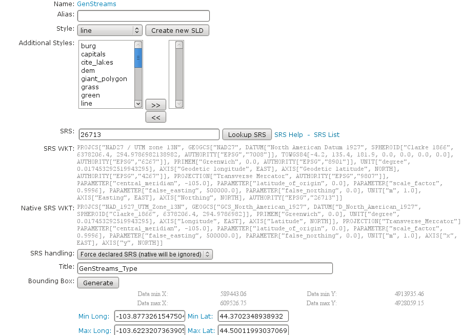
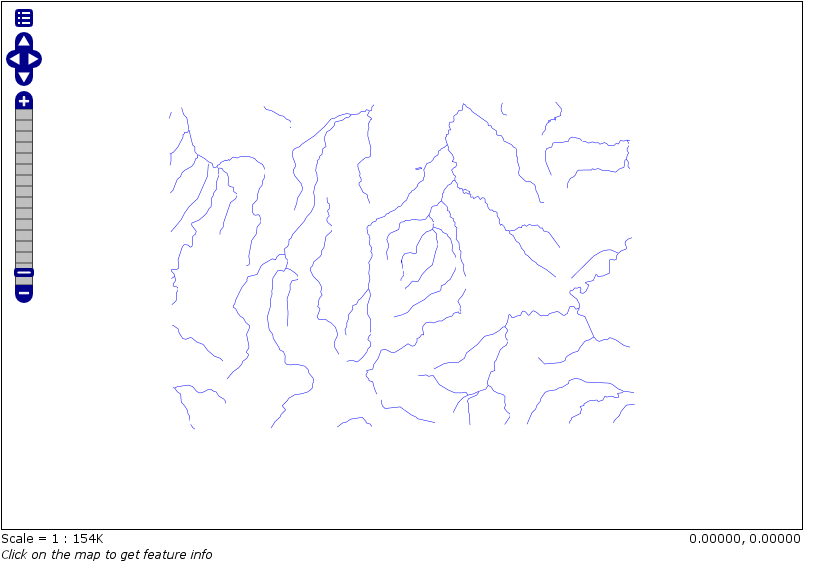
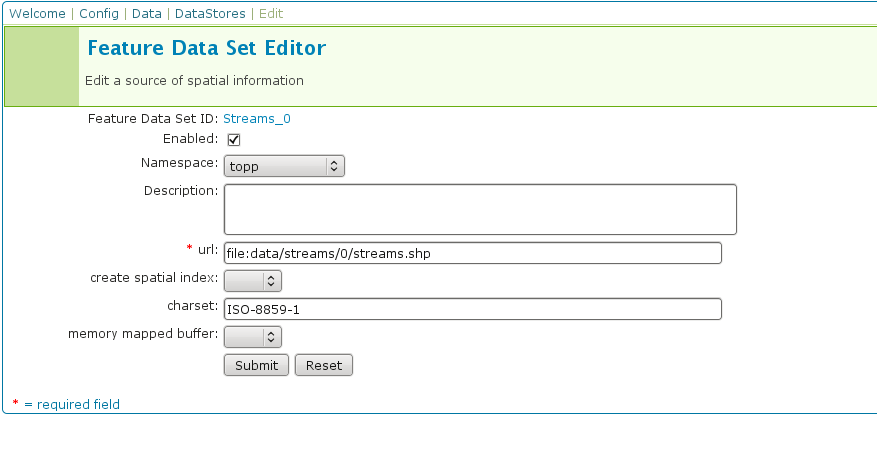
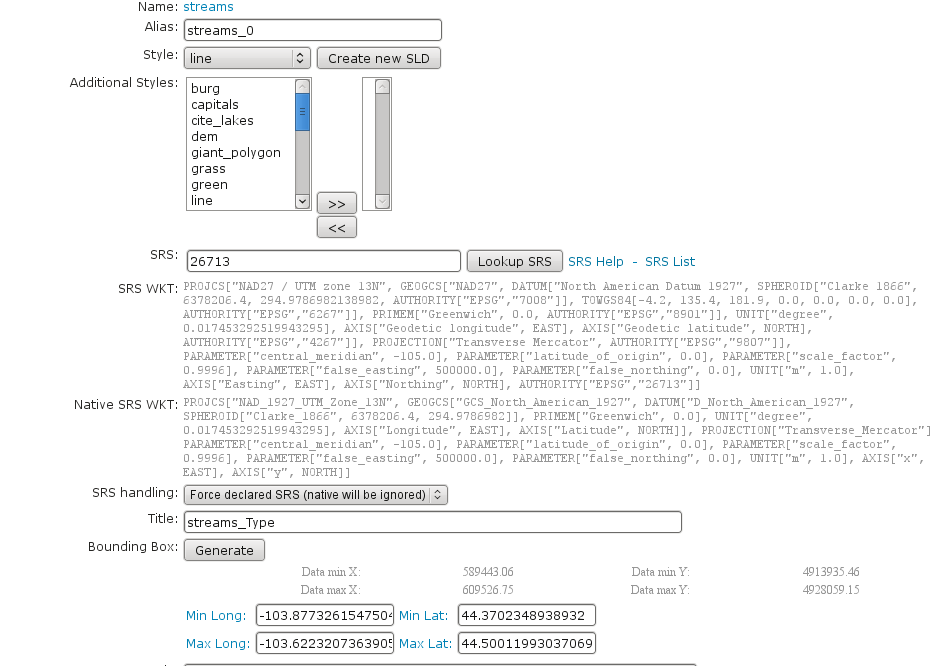
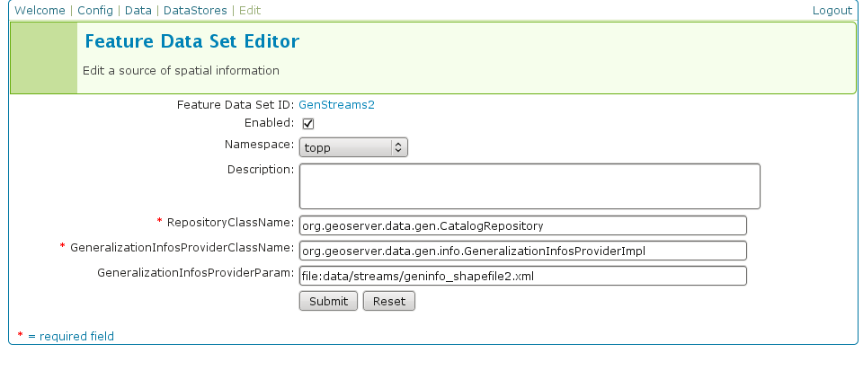
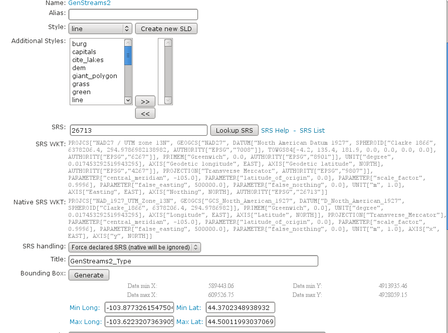

# Using the GeoTools feature-pregeneralized module

!!! warning

    The screenshots on this tutorial have not yet been updated for the 2.0.x user interface. But most all the rest of the information should be valid, and the user interface is roughly the same, but a bit more easy to use.

## Introduction

This tutorial shows how to use the geotools feature-pregeneralized module in GeoServer. The feature-pregeneralized module is used to improve performance and lower memory usage and IO traffic.

!!! note

    Vector generalization reduces the number of vertices of a geometry for a given purpose. It makes no sense drawing a polygon with 500000 vertices on a screen. A much smaller number of vertices is enough to draw a topological correct picture of the polygon.

This module needs features with already generalized geometries, selecting the best fit geometry on demand.

The full documentation is available in [GeoTools Pregeneralized Plugin](https://docs.geotools.org/latest/userguide/library/data/pregeneralized.html) documentation.

This tutorial will show two possible scenarios, explaining step by step what to do for using this module in GeoServer.

## Getting Started

First, find the location of the GEOSERVER_DATA_DIR. This info is contained in the log file when starting GeoServer.:

    ----------------------------------
    - GEOSERVER_DATA_DIR: /home/mcr/geoserver-1.7.x/1.7.x/data/release
    ----------------------------------

Within this directory, we have to place the shape files. There is already a sub directory **`data`** which will be used. Within this sub directory, create a directory **`streams`**.

Within **`{GEOSERVER_DATA_DIR}/data/streams`** create another sub directory called **`0`**. ( 0 meaning "no generalized geometries").

This tutorial is based on a shape file, which you can download from here [Streams](streams.zip). Unzip this file into **`{GEOSERVER_DATA_DIR}/data/streams/0`**.

Look for the **`WEB-INF/lib/`** directory of your GeoServer installation. There must be a file called **`gt-feature-pregeneralized-{version}-jar`**. This jar file includes a tool for generalizing shape files. Open a cmd line and execute the following:

    cd <GEOSERVER_DATA_DIR>/data/streams/0
    java -jar <GEOSERVER_INSTALLATION>/WEB-INF/lib/gt-feature-pregeneralized-{version}.jar generalize 0/streams.shp . 5,10,20,50

You should see the following output:

    Shape file            0/streams.shp
    Target directory      .
    Distances             5,10,20,50
    % |################################|

Now there are four additional directories **`5.0`** , **`10.0`** , **`20.0`** , **`50.0`** . Look at the size of files with the extension **`shp`** within these directories, increasing the generalization distance reduces the file size.

!!! note

    The generalized geometries can be stored in additional properties of a feature or the features can be duplicated. Mixed variations are also possible. Since we are working with shape files we have to duplicate the features.

There are two possibilities how we can deploy our generalized shape files.

1.  Deploy hidden (not visible to the user)
2.  Deploy each generalized shape file as a separate GeoServer feature

## Hidden Deployment

First we need a XML config file

``` xml
<?xml version="1.0" encoding="UTF-8"?>
<GeneralizationInfos version="1.0">
  <GeneralizationInfo dataSourceName="file:data/streams/0/streams.shp"  featureName="GenStreams" baseFeatureName="streams" geomPropertyName="the_geom">
      <Generalization dataSourceName="file:data/streams/5.0/streams.shp"  distance="5" featureName="streams" geomPropertyName="the_geom"/>
      <Generalization dataSourceName="file:data/streams/10.0/streams.shp"  distance="10" featureName="streams" geomPropertyName="the_geom"/>
      <Generalization dataSourceName="file:data/streams/20.0/streams.shp"  distance="20" featureName="streams" geomPropertyName="the_geom"/>
      <Generalization dataSourceName="file:data/streams/50.0/streams.shp"  distance="50" featureName="streams" geomPropertyName="the_geom"/>      
  </GeneralizationInfo>
</GeneralizationInfos>
```

Save this file as **`geninfo_shapefile.xml`** into **`{GEOSERVER_DATA_DIR}/data/streams`**.

!!! note

    The **dataSourceName** attribute in the XML config is not interpreted as a name, it could be the URL for a shape file or for a property file containing properties for data store creation (e. g. jdbc connect parameters). Remember, this is a hidden deployment and no names are needed. The only *official* name is the value of the attribute **featureName** in the **GeneralizationInfo** Element.

Start GeoServer and go to **Config-->Data-->DataStores-->New** and fill in the form


Press **Submit**.

The next form you see is



!!! note

    **RepositoryClassName** and **GeneralizationInfosProviderClassName** have default values which suit for GeoTools, not for GeoServer. Change **GeoTools** to **GeoServer** in the package names to instantiate the correct objects for GeoServer. **GeneralizationInfosProviderParam** could be an URL or a datastore from the GeoServer catalog. A datastore is referenced by using *workspacename:datastorename*. This makes sense if you have your own implementation for the **GeneralizationInfosProvider** interface and this implementation reads the infos from a database.

The configuration should look like this



Press **Submit**, afterward a form for the feature type opens.

Alter the **Style** to *line*, **SRS** is *26713* and press the **Generate** button labeled by **Bounding Box**.



Afterward, press **Submit**, **Apply** and **Save**.

Examine the result by pressing "**My GeoServer**, **Demo** and **Map Preview**. In this list there must be an entry **topp:GenStreams**. Press it and you will see



Now start zooming in and out and look at the log file of GeoServer. If the deployment is correct you should see something like this:

    May 20, 2009 4:53:05 PM org.geotools.data.gen.PreGeneralizedFeatureSource logDistanceInfo
    INFO: Using generalizsation: file:data/streams/20.0/streams.shp streams the_geom 20.0
    May 20, 2009 4:53:41 PM org.geotools.data.gen.PreGeneralizedFeatureSource logDistanceInfo
    INFO: Using generalizsation: file:data/streams/5.0/streams.shp streams the_geom 5.0
    May 20, 2009 4:54:08 PM org.geotools.data.gen.PreGeneralizedFeatureSource logDistanceInfo
    INFO: Using generalizsation: file:data/streams/5.0/streams.shp streams the_geom 5.0
    May 20, 2009 4:54:09 PM org.geotools.data.gen.PreGeneralizedFeatureSource logDistanceInfo
    INFO: Using generalizsation: file:data/streams/20.0/streams.shp streams the_geom 20.0

## Public Deployment

First we have to configure all our shape files


The **Feature Data Set ID** for the other shape files is

1.  Streams_5
2.  Streams_10
3.  Streams_20
4.  Streams_50



The **URL** needed for the other shape files

1.  `file:data/streams/5.0/streams.shp`
2.  `file:data/streams/10.0/streams.shp`
3.  `file:data/streams/20.0/streams.shp`
4.  `file:data/streams/50.0/streams.shp`



Each feature needs an **Alias**, here it is *streams_0*. For the other shape files use

1.  streams_5
2.  streams_10
3.  streams_20
4.  streams_50

Check the result by pressing **My GeoServer**, **Demo** and **Map Preview**. You should see your additional layers.

No we need another XML configuration file

``` xml
<?xml version="1.0" encoding="UTF-8"?>
<GeneralizationInfos version="1.0">
  <GeneralizationInfo dataSourceNameSpace="topp" dataSourceName="Streams_0"  featureName="GenStreams2" baseFeatureName="streams" geomPropertyName="the_geom">
      <Generalization dataSourceNameSpace="topp" dataSourceName="Streams_5"  distance="5" featureName="streams" geomPropertyName="the_geom"/>
      <Generalization dataSourceNameSpace="topp" dataSourceName="Streams_10"  distance="10" featureName="streams" geomPropertyName="the_geom"/>
      <Generalization dataSourceNameSpace="topp" dataSourceName="Streams_20"  distance="20" featureName="streams" geomPropertyName="the_geom"/>
      <Generalization dataSourceNameSpace="topp" dataSourceName="Streams_50"  distance="50" featureName="streams" geomPropertyName="the_geom"/>       
  </GeneralizationInfo>
</GeneralizationInfos>
```

Save this file as **`geninfo_shapefile2.xml`** into **`{GEOSERVER_DATA_DIR}/data/streams`**.

Create the pregeneralized datastore


Now we use the **CatalogRepository** class to find our needed data stores



Last step



In the **Map Preview** you should find **topp:GenStreams2** and all other generalizations. Test in the same manner we discussed in the hidden deployment and you should see something like this in the GeoServer log:

    May 20, 2009 6:11:06 PM org.geotools.data.gen.PreGeneralizedFeatureSource logDistanceInfo
    INFO: Using generalizsation: Streams_20 streams the_geom 20.0
    May 20, 2009 6:11:08 PM org.geotools.data.gen.PreGeneralizedFeatureSource logDistanceInfo
    INFO: Using generalizsation: Streams_10 streams the_geom 10.0
    May 20, 2009 6:11:12 PM org.geotools.data.gen.PreGeneralizedFeatureSource logDistanceInfo
    INFO: Using generalizsation: Streams_10 streams the_geom 10.0

## Conclusion

This is only a very simple example using shape files. The plugin architecture allows you to get your data and generalizations from anywhere. The used dataset is a very small one, so you will not feel a big difference in response time. Having big geometries (in the sense of many vertices) and creating maps with some different layers will show the difference.
