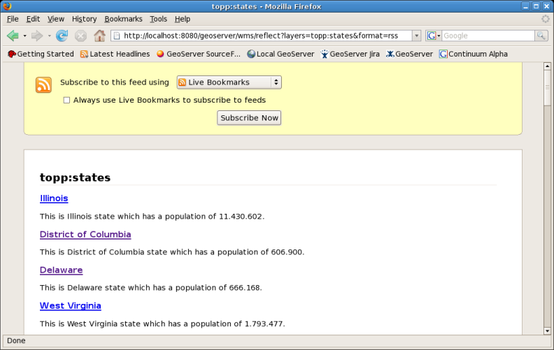
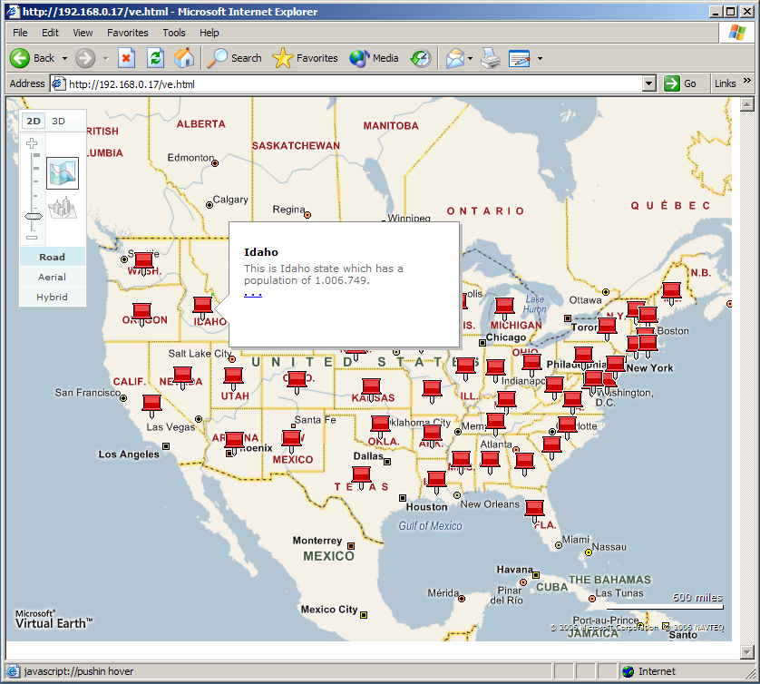

# GeoRSS {: #tutorials_georss }

GeoServer supports [GeoRSS](http://georss.org/) as an output format allowing you to serve features as an RSS feed.

## Quick Start

If you are using a web browser which can render RSS feeds simply visit the URL <http://localhost:8080/geoserver/wms/reflect?layers=states&format=rss> in your browser. This is assuming a local GeoServer instance is running with an out of the box configuration. You should see a result that looks more or less like this:

*topp:states rss feed*

## Templating

GeoServer uses FreeMarker templates to customize the returned GeoRSS feed. If you are not familiar with FreeMarker templates you may wish to read the [Freemarker Templates](../freemarker.md) tutorial, and the [KML Placemark Templates](../../services/wms/googleearth/tutorials/kmlplacemark/index.md) page, which has simple examples.

Three template files are currently supported:

-   `title.ftl`
-   `description.ftl`
-   `link.ftl`

Each of these files may be used to customize the associated field in the GeoRSS feed.

## Ajax Map Mashups

!!! note

    For Ajax map mashups to work, the GeoServer instance must be visible to the Internet (i.e. using the address `localhost` will not work).

## Google Maps

How to create a Google Maps mashup with a GeoRSS overlay produced by GeoServer.

1.  Obtain a [Google Maps API Key](http://www.google.com/apis/maps/signup.html) from Google.

2.  Create an html file called `gmaps.html`:

        <!DOCTYPE html PUBLIC "-//W3C//DTD XHTML 1.0 Strict//EN" "http://www.w3.org    R/xhtml1/DTD/xhtml1-strict.dtd">
        <html xmlns="http://www.w3.org/1999/xhtml">
            <head>
            <meta http-equiv="content-type" content="text/html; charset=utf-8"/>
            <title>Google Maps JavaScript API Example<    itle>
            

            

            </head>
            <body onload="load()" onunload="GUnload()">
                

            </body>
        </html>

3.  Visit `gmaps.html` in your web browser.

!!! note

    The version of the google maps api must be **2.x**, and not just **2** You must insert your specific maps api key, and geoserver base url

## Yahoo Maps

How to create a Yahoo! Maps mashup with a GeoRSS overlay produced by GeoServer.

1.  Obtain a <Yahoo Maps Application ID <<http://search.yahooapis.com/webservices/register_application>>`_ from Yahoo.

2.  Create an html file called `ymaps.html`:

        <html>
            <head>
            <title>Yahoo! Maps GeoRSS Overlay Example<    itle>
            
            
              </head>
              <body>
                   

             </body>
        </html>

3.  Visit `ymaps.html` in your web browser.

!!! note

    The version of the yahoo maps api must be **3.0** You must insert your specific application id, and geoserver base url

## Microsoft Virtual Earth

!!! note

    Non Internet Explorer Users*: GeoRSS overlays are only supported in Internet Explorer, versions greater than 5.5.

How to create a Microsoft Virtual Earth mashup with a GeoRSS overlay produced by GeoServer.

!!! note

    To access a GeoRSS feed from Microsoft Virtual Earth the file (ve.html) must be accessed from a Web Server, IE. It will not work if run from local disk.

1.  Create an html file called `ve.html`. **Note**: You must insert your specific maps api key, and geoserver base url:

        <html>
          <head>
            
            
         </head>
         <body onload="OnPageLoad();">
            

          </body>

        </html>

2.  Visit `ve.html` in your web browser. You should see the following:

*Virtual Earth*
