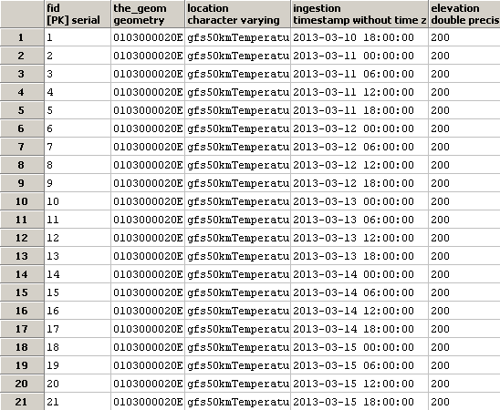
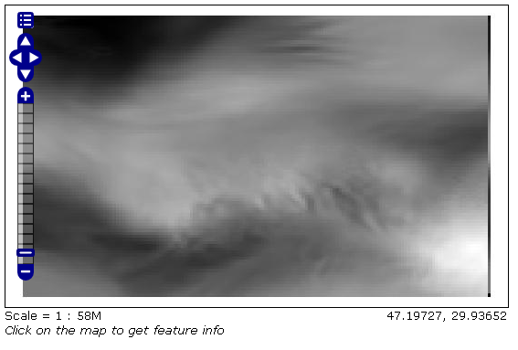
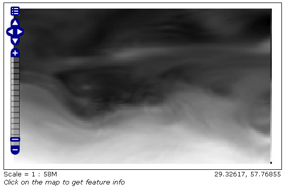

# Using the ImageMosaic plugin for raster with time and elevation data {: #tutorial_imagemosaic_timeelevationseries }

## Introduction

This tutorial is the following of [Using the ImageMosaic plugin for raster time-series data](imagemosaic_timeseries.md) and explains how manage an ImageMosaic using both **Time** and **Elevation** attributes.

The dataset used is a set of raster images used in weather forecast, representing the temperature in a certain zone at different times and elevations.

All the steps explained in chapter *Configurations* of [ImageMosaic](../../data/raster/imagemosaic/index.md) section are still the same.

This tutorial explains just how to configure the **elevationregex.properties** that is an additional configuration file needed, and how to modify the **indexer.properties**.

The dataset used is different so also a fix to the **timeregex.properties** used in the previous tutorial is needed.

Will be shown also how query GeoServer asking for layers specifying both time and elevation dimensions.

The dataset used in the tutorial can be downloaded [Here](temperatureLZWdataset.zip)

## Configuration examples

The additional configurations needed in order to handle also the elevation attributes are:

-   Improve the previous version of the *indexer.properties* file
-   Add the *elevationregex.properties file* in order to extract the elevation dimension from the filename

### indexer.properties:

Here the user can specify the information that needs GeoServer for creating the table in the database.

In this case the time values are stored in the column ingestion as shown in the previous tutorial but now is mandatory specify the elevation column too.



### elevationregex.properties:

Remember that every tif file must follow this naming convention:

    {coveragename}_{timestamp}_[{elevation}].tif

As in the timeregex property file the user must specify the pattern that the elevation in the file name looks like. In this example it consists of 4 digits, a dot '.' and other 3 digits.

an example of filename, that is used in this tutorial is:

    gfs50kmTemperature20130310T180000000Z_0600.000_.tiff

The GeoServer ImageMosaic plugin scans the filename and search for the first occurrence that match with the pattern specified. Here the content of **elevationregex.properties**:



### timeregex.properties:

As you can see the time in this dataset is specified as ISO8601 format:

    20130310T180000000Z

Instead of the form **yyyymmdd** as in the previous tutorial. So the regex to specify in timeregex.properties is:



## Coverage based on filestore

Once the mosaic configuration is ready the store mosaic could be loaded on GeoServer.

The steps needed are the same shown the previous chapter. After the store is loaded and a layer published note the differences in WMS Capabilities document and in the table on postgres.

### WMS Capabilities document

The WMS Capabilities document is a bit different, now there is also the dimension **elevation**. In this example both time and elevation dimension are set to **List** .

``` xml
<Dimension name="time" default="current" units="ISO8601">
    2013-03-10T00:00:00.000Z,2013-03-11T00:00:00.000Z,2013-03-12T00:00:00.000Z,2013-03-13T00:00:00.000Z,2013-03-14T00:00:00.000Z,2013-03-15T00:00:00.000Z,2013-03-16T00:00:00.000Z,2013-03-17T00:00:00.000Z,2013-03-18T00:00:00.000Z
</Dimension>
<Dimension name="elevation" default="200.0" units="EPSG:5030" unitSymbol="m">
    200.0,300.0,500.0,600.0,700.0,850.0,925.0,1000.0
</Dimension>
```

### The table on postgres

With the elevation support enabled the table on postgres has, for each image, the field **elevation** filled with the elevation value.



!!! note

    The user must create manually the index on the table in order to speed up the search by attribute.

#### Query layer on timestamp:

In order to display a snapshot of the map at a specific time instant and elevation you have to pass in the request those parameters.

-   **&time=** < **pattern** > , as shown before,
-   **&elevation=** < **pattern** > where you pass the value of the elevation.

For example if an user wants to obtain the temperature coverage images for the day **2013-03-10 at 6 PM** at elevation **200 meters** must append to the request:

    &time=2013-03-10T00:00:00.000Z&elevation=200.0



Same day at elevation **300.0 meters**:

    &time=2013-03-10T00:00:00.000Z&elevation=300.0



Note that if just the time dimension is append to the request will be displayed the elevation **200 meters** (if present) because of the **default** attribute of the tag `<Dimension name="elevation" ...` in the WMS Capabilities document is set to **200**
