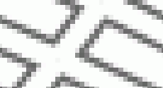
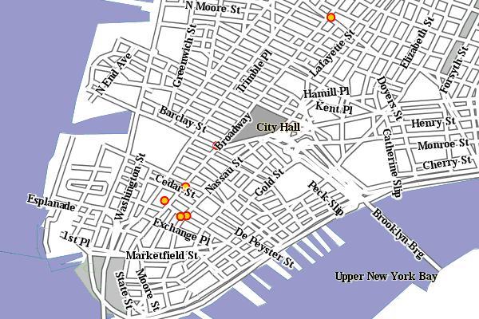
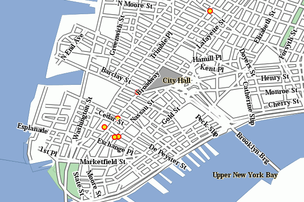
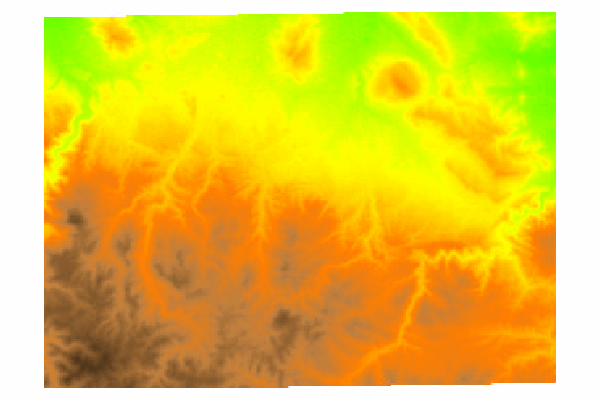
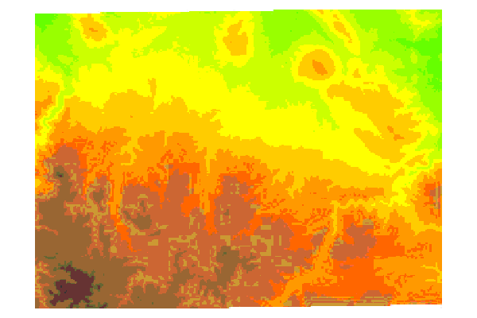

# Paletted Images {: #tutorials_palettedimages }

GeoServer has the ability to output high quality 256 color images. This tutorial introduces you to the palette concepts, the various image generation options, and offers a quality/resource comparison of them in different situations.

## What are Paletted Images?

Some image formats, such as GIF or PNG, can use a palette, which is a table of (usually) 256 colors to allow for better compression. Basically, instead of representing each pixel with its full color triplet, which takes 24bits (plus eventual 8 more for transparency), they use a 8 bit index that represent the position inside the palette, and thus the color.

This allows for images that are 3-4 times smaller than the standard images, with the limitation that only 256 different colors can appear on the image itself. Depending of the actual map, this may be a very stringent limitation, visibly degrading the image quality, or it may be that the output cannot be differentiated from a full color image. For many maps, one can easily find 256 representative colors.

In the latter case, the smaller footprint of paletted images is usually a big gain in both performance and costs, because more data can be served with the same internet connection, and the clients will obtain responses faster.

## Formats and Antialiasing

Internet standards offer a variety of image formats, all having different strong and weak points. The three most common formats are:

-   **JPEG**: a lossy format with tunable compression. JPEG is best suited for imagery layers, where the pixel color varies continuously from one pixel to the next one, and allows for the best compressed outputs. On the contrary, it's not suited to most vector layers, because even slight compression generates visible artifacts on uniform color areas.
-   **PNG**: a non lossy format allowing for both full color and paletted. In full color images each pixel is encoded as a 24bits integer with full transparency information (so PNG images can be translucent), in paletted mode each pixel is an 8 bit index into a 256 color table (the palette). This format is best suited to vector layers, especially in the paletted version. The full color version is sometimes referred as PNG24, the paletted version as PNG8.
-   **GIF**: a non lossy format with a 256 color palette, best suited for vector layers. Does not support translucency, but allows for fully transparent pixels.

So, as it turns out, paletted images can be used with profit on vector data sets, either using the PNG8 or GIF formats.

Antialiasing plays a role too. Let's take a road layer, where each road is depicted by a solid gray line, 2 pixels thick. One may think this layer needs only 2 colors: the background one (eventually transparent) and gray. In fact, this is true only if no antialiasing is enabled. Antialiasing will smooth the borders of the line giving a softer, better looking shape, and it will do so by adding pixels with an intermediate color, thus increasing the number of colors that are needed to fully display the image.

The following zoom of an image shows antialiasing in action:

*Antialiasing*

These output formats, if no other parameters are provided, do compute the optimal palette on the fly. As you'll see, this is an expensive process (CPU bound), but as you'll see, depending on the speed of the network connecting the server and the client, the extra cost can be ignored (especially if the bottleneck can be found in the network instead of the server CPU).

Optimal palette computation is anyways a repetitive work that can be done up front: a user can compute the optimal palette once, and tell GeoServer to use it. There are three ways to do so:

1.  Use the [internet safe palette](http://www.intuitive.com/coolweb/colors.html), a standard palette built in into GeoServer, by appending `palette=safe` to the `GetMap` request.

2.  Provide a palette by example. In this case, the user will generate an 256 color images using an external program (such as Photoshop), and then will save it into the `$GEOSERVER_DATA_DIR/palettes` directory. The sample file can be either in GIF or PNG format. If the file is named mypalette.gif or mypalette.png, the user will be able to refer it appending `palette=mypalette` to the GetMap request. GeoServer will load the palette from the file and use it.

3.  Provide a palette file. The palette file must be in JASC-PAL format, and have a `.pal` extension. This file type can be generated by applications such as Paint Shop Pro and IrfanView, but also can be generated manually in a text editor. The process is just as before, but this time only the palette file will be stored into `$GEOSERVER_DATA_DIR/palettes`.

    !!! note

        GeoServer does not support palette files in Microsoft Palette format, despite having the same `.pal` file extension.

## An Example with Vector Data

Enough theory, let's have a look at how to deal with paletted images in practice. We'll use the `tiger-ny` basemap to gather some numbers, and in particular the following map request:

> <http://localhost:8080/geoserver/wms?SERVICE=WMS&VERSION=1.1.1&REQUEST=GetMap&LAYERS=tiger-ny&BBOX=-74.022019,40.701196,-73.992366,40.720964&HEIGHT=400&WIDTH=600&FORMAT=image/png>

And we'll change various parameters in order to play with formats and palettes. Here goes the sampler:

**Parameters**:`FORMAT=image/png` | Size: 257 KB | Map generation time: 0.3s

*The standard PNG full color output*

**Parameters**:`FORMAT=image/png8` | Size: 60 KB | Map generation time: 0.6s

*The PNG8 output*

**Parameters**:`FORMAT=image/png` | Size: 257 KB | Map generation time: 0.3s

*PNG + internet safe palette*

**Parameters**:`FORMAT=image/png` & `palette=nyp` | Size: 56KB | Map generation time: 0.3s

*PNG + `custom palette <http://geoserver.org/download/attachments/1278244/nyp.pal?version=1>`_*

The attachments include also the GIF outputs, whose size, appearance and generation time does not differ significantly from the PNG outputs.

As we can see, depending on the choice we have a variation on the image quality, size and generation time (which has been recorded using the FasterFox Firefox extension timer, with the browser sitting on the same box as the server). Using `palette=xxx` provides the best match in speed and size, though using the built-in internet safe palette altered the colors. Then again, the real gain can be seen only by assuming a certain connection speed between the server and the client, and adding the time required to move the image to the client. The following table provides some results:

  ------------------------------- ----------- -------------------- ------------------ ---------------- ---------------- -----------------
  **Configuration**               **GT(s)**   **File size (kb)**   **TT 256kbit/s**   **TT 1MBit/s**   **TT 4MBit/s**   **TT 20MBit/s**

  tiger-ny-png                    0,36        257                  8,39               2,42             0,87             0,46

  tyger-ny-png8                   0,6         60                   2,48               1,08             0,72             0,62

  tiger-ny-png + safe palette     0,3         56                   22,05              0,75             0,41             0,32

  tiger-ny-png + custom palette   0,3         59                   2,14               0,77             0,42             0,32
  ------------------------------- ----------- -------------------- ------------------ ---------------- ---------------- -----------------

Legend:

-   `GT`: map generation time on the same box
-   `TT <speed>`: total time needed for a client to show the image, assuming an internet connection of the given speed. This time is a sum of the image generation time and the transfer time, that is, `GT + sizeInKbytes * 8/ speedInKbits`.

As the table shows, the full color PNG image takes usually a lot more time than other formats, unless it's being served over a fast network (and even in this case, one should consider network congestion as well). The png8 output format proves to be a good choice if the connection is slow, whilst the extra work done in looking up an optimal palette always pays back in faster map delivery.

## Generating the custom palette

The **`nyp.pal`** file has been generated using IrfanView, on Windows:

-   open the png 24 bit version of the image
-   use Image/Decrease Color Depth and set 256 colors
-   use Image/Palette/Export to save the palette

## An example with raster data

To give you an example when paletted images may not fit the bill, let's consider the sf:dem coverage from the sample data, and repeat the same operation as before.

**Parameters**:`FORMAT=image/png` Size: 117 KB | Map generation time: 0.2s

*The standard PNG full color output.*

**Parameters**:`FORMAT=image/jpeg` Size: 23KB | Map generation time: 0.12s

*JPEG output*

**Parameters**:`FORMAT=image/png8` Size: 60 KB | Map generation time: 0.5s

*The PNG8 output.*

**Parameters**:`FORMAT=image/png` & `palette=dem-png8` Size: 48KB | Map generation time: 0.15s

*PNG + custom palette (using the png8 output as the palette).*

**Parameters**:`FORMAT=image/png` & `palette=safe` Size: 17KB | Map generation time: 0.15s

*PNG + internet safe palette.*

As the sample shows, the JPEG output has the same quality as the full color image, is generated faster and uses only 1/5 of its size. On the other hand, the version using the internet safe palette is fast and small, but the output is totally ruined. Everything considered, JPEG is the clear winner, sporting good quality, fast image generation and a size that's half of the best png output we can get.
