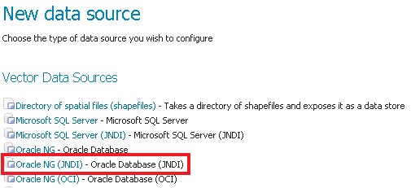
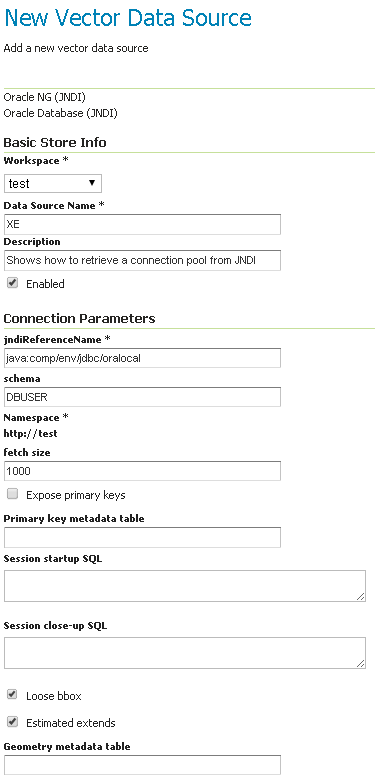
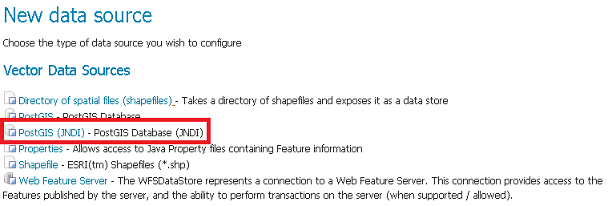
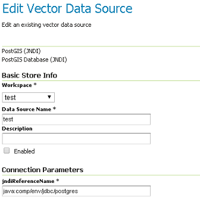
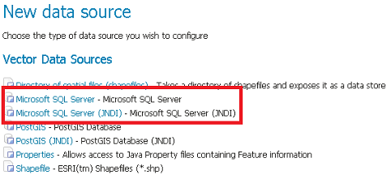
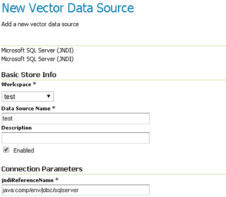

# Setting up a JNDI connection pool with Tomcat

This tutorial walks the reader through the procedures necessary to setup a Oracle JNDI connection pool in Tomcat 6 and how to retrieve it from GeoServer. In the last section other two examples of configuration are described with PostGIS and SQLServer.

## Tomcat setup

In order to setup a connection pool Tomcat needs a JDBC driver and the necessary pool configurations.

First off, you need to find the JDBC driver for your database. Most often it is distributed on the website of your DBMS provider, or available in the installed version of your database. For example, a Oracle XE install on a Linux system provides the driver at **`/usr/lib/oracle/xe/app/oracle/product/10.2.0/server/jdbc/lib/ojdbc14.jar`**, and that file needs to be moved into Tomcat shared libs directory, **`{TOMCAT_HOME}/lib`**

!!! note

    be careful to remove the jdbc driver from the GeoServer WEB-INF/lib folder when copied to the Tomcat shared libs, to avoid issues in JNDI DataStores usage.

Once that is done, the Tomcat configuration file **`{TOMCAT_HOME}/conf/context.xml`** needs to be edited in order to setup the connection pool. In the case of a local Oracle XE the setup might look like:

``` xml
<Context>
   ...
   <Resource name="jdbc/oralocal"
      auth="Container"
      type="javax.sql.DataSource"
      driverClassName="oracle.jdbc.driver.OracleDriver"
      url="jdbc:oracle:thin:@localhost:1521:xe"
      username="xxxxx" password="xxxxxx"
      maxTotal="20"
      initialSize="0"
      minIdle="0"
      maxIdle="8"
      maxWait="10000"
      timeBetweenEvictionRunsMillis="30000"
      minEvictableIdleTimeMillis="60000"
      testWhileIdle="true"
      poolPreparedStatements="true"
      maxOpenPreparedStatements="100"
      validationQuery="SELECT SYSDATE FROM DUAL"
      maxAge="600000"
      rollbackOnReturn="true"
      />
 </Context>
```

!!! note

    The above configuration is valid for Tomcat 8+, while Tomcat 7.x would use `maxActive` in place of `maxTotal`.

The example sets up a connection pool connecting to the local Oracle XE instance. The pool configuration shows is quite full-fledged:

-   at most 20 active connections (max number of connection that will ever be used in parallel)
-   at most 3 connections kept in the pool unused
-   prepared statement pooling (very important for good performance)
-   at most 100 prepared statements in the pool
-   a validation query that double checks the connection is still alive before actually using it (this is not necessary if there is guarantee the connections will never drop, either due to the server forcefully closing them, or to network/maintenance issues).

!!! warning

    Modify following settings only if you really know what you are doing. Using too low values for `removedAbandonedTimeout` and `minEvictableIdleTimeMillis` may result in connection failures, if so try to setup `logAbandoned` to `true` and check your `catalina.out` log file.

Other parameters to setup connection pool:

-   timeBetweenEvictionRunsMillis (default -1) The number of milliseconds to sleep between runs of the idle object evictor thread. When non-positive, no idle object evictor thread will be run.
-   numTestsPerEvictionRun (default 3) The number of objects to examine during each run of the idle object evictor thread (if any).
-   minEvictableIdleTimeMillis (default 1000 * 60 * 30) The minimum amount of time an object may sit idle in the pool before it is eligible for eviction by the idle object evictor (if any).
-   removeAbandoned (default false) Flag to remove abandoned connections if they exceed the removeAbandonedTimout. If set to true a connection is considered abandoned and eligible for removal if it has been idle longer than the removeAbandonedTimeout. Setting this to true can recover db connections from poorly written applications which fail to close a connection.
-   removeAbandonedTimeout (default 300) Timeout in seconds before an abandoned connection can be removed.
-   logAbandoned (default false) Flag to log stack traces for application code which abandoned a Statement or Connection.

For more information about the possible parameters and their values refer to the [DBCP documentation](http://commons.apache.org/dbcp/configuration.html).

## GeoServer setup

Login into the GeoServer web administration interface and configure the datastore.

First, choose the *Oracle (JNDI)* datastore and give it a name:


*Choosing a JNDI enabled datastore*

Then, configure the connection parameters so that the JNDI path matches the one specified in the Tomcat configuration:


*Configuring the JNDI connection*

When you are doing this, make sure the *schema* is properly setup, or the datastore will list all the tables it can find in the schema it can access. In the case of Oracle the schema is usually the user name, upper cased.

Once the datastore is accepted the GeoServer usage proceeds as normal.

## Other examples

### Configuring a PostgreSQL connection pool

In this example a PostgreSQL connection pool will be configured.

For configuring the JNDI pool you need to move the Postgres JDBC driver (it should be named **`postgresql-XX.X.X.jar`**) from the GeoServer **`WEB-INF/lib`** folder and put it into the **`{TOMCAT_HOME}/lib`** folder.

Then the following code must be added to the Tomcat configuration file **`{TOMCAT_HOME}/conf/context.xml`** inside a Context tag.

``` xml
<Context>
   <Resource name="jdbc/postgres"
      auth="Container"
      type="javax.sql.DataSource"
      driverClassName="org.postgresql.Driver"
      url="jdbc:postgresql://localhost:5432/test"
      username="xxxxx" password="xxxxxx"
      maxTotal="20"
      initialSize="0"
      minIdle="0"
      maxIdle="8"
      maxWait="10000"
      timeBetweenEvictionRunsMillis="30000"
      minEvictableIdleTimeMillis="60000"
      testWhileIdle="true"
      validationQuery="SELECT 1"
      maxAge="600000"
      rollbackOnReturn="true"
    />
</Context>
```

#### GeoServer setup

Login into the GeoServer web administration interface.

First, choose the *PostGIS (JNDI)* datastore and give it a name:



Then configure the associated parameters. The value for jndiReferenceName corresponds to the Resource name given in **`{TOMCAT_HOME}/conf/context.xml`**.



### Configuring a SQLServer connection pool

For configuring the connection pool for SQLServer you need to configure the SQLServer drivers as explained in the [Microsoft SQL Server](../../data/database/sqlserver.md) section and put the jar file into the **`{TOMCAT_HOME}/lib`** folder.

Then the following code must be written in the Tomcat configuration file **`{TOMCAT_HOME}/conf/context.xml`**

``` xml
<Context>
   ...
      <Resource name="jdbc/sqlserver"
      auth="Container"
      type="javax.sql.DataSource"
      driverClassName="com.microsoft.sqlserver.jdbc.SQLServerDriver"
      url="jdbc:sqlserver://localhost:1433;databaseName=test;user=admin;password=admin;"
      username="admin" password="admin"
      maxTotal="20"
      initialSize="0"
      minIdle="0"
      maxIdle="8"
      maxWait="10000"
      timeBetweenEvictionRunsMillis="30000"
      minEvictableIdleTimeMillis="60000"
      testWhileIdle="true"
      poolPreparedStatements="true"
      maxOpenPreparedStatements="100"
      validationQuery="SELECT 1"
      maxAge="600000"
      rollbackOnReturn="true"
      />
</Context>
```

!!! note

    Note that database name, username and password must be defined directly in the URL.

#### GeoServer setup

Login into the GeoServer web administration interface.

First, choose the *Microsoft SQL Server (JNDI)* datastore and give it a name:



Then configure the associated params:


